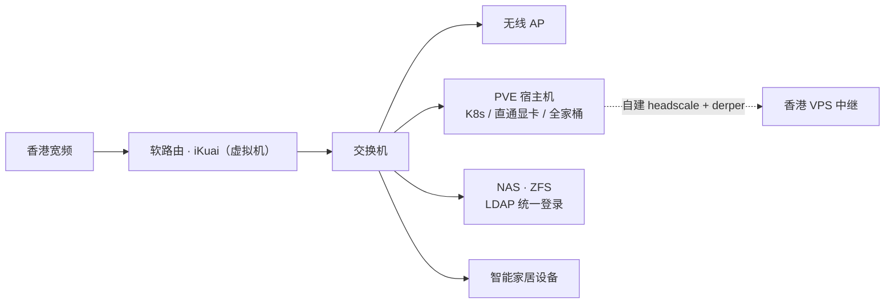

# 你好，我是 passio 🐱

> **Java 后端 · IoT 基础设施 · 运维**，也写点东西。

五年后端 + 运维一把梭：从 Spring 微服务到百万级设备接入，从写代码到谈判云折扣，信条是——**能用开源解决的，绝不掏钱给厂商**。

## 我靠什么吃饭

主业是 IoT 云平台与基础设施，后端和运维一把梭，几个拿得出手的数字：

| 维度 | 规模 |
| --- | --- |
| 设备并发接入 | 100 万+ 长连接（MQTT） |
| 服务用户 | 200 万+，98% 在海外 |
| 实时数仓 | StarRocks 日均 200 亿条 |

### 技术栈

- **接入层**：EMQX 集群调优与瓶颈分析、自研 emqx-kafka 插件、且自己写了个Java的mqtt-broker实现 [jmqtt-broker](#https://github.com/passiolin/jmqtt-broker)
- **存储计算**：MySQL MGR 集群、Redis、Elasticsearch 全套 ELK、StarRocks / Doris、MongoDB
- **容器与编排**：RKE2 自建 K8s、Rancher、Cilium/Calico 选型、Longhorn 存储
- **CI/CD**：Jenkins 多 Slave、GitLab、Nexus、Trivy + AI 漏洞分析、连嵌入式固件（ESP32/STM32）的 CI 都标准化了
- **云**：AWS/腾讯/阿里深度使用，VPC、EC2、块存储、EKS等。

### 代表性的架构决策

- [x] 自建 WAF + LB 替换 AWS ALB/WAF，该项成本 **-70%**
- [x] AWS 迁移甲骨文云可行性分析：年省 336 万的诱惑下，结论是「不全量迁、新区用 OCI」
- [x] 全球多区域数据中心渐进式规划：「DC 月成本 < 区域月收入」才建下一个
- [x] 自签 MQTTS 全套 PKI：根 CA → 中间 CA → 设备证书，六篇实操

## 我在折腾什么（HomeLab）

下班后的基础设施才是纯爱好：

- 🌐 **软路由**：iKuai 虚拟机部署 + NAT/桥接组网、DNS 劫持，写成了系列教程
- 🖥 **虚拟化**：PVE，显卡直通（RTX 5060 Ti 的 IOMMU/VFIO 全流程踩坑记录）
- 💾 **存储**：ZFS（zpool raidz1 实操）、OpenLDAP 统一账号直通 NAS 登录
- 🔗 **组网**：Tailscale 不用官方服务——自托管 headscale + derper 中继；OpenVPN、WireGuard 异地组网
- 📦 **自托管全家桶**：Gitea、Halo、NginxWebUI、JumpServer、Nexus、Prometheus + Grafana……

### 我家的网络拓扑

## 正在写的系列

1. **open-mqtt-broker** —— EMQX 企业版报价太离谱（占终端硬件成本 10%），决定用 Java 手写一个 MQTT Broker，源码分析 MqttWk / iot-mqtt-broker 之后推陈出新，回馈开源社区
2. **全球多区域数据中心规划** —— Home Region Pinning、Geo-sharding、Data Residency，海外 IoT 产品的合规与调度
3. **优雅的使用对象存储** —— 预签名上传防 OOM、公私桶隔离、元数据入 ES

## 博客目录

- **[前端](./前端/README.md)** —— CSS 布局、JavaScript 异步编程
- **[后端](./后端/README.md)** —— RESTful API 设计、数据库索引优化
- **[工具链](./工具链/README.md)** —— Git 工作流、Docker 入门

系统架构、CI/CD、云成本的深度文章整理好后会陆续搬进来。

## 关于本站

本站本身就是「基础设施 DIY」的产物：**纯静态 Markdown 站点**——nginx 直接托管 `.md` 文件，浏览器实时解析渲染，没有构建步骤、没有数据库，全部源码就一个 `index.html`。写一篇新文章 = 新建一个 `.md` 文件。

---

代码写累了就去机柜前站一会儿，比咖啡管用。折腾路线相近的朋友，欢迎交流。
