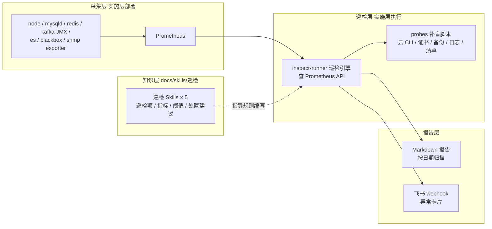

# 运维巡检体系(总纲)

本目录是巡检体系的**知识层**:把"巡什么、指标怎么取、阈值定多少、异常怎么处置"沉淀为一系列可被 AI 调用的 skill。实施层(监控栈部署、巡检引擎、补盲脚本)位于 `docs/运维巡检/`,其规则一律从本目录派生,**本目录是唯一事实源**——先改 skill,再同步脚本。

## 巡检与告警的边界

| | 实时告警(Prometheus + Alertmanager) | 周期巡检(本体系) |
| --- | --- | --- |
| 定位 | 东西坏了,立刻推人 | 定期整体体检,兜底与对账 |
| 节奏 | 7×24 常驻 | 每日/每周定时 |
| 关注点 | 可用性:宕机、错误率、延迟飙升 | 容量趋势、备份是否真的存在、安全组合规、证书到期、闲置资源烧钱 |
| 通知 | 即时 IM/电话 | 巡检报告归档 + 异常摘要推飞书 |

巡检不与告警抢活:告警管"现在坏了",巡检管"正在变坏、没人管、以及对不上账"。Alertmanager 接入为本体系二期演进,不影响 skill 与巡检脚本的设计。

## 体系架构



- **指标面**:能被 exporter 持续采集的,一律走 Prometheus,巡检只做查询与判断;
- **盲区面**:状态对账类(云资源、安全组、备份文件、证书文件、登录安全)、非 SNMP 的机房设备,用 shell/CLI 脚本补盲,或降级为人工清单。

## 巡检域与 skill 清单

按资源域拆分,互不依赖,可单独启用。命名统一 `inspect-*` 前缀。

| Skill | 覆盖对象 | 主要数据来源 | 状态 |
| --- | --- | --- | --- |
| [inspect-server](./inspect-server/SKILL.md) | Linux 主机(物理机/虚机/宿主机) | node_exporter + shell 盲区 | ✅ 初版 |
| inspect-middleware | MySQL、Redis、Kafka、Zookeeper、ES、Nginx、Nacos、EMQX、Filebeat、Jenkins | 组件原生 CLI/API 为主,exporter 可选 | ✅ 初版(10 组件 / 100 项,实验机实测) |
| inspect-cloud | 阿里云、AWS | aliyun / aws CLI(非指标类巡检) | 待编写 |
| inspect-service | liko-* 业务服务 | blackbox 拨测 + ES 日志错误率(复用 filebeat→ES 链路) | 待编写 |
| inspect-datacenter | 温湿度、UPS、交换机、PDU、机柜电力 | snmp_exporter + 人工巡检清单模板 | 待编写 |

## 巡检节奏

| 节奏 | 范围 | 说明 |
| --- | --- | --- |
| 每日异常巡 | 全部域,只看 P0/P1 | 早间定时执行,异常摘要推飞书群 |
| 每周全量巡 | 全部域,含 P2 与趋势 | 产出完整报告,归档并周会过一遍 |
| 专项巡 | 单域 | 重大变更后、故障复盘后按需执行,如"发版后拨测全量接口" |

## 异常分级

| 级别 | 含义 | 响应约定 |
| --- | --- | --- |
| P0 严重 | 已影响或即将影响可用性/数据安全 | 飞书立即推送并 @值班,当日闭环 |
| P1 警告 | 趋于恶化,留有处理窗口 | 48 小时内处理或明确排期 |
| P2 提示 | 合规、优化、待人工复核 | 进入周报,周会决策 |

## 阈值约定

- 各 skill 内的阈值为**通用默认基线**,适用于常规 Web/中间件机器;
- 数据库、接入层等特殊角色可在实施层规则文件中**覆盖**阈值,但覆盖必须注明原因与生效范围;
- 调整阈值时先改 skill、再同步规则文件,保持两处一致;
- "持续 N 分钟才判异常"的表达方式见各 skill 明细(用 `min_over_time` 子查询包装)。

## 报告与通知约定

- 报告为 Markdown,按域分节,异常项按级别置顶,每条异常附**当前值、阈值、处置建议**;
- 命名:`inspect-<域>-YYYYMMDD.md`,归档到实施层 `reports/`(默认 gitignore,防仓库膨胀);
- 飞书推送只发异常摘要卡片(P0 额外 @值班),不发全量报告刷屏;
- 巡检退出码:`0` 健康 / `1` 有告警 / `2` 巡检自身故障(cron 与上层可判断)。

## 在 ZCode 中启用(可选)

本目录按文档站目录约定组织,同时可直接 symlink 为 ZCode skill 供 AI 调用:

```bash
# 在仓库根目录下执行
ln -s "$PWD/docs/skills/巡检/inspect-server" ~/.zcode/skills/inspect-server
```

启用后,对 AI 说"巡检服务器"或让它"按 inspect-server 写巡检脚本"即可触发。

## 演进路线

| 阶段 | 内容 | 状态 |
| --- | --- | --- |
| 1 | 抽取 5 个巡检 skill(知识先行) | 进行中 |
| 2 | 监控栈部署(docker-compose + exporter 文档) | 未开始 |
| 3 | inspect-runner 巡检引擎 + server/middleware 规则 | 未开始 |
| 4 | 云 CLI 补盲 + 业务拨测 + 机房 | 未开始 |
| 5 | cron 定时 + 飞书 + 报告归档流程 | 未开始 |
| 6(二期) | Alertmanager 实时告警接飞书 | 规划 |
