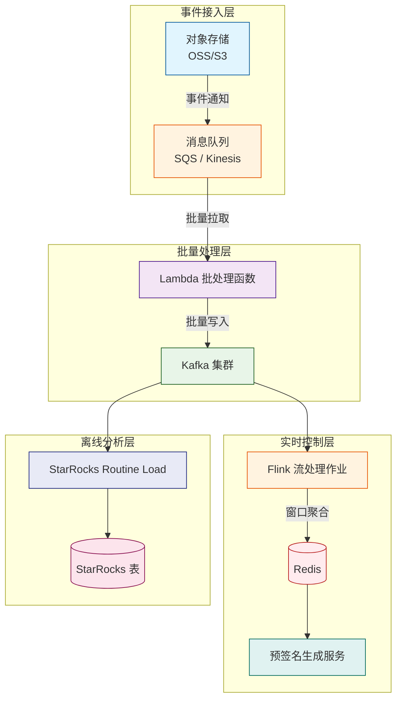

# 对象存储的索引和ETL监控


微服务让客户端拿着预签名 URL 或临时密钥直传对象存储（AWS S3、阿里云 OSS），文件流不再垫服务器内存——省下的是资源，丢掉的是视线：上传不经服务端实时校验，URL 一旦泄露即敞开写入通道，谁传了什么、何时传的无人知晓。对象存储的索引与 ETL 监控，补的正是这条视线——让上传行为可观测、可控制、可追溯。

---

## 一、监控目标

- **实时性**：秒级感知文件上传事件，为流控策略提供数据支持。
- **成本可控**：避免高频 Serverless 调用与存储日志扫描带来的高昂成本。
- **可分析性**：构建行为分析索引，支持用户、IP、时间等多维度的查询与统计。
- **可扩展性**：兼容多云对象存储，方便接入现有监控告警体系。

---

## 二、整体架构

下图描述了从对象存储事件捕获到最终行为分析的核心链路：

1. **事件触发**：对象存储桶配置事件通知，当有对象创建（上传）时，将事件信息发送至中间消息队列（SQS 或 Kinesis）。
2. **批量处理**：Lambda 函数从队列中拉取消息，根据批处理窗口（如最大消息数或最大等待时间）聚合事件，解析后批量写入 Kafka 主题。
3. **实时控制**：Flink 作业消费 Kafka 事件，按用户、IP 等维度进行滑动窗口聚合，实时统计上传次数与流量，将结果存入 Redis。预签名生成服务在颁发上传凭证前查询 Redis，判断用户是否超过限流阈值，实现事前控制。
4. **离线分析**：StarRocks 通过 Routine Load 持续导入 Kafka 中的原始事件，利用其高性能查询能力进行深度行为分析（如异常 IP 检测、用户画像、长期趋势报表）。




---

## 三、关键组件详解

### 3.1 对象存储事件与消息队列

- **对象存储**：以 S3 为例，开启事件通知，将 `s3:ObjectCreated:*` 事件发送至 SQS 或 Kinesis。
- **消息队列选择**：
  - **SQS**：简单易用，支持 Lambda 事件源映射，自带死信队列；适合中小规模场景。
  - **Kinesis**：支持更高吞吐，数据保留期更长，适合大规模、低延迟需求；但需要管理分片。

### 3.2 批量处理 Lambda

- **触发器配置**：设置 Lambda 的 SQS 触发器，指定 `BatchSize`（例如 100）和 `MaximumBatchingWindowInSeconds`（例如 60）。函数将在窗口内聚合最多 100 条消息或等待 60 秒后调用。
- **处理逻辑**：
  1. 遍历消息，提取必要字段（桶名、对象键、大小、上传者身份、IP、用户代理等）。
  2. 对消息进行去重（基于消息 ID 或对象 ETag）。
  3. 使用 Kafka 生产者 SDK，设置 `linger.ms` 和 `batch.size` 以启用批量发送。
  4. 若 Kafka 写入失败，将消息发送至死信队列（SQS DLQ 或 Kafka 死信主题）。
- **幂等性设计**：消息可能重复投递，下游需通过唯一标识（如 `bucket+key+timestamp`）去重。

### 3.3 Kafka 集群

- 作为流数据中枢，持久化原始事件，支持多订阅者。
- 根据数据量规划分区数，确保并行度与扩展性。
- 开启 TLS 加密与 SASL 认证，确保传输安全。

### 3.4 Flink 实时流处理

- **作业逻辑**：
  - 从 Kafka 消费事件，按用户 ID（或 IP）进行 `keyBy`。
  - 定义滑动窗口（如 1 分钟滑动窗口，统计最近 5 分钟上传次数）或滚动窗口（如天级累计）。
  - 使用增量聚合函数（如 `reduce` 或 `aggregate`）实时计算窗口内上传次数和总大小。
  - 将聚合结果写入 Redis（使用 `SETEX` 命令，设置过期时间与窗口对齐）。
- **状态后端**：使用 RocksDB 存储大状态，避免内存溢出。
- **容错**：启用 checkpoint，确保 Exactly-Once 语义。

### 3.5 Redis

- 存储用户实时用量，数据结构示例：
  - Key: `user:<userId>:upload_count_1min`（1 分钟计数）
  - Value: 当前窗口内的上传次数
  - TTL: 2 分钟（略大于窗口长度，避免过期影响查询）
- 预签名生成服务通过简单的 `GET` 操作获取当前计数，与阈值比较后决定是否允许颁发 URL。

### 3.6 StarRocks 离线分析

- **Routine Load**：创建例行导入任务，持续消费 Kafka 指定主题，将数据写入明细表。

```sql
CREATE ROUTINE LOAD behavior_analysis ON upload_events
COLUMNS(bucket, key, size, user_id, client_ip, event_time)
FROM KAFKA (
    "kafka_broker_list" = "broker1:9092,broker2:9092",
    "kafka_topic" = "oss_events",
    "property.kafka_default_offsets" = "OFFSET_BEGINNING"
);
```

- **表设计**：
  - **明细表**：存储原始事件，按事件时间分区，使用 Duplicate Key 模型。
  - **聚合表**：通过物化视图预计算每日/每周用户上传总量，加速查询。
- **查询应用**：
  - 异常检测：
    ```sql
    SELECT user_id, COUNT(*) as cnt
    FROM upload_events
    WHERE event_time > NOW() - INTERVAL 1 HOUR
    GROUP BY user_id
    HAVING cnt > 1000;
    ```
  - 用户画像：统计用户常用 IP、平均文件大小等。

---

## 四、行为控制策略实现

结合实时层与离线层，可实现以下控制策略。

### 4.1 事前限流（基于实时计数）

- **策略示例**：
  - 普通用户：1 分钟内最多上传 10 次，24 小时内累计不超过 1GB。
  - VIP 用户：放宽限制。
- **实现**：
  - 预签名生成服务调用前，查询 Redis 中的实时计数（分钟级窗口）和 StarRocks 中近 24 小时累计总量（可通过缓存或预加载到 Redis）。
  - 若超出阈值，返回 `429` 或拒绝生成 URL。

### 4.2 事中快速响应（基于事件触发）

- 对于无法事前拦截的场景（如直接使用临时密钥上传），可在事件进入 Kafka 后触发快速响应：
  - Flink 识别出超限用户，调用对象存储 API 删除刚上传的文件。
  - 或发送告警至安全中心，由人工介入。

### 4.3 事后分析与策略优化

- StarRocks 中存储的历史数据可用于：
  - 分析用户上传模式，动态调整限流阈值。
  - 识别恶意 IP 或异常行为（如凌晨批量上传）。
  - 生成合规报表，供审计使用。

---

## 五、成本与性能优化

- **Lambda 批量处理**：通过调整批处理窗口，平衡延迟与调用次数。例如，允许 60 秒等待可显著减少调用量，但会增加事件可见延迟。
- **Kafka 分区数**：根据预估 TPS 设置分区，确保吞吐量；分区数不宜过多，避免 Zookeeper 压力。
- **Flink 资源配置**：根据数据量调整并行度，利用增量 checkpoint 减少状态保存开销。
- **StarRocks 数据生命周期**：设置分区 TTL（如 30 天），自动删除过期明细数据；保留聚合结果长期存储。

---

## 六、总结

上述链路落地第一节设定的四个监控目标：实时性（Flink 滑动窗口秒级感知，支撑事前限流与事中干预）、成本可控（Lambda 批量聚合与 Kafka 缓冲，避免高频 Serverless 调用与存储日志扫描）、可分析性（StarRocks 承接行为分析索引，支撑安全运营与业务决策）、可扩展性（组件松耦合，可替换或集成其他云服务）。
