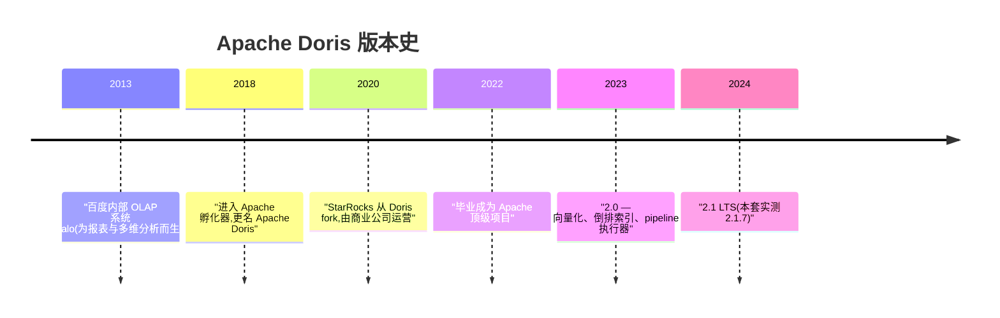
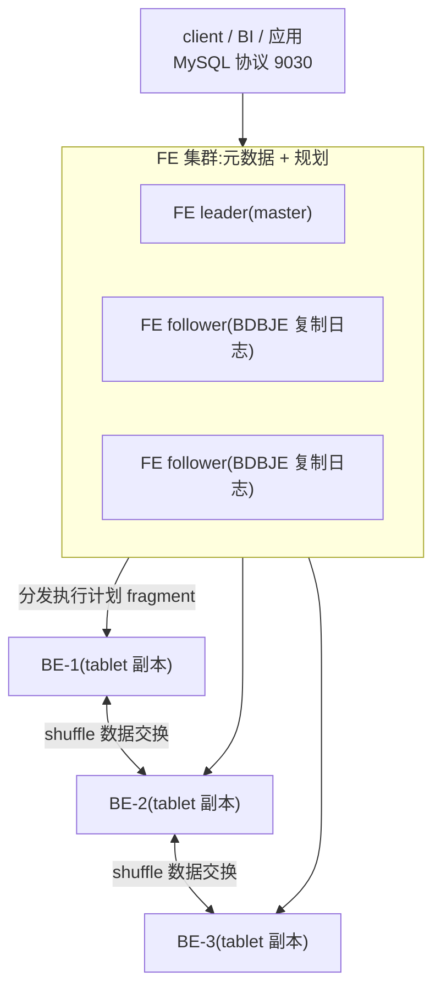
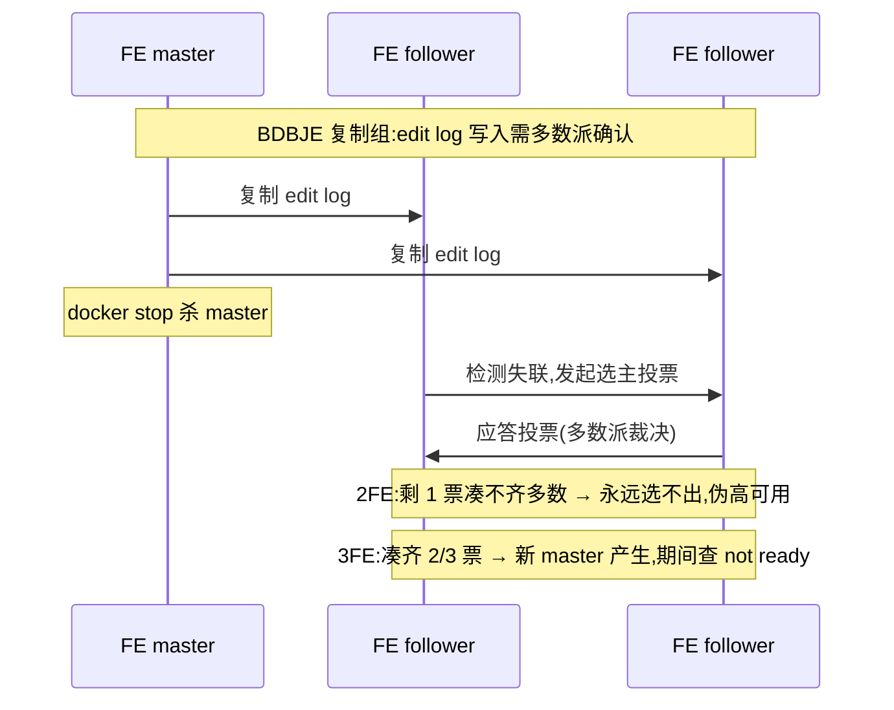
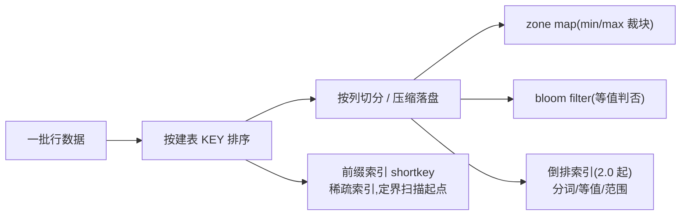
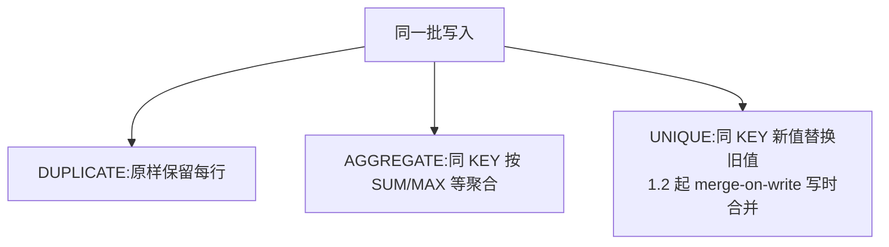
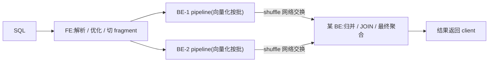
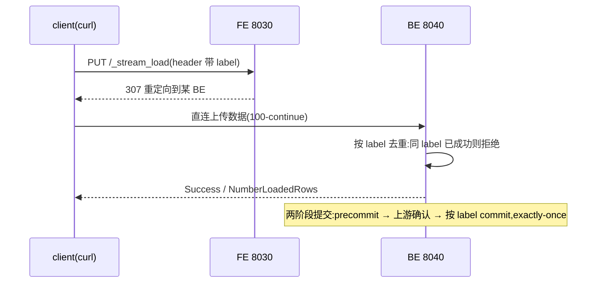

# Doris 部署与运维(doris)

> - **版本基线**:Apache Doris 2.1.7(官方镜像 `apache/doris:fe-2.1.7` / `be-2.1.7`,2.1 LTS 线)。
> - **实测环境**:PVE 虚机 doris-1/2/3(10.10.12.124/125/126,4C/8G/100G,Ubuntu 26.04,docker),2026-09-30。**3 FE + 3 BE 全链路实测**:部署、三大宿主前置、建表、Stream Load(10 万行)、杀 BE 副本容灾、FE 多数派与选举、在线扩容、metrics。
> - **定位**:实时 OLAP 数仓(MPP 架构,FE 元数据/规划 + BE 存储/计算),MySQL 协议接入。生产参考:我们 StarRocks 同源架构的实验田。

## 文章索引

| 编号 | 文章 | 内容 | 状态 |
| --- | --- | --- | --- |
| 1 | [安装部署-单机](1.安装部署-单机.md) | 1FE+1BE 同机、RF=1、实测坑 | ✅ 已实测 |
| 2 | [架构与部署-docker](2.架构与部署-docker.md) | FE/BE 分工、宿主前置、建群 | ✅ 已实测 |
| 3 | [数据导入与查询](3.数据导入与查询.md) | 建表模型、Stream Load、验证 | ✅ 已实测 |
| 4 | [高可用与扩缩容](4.高可用与扩缩容.md) | 副本容灾、FE 多数派、选举与冷启 | ✅ 已实测 |
| 5 | [监控与日常运维](5.监控与日常运维.md) | metrics 端点、排障字典 | ✅ 已实测 |

## 阅读路径

从零搭:1(单机)→ 3(导入验证)→ 2 → 4(集群 HA);接手在跑的:5 → 4。

## 组件介绍

> Apache Doris 是**实时 OLAP 数仓**:MPP 架构——FE 管元数据与查询规划、BE 管存储与并行执行,MySQL 协议接入,报表与多维分析亚秒级返回。

### 诞生背景



Doris 前身是百度 2013 年前后的内部 OLAP 系统 Palo,动机:报表与多维分析既要**快**(聚合亚秒级)又要**高并发**(大量 BI 看板同时打)——当时 MySQL 聚合慢、Hadoop 系交互延迟高,中间缺一个产品。2018 年进入 Apache 孵化器并更名 Apache Doris,2022 年毕业成为顶级项目。版本线:1.x 稳定线;2.0(2023)的向量化、倒排索引、pipeline 执行器把性能抬了一档;2.1(2024,本套实测 2.1.7)。生态侧:2020 年 StarRocks 从 Doris fork、由商业公司运营,在生态与湖仓一体方向演进——两者 **MySQL 协议同源**,技能与工具链互通;我们生产用 StarRocks,本套文档以 Doris 为实验田。

### 功能特色

| 能力 | 一句话说明 | 本套落点 |
| --- | --- | --- |
| 实时 OLAP | 列存 + MPP 并行,聚合/多维分析亚秒级 | 第 3 篇 |
| MySQL 协议 | 9030 直连,BI/应用零改造接入 | 第 3 篇 |
| 三种表模型 | 明细/聚合/主键,一张 DDL 适配场景 | 第 3 篇(实测 DUPLICATE) |
| 多通道导入 | Stream Load/INSERT/Broker/routine load | 第 3 篇(10 万行实测) |
| 二级索引 | 前缀索引/zone map/bloom/倒排(2.0) | 本文原理节 |
| 高可用 | FE 多数派选主 + BE 副本自愈 | 第 4 篇 |
| 在线扩缩容 | 加 BE 自动 tablet 再均衡 | 第 4 篇(实测) |
| 湖仓一体 | 2.x 支持湖上查询 | ✅ TVF S3() 直查实测(第 3 篇) |

### 使用速查

```sql
-- ── 建表三模型(本套实测 DUPLICATE) ──
CREATE TABLE t (...) DUPLICATE KEY(id)          -- 明细:每行原样保留
  DISTRIBUTED BY HASH(id) BUCKETS 4
  PROPERTIES("replication_num" = "2");          -- 实验 2 / 生产 3
-- AGGREGATE KEY(...):同 KEY 按 SUM/MAX/REPLACE 聚合
-- UNIQUE KEY(...):主键更新/点查,1.2 起默认 merge-on-write

-- ── 管理语句(实验高频) ──
SHOW FRONTENDS; SHOW BACKENDS;                  -- Alive/TabletNum 一眼看集群
ALTER SYSTEM DROP BACKEND "ip:9050";            -- 缩容(先确认副本数足够)
```

```bash
# Stream Load(永远打 FE 8030,自动重定向到 BE 8040)
curl --location-trusted -u root: -H "column_separator:," \
  -T data.csv -X PUT http://fe:8030/api/db/t/_stream_load
```

### 核心原理

#### 1. FE/BE 分工:元数据与计算的分离

**FE(Frontend)**管元数据与接入:库表/副本/事务的元数据走 **BDBJE(Berkeley DB Java Edition)**多数派复制日志;SQL 解析、优化、执行计划切分也在 FE;对外 MySQL 协议 9030、HTTP 8030、复制端口 9010。**BE(Backend)**管存储与执行:数据按 **tablet(数据分片)**组织,每个 tablet 多副本(建表 `replication_num`:实验基线 2 / 生产 3,单机篇 RF=1)分布在不同 BE;BE 端口 8040(HTTP/Stream Load)/9050(心跳)/9060(thrift)/8060(brpc)。两层解耦的收益:元数据小而关键,用多数派保一致;数据大而可重建,用副本+克隆保可用——第 4 篇实测"停一台 BE 剩余副本照常服务、回归后自动补齐",以及"加 BE 自动 tablet 再均衡",都是这套分工的结果。



#### 2. BDBJE 选主:FE 多数派是硬约束

FE 的元数据改动(建表、导入事务)先写 edit log,经 BDBJE 复制组**多数派确认**才生效;master FE 挂掉后,剩余 follower 互相投票选新 master——票数凑不齐多数,元数据就"不可提交",集群拒绝读写(`Node catalog is not ready`)。第 4 篇两条实测结论直接源于此:**2 FE 杀 master = 全集群不可用**(剩 1 票 < 2/3 多数,永远选不出)——FE 要么 1 个要么 3 个起,**2 个是伪高可用**;**3 FE 杀 master 依赖选举收敛**,不是秒级承诺,应用侧连接串要带多 FE 地址 + 重试。冷启纪律(日志最新的前 master 先起)见第 4 篇 Runbook。



#### 3. 存储模型:列存 + 前缀索引 + 二级索引

BE 落盘是**列存**:一批数据先按建表 KEY **排序**,再按列切分、压缩存储。排序带来第一个免费索引——**前缀索引(shortkey)**:稀疏索引只记每个数据块的 KEY 起止,等值/前缀过滤能直接跳过整块(所以"高频过滤列放 KEY 前面"是建表铁律)。再叠加三类二级索引:**zone map**(每块 min/max,范围过滤裁块)、**bloom filter**(高基数列等值快速判否)、**倒排索引**(2.0 起,分词/等值/范围,补全文与点查短板)。写入攒批生成小版本文件,后台 **compaction** 按序压实——与 ES 的 segment merge 同一思想:追加不可变 + 后台合并。



#### 4. 三种表模型:DUPLICATE / AGGREGATE / UNIQUE

同一批写入,三种模型的处理不同:**DUPLICATE(明细模型)**每行原样保留,不丢任何细节——日志/事件类首选,本套实测即此模型;**AGGREGATE(聚合模型)**同 KEY 行按 SUM/MAX/MIN/REPLACE 等聚合后只存结果,报表预聚合省空间省扫描,代价是明细不可回查;**UNIQUE(主键模型)**同 KEY 新值覆盖旧值,做点查与更新(维表/状态表),1.2 起默认 **merge-on-write(写时合并)**——写入时即合并好,查询不再付合并代价,换写入放大。选型一句话:要明细用 DUPLICATE,要预聚合用 AGGREGATE,要更新点查用 UNIQUE。

| 模型 | 同 KEY 语义 | 场景 | 代价 |
| --- | --- | --- | --- |
| DUPLICATE | 全保留 | 日志/事件明细(实测) | 聚合现算 |
| AGGREGATE | 按 agg 函数归并 | 报表预聚合 | 明细丢失 |
| UNIQUE | 新值覆盖旧值 | 维表/状态更新 | MoW 写放大(✅ 实测 1902KB vs 明细 864KB,见下) |



#### 5. MPP 执行:pipeline 向量化与常驻进程

查询到 FE 先解析优化,切成多个 **fragment** 分发到各 BE;BE 间 **shuffle** 交换数据,分布式 JOIN/聚合在多机同时进行——**MPP(Massively Parallel Processing)**没有中心汇总瓶颈。2.0 起执行器为 **pipeline + 向量化**:按批(而非行)在 SIMD 友好的循环里处理列数据,吞吐显著高于逐行解释执行。与 Spark/MapReduce 这类批处理框架的本质区别:**常驻进程、无任务启动开销**——Doris 的 FE/BE 一直活着,查询提交即执行;批处理每次提交作业要经历调度/启动/分配资源,适合大吞吐离线,不适合亚秒高并发。这也是"实时 OLAP"与"离线数仓"的分界线。



#### 6. Stream Load:label 幂等与两阶段提交

Stream Load 是 HTTP 文件/流式导入:**永远打 FE 8030,FE 返回 307 重定向到某 BE 8040**(`--location-trusted` 必带),数据直传 BE,不占 FE 带宽。**exactly-once 靠 label**:每次导入携带唯一 label,BE 按 label 去重——同 label 已成功则拒绝重放,网络超时重试不会重复入库;配合**两阶段提交**(2PC):先 prepare 挂起,上游事务确认后再按 label commit,导入与外部事务对齐。第 3 篇实测两坑:**默认列分隔符是 TAB**,CSV 逗号文件必须 `column_separator:,`,否则整批报列数错(逐行原因看返回体 ErrorURL);重定向上传大文件要正确处理 **100-continue**(curl 带 `expect:100-continue` 头)。



### 与本文档集的衔接

| 本节概念 | 实测落点 |
| --- | --- |
| DUPLICATE 明细模型 | [第 3 篇](3.数据导入与查询.md):建表 DDL 三件套、SHOW BACKENDS 前置 |
| Stream Load 与两坑 | [第 3 篇](3.数据导入与查询.md):10 万行两次(冷 16s/热 3.9s)、column_separator 坑 |
| BE 副本自愈 / RF | [第 4 篇](4.高可用与扩缩容.md):RF=2 杀 BE 照常服务,回归自动补副本 |
| FE 多数派 / 2FE 伪高可用 | [第 4 篇](4.高可用与扩缩容.md):2FE 杀 master 全拒;3FE 选举收敛与冷启 Runbook |
| 在线扩容再均衡 | [第 4 篇](4.高可用与扩缩容.md):第三节点加入,tablet 自动再均衡 |
| 单机形态 RF=1 | [第 1 篇](1.安装部署-单机.md):1FE+1BE 同机 |

> ✅ **UNIQUE MoW 写放大已实测**(2026-10-09):同构两表(3 桶 RF=2)各灌 10 万行后,u_mow 两轮更新 5 万键 / d_dup 两轮追加 5 万行(compaction score 仍 0,即压缩前状态):**MoW 10 万行占 1902KB,明细表 20 万行只占 864KB**——MoW 的写放大在 tablet 尺寸上直接可见(基线数据 + 增量 rowset + delete-bitmap 未合并),等价换查询免合并;"换写入放大"从一句话变成实测数字。
> ✅ **routine load 接 Kafka 与湖仓查询已实测**(2026-10-09):routine load(JSON+jsonpaths)创建即 RUNNING、三批持续落库,默认从**创建时刻的分区末尾**消费(要回溯用 OFFSET_ZERO);湖仓查询走 TVF `S3()` 直查对象存储 CSV,10 万行对账一致 → [第 3 篇](3.数据导入与查询.md)。

## 资料索引

- 官方文档:https://doris.apache.org/docs/2.1/
- 官方 docker 镜像说明:https://hub.docker.com/r/apache/doris
- Stream Load:https://doris.apache.org/docs/2.1/data-operate/import/import-way/stream-load-manual
- FE 参数 / BE 参数手册:见官方 docs 的 Config 页(链接为主,不整本入库,同 MySQL 篇纪律)。

## 关联

- MySQL 协议接入侧的账号纪律沿用 [../mysql/3.账号与安全.md](../mysql/3.账号与安全.md) 的思路;
- 巡检:Doris 未纳入巡检 10 组件,积累期后按"新增组件"流程补 references/doris.md。

## 新增与修改

新增内容沿用 MySQL 篇的纪律——命令与输出先实测,版本、日期随事实写进正文。
