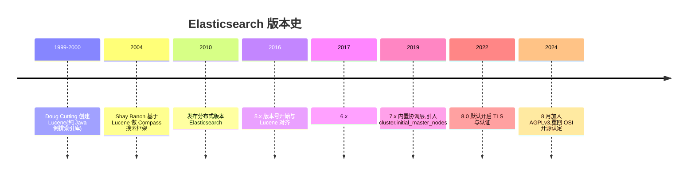
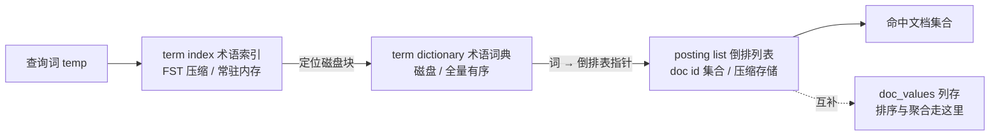
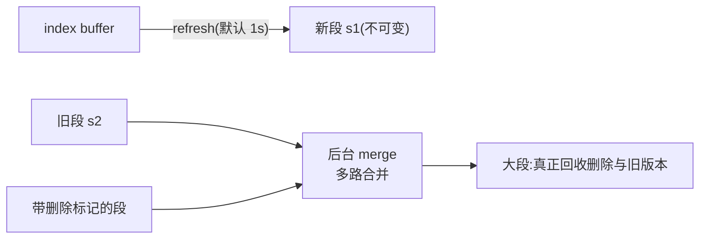
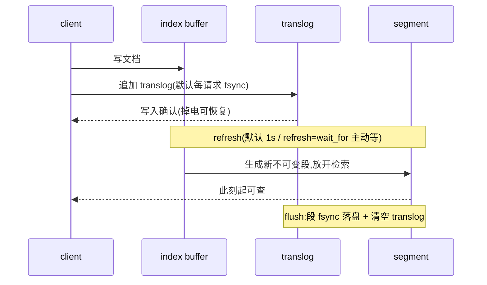
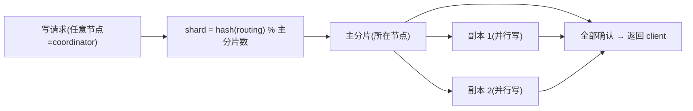

# Elasticsearch 部署与运维(elasticsearch)

> - **版本基线**:Elasticsearch 8.19(实测 8.19.14,官方镜像 `elasticsearch:8.19.14`)。与巡检文档(8.19.14 deb)同版本;老 README 的 7.17 私有镜像形态已被本文取代。
> - **实测环境**:PVE 虚机 es-1/2/3(10.10.12.134/135/136,4C/8G,`--net=host`),2026-10-01。**三节点集群全链路实测**:部署(含 config 全量提取的坑)、索引/检索/分片分布、快照备份、杀节点容灾、集群健康 API。**安全基线:内网明文(xpack.security.enabled=false)**——TLS/认证形态已于 2026-10-09 实测走通并回退(路径与代价见第 2 篇"安全形态")。
> - **参数基线**:[conf/](conf/)(`elasticsearch.yml` 共享 + `gen-node-yml.sh` 注入 node.name + `jvm.options`)。

## 文章索引

| 编号 | 文章 | 内容 | 状态 |
| --- | --- | --- | --- |
| 1 | [安装部署-单机](1.安装部署-单机.md) | 安全默认开形态、三个实测坑 | ✅ 已实测 |
| 2 | [安装部署-三节点](2.安装部署-三节点.md) | 前置、config 提取、安全形态 | ✅ 已实测 |
| 3 | [参数基线与配置模板](3.参数基线与配置模板.md) | yml 决策项、JVM | ✅ 已实测 |
| 4 | [索引与检索](4.索引与检索.md) | 建索引/写入/查询/分片分布 | ✅ 已实测 |
| 5 | [快照备份](5.快照备份.md) | path.repo 前置、快照实测 | ✅ 已实测 |
| 6 | [容灾实测](6.容灾实测.md) | 杀节点 yellow/检索可用/回归 | ✅ 已实测 |
| 7 | [日常运维与排障](7.日常运维与排障.md) | 排障字典(实测错误集) | ✅ 已实测 |
| 8 | [监控与告警](8.监控与告警.md) | 集群健康 API 面板 | ✅ 已实测 |

## 阅读路径

从零搭:1(单机)→ 3 → 4 → 5(单机闭环)→ 2 → 6(集群);接手在跑的:7 → 8 → 5(快照是否在做)。

## 组件介绍

> Elasticsearch 是构建在 Lucene 之上的**分布式搜索与分析引擎**:倒排索引管"查得快",分片副本管"存得下、挂得起",近实时管"写完约 1 秒可查",全程 REST/JSON。

### 诞生背景



检索的第一性问题:不遍历全部文档,怎么找到"含某词的文档"?单机把这件事做到极致的是 Lucene——Doug Cutting 于 1999/2000 年创建(以作者之子的中间名命名),纯 Java 倒排索引库,至今仍是 ES 的存储引擎底座。但 Lucene 只管单机:索引分片、副本容灾、跨节点归并这些"集群活"它不管。2004 年 Shay Banon 基于 Lucene 做出 Compass 搜索框架,2010 年发布分布式版本 Elasticsearch,把"Lucene 分片 + REST API + 近实时"打包成开箱即用的集群——"搜"从一个自建工程变成下载即用的产品。

版本线关键节点:5.x(2016)起版本号与 Lucene 对齐;6.x(2017);7.x(2019)默认发行形态剥离安全模块、引入 cluster.initial_master_nodes,协调选主改为内置实现(见"选主"一节);8.0(2022)默认开启安全——TLS 与认证开箱即用,我们 8.19.14 单机实测印证(第 1 篇的"安全默认开形态")。许可史一波三折:2018 年改 Elastic License(源码可见但限制云服务转售),2021 年起 SSPL + ELv2 双许可,2024 年 8 月加入 AGPLv3,重回"OSI 认定开源"。

### 功能特色

| 能力 | 一句话说明 | 本套落点 |
| --- | --- | --- |
| 全文检索 | 分析器分词 + 相关性打分,毫秒级返回 | 第 4 篇 |
| 结构化过滤与聚合 | range/term 精确过滤;聚合做统计分析 | 第 4 篇 |
| 近实时写入 | refresh 默认 1s,写后约 1 秒可查 | 第 4 篇(refresh=wait_for) |
| 水平扩展 | 索引拆主分片打散到节点;副本数可调 | 第 4 篇(分片分布) |
| 容灾自愈 | 主挂副本顶上、节点回归自动回补 | 第 6 篇(杀节点 yellow) |
| 快照备份 | 集群级一致性快照,fs/S3 仓库 | 第 5 篇(快照 SUCCESS) |
| REST/JSON | 全部操作走 HTTP,天然脚本化 | 全篇 curl |
| 生态 | Kibana/Logstash/Beats 组成 ELK 栈 | 关联 [../filebeat/](../filebeat/README.md) |

### 使用速查

```bash
# ── 集群面(_cat 家族:排障第一入口) ──
GET _cluster/health                  # green/yellow/red 三态总览
GET _cat/nodes?v                     # 节点/堆/磁盘水位
GET _cat/indices?v                   # 索引健康与体量
GET _cat/shards/<index>?v            # 分片落点(p/r 与宿主节点)

# ── 索引与写入 ──
PUT <index>  {"settings":{"number_of_shards":3,"number_of_replicas":1}}
POST <index>/_doc?refresh=wait_for   # 单条写完立即可查(压测/批量别用)
POST _bulk                           # 批量主力

# ── 检索(query DSL) ──
GET <index>/_search  {"query":{"bool":{"filter":[{"range":{"temp":{"gt":25}}}]}}}
GET <index>/_count                   # 只要条数时省掉取文档开销

# ── 快照 ──
PUT _snapshot/<repo>                          # 注册仓库(fs 需 path.repo 白名单)
PUT _snapshot/<repo>/<snap>?wait_for_completion=true
POST _snapshot/<repo>/<snap>/_restore

# ── 排障 ──
GET _cluster/allocation/explain      # 分片未分配先看它,别急着重启节点
```

### 核心原理

#### 1. 倒排索引:term dictionary + posting list

答案是把数据"反着存":不按文档组织,按**词**组织。**term dictionary(术语词典)**存放全部分析后的词并保持有序;每个词挂一条 **posting list(倒排列表)**,记录它出现在哪些文档(可含词频/位置)。查询从词直达文档集合,代价与文档总量解耦。词典太大不能全内存,于是前面再架一层 **term index(术语索引)**:用 **FST(Finite State Transducer,有限状态转换器)**压缩——前缀/后缀共享的有向无环图,把"词 → 词典磁盘偏移"的映射压得很小、**常驻内存**;查询先在内存锁定磁盘块,再读词典与倒排表。这正是第 3 篇"倒排索引极吃 page cache"的原理侧注。列存 **doc_values** 与倒排互补:倒排回答"哪些文档匹配",doc_values 回答"这些文档某字段的值序列"——排序、聚合走它,不必回 `_source`。



#### 2. segment 不可变与 merge

Lucene 不原地改文件,而是**追加不可变的 segment(段)**:一次 refresh 把内存 buffer 落成一个新段,此后只读、永不修改。不可变带来三个红利:**读免锁**(没有并发写,就不需要锁)、**缓存极度友好**(页缓存不会失效,系统敢长期热住)、**压缩率高**。代价是碎片:高频写入 = 海量小段,每个查询要跨所有段找词、打开大量文件。解法是后台 **merge**:按策略把小段多路合并成大段,合并时顺带**真正回收**删除标记与旧版本文档——删除在段内只是打标,不立即腾空间。所以 merge 是 IO 大户:段数异常、磁盘只涨不降,先想 merge(`_cat/segments`;force merge 放低峰做)。



#### 3. 近实时:buffer → refresh → translog → flush

ES 的"近实时"不是写穿,是三件套接力。**写**:文档先进内存 **index buffer**,同时追加 **translog(事务日志)**——默认**每请求 fsync**(`index.translog.durability=request`),段还没落盘掉电也不丢数据,crash 后靠它重放。**refresh**(默认 1s):buffer 生成一个新段并放开页缓存供检索——"写后约 1 秒可查"的来源;第 4 篇实测的 `refresh=wait_for` 语义就是"等这次 refresh 完成再返回",单条立即可查但压测/批量别用。**flush**:translog 涨到阈值/定时触发,段真正 fsync 落盘并清空 translog。三层各司其职:buffer 管快、translog 管不丢、flush 管磁盘。



#### 4. 分片模型:路由公式与主副协作

一个索引拆成 N 个**主分片**,文档归属由公式决定:**shard = hash(routing) % number_of_primary_shards**(routing 缺省取 `_id`)。由此推出运维铁律:**主分片数建后不可改**(改了取模基数,旧文档全部错位),副本数可动态调——第 4 篇建索引三要素的原理依据。写入路径:任意节点都可当 **coordinator(协调者)**,按公式算出目标主分片所在节点并转发;主分片写完,**并行写所有副本**;副本齐了才向客户端确认。第 4 篇实测的分片分布"教科书式均衡"(3 主分片各落不同节点、副本绝不与主同宿)与第 6 篇"杀节点 yellow、检索可用"都是这套模型的直接体现。



#### 5. 选主与集群形成:内置协调层与投票配置

7.0 起 ES 内置协调层,不再依赖旧版手工 `min_master_nodes`:节点经 `discovery.seed_hosts` 互相发现;**首次**组网时按 `cluster.initial_master_nodes` 引导——第 3 篇实测结论:它是"一次性火种",**仅首次组网时被读**,组网完成后应从配置删除(留着整集群重启有分脑风险)。此后集群由 **voting configuration(投票配置)**维护"有投票权的成员集",master-eligible 节点增删时自动调整;选主按**多数票**裁决——**架构上排除脑裂**:凑不齐多数就没有 master,宁可暂不可写,不会出现双主。第 6 篇杀节点后 yellow→green 的自愈,背后正是这套机制在重排分片归属。


### 与本文档集的衔接

| 本节概念 | 实测落点 |
| --- | --- |
| refresh=wait_for / 近实时 | [第 4 篇](4.索引与检索.md):单条立即可查,与默认 1s 的关系 |
| 分片路由公式 | [第 4 篇](4.索引与检索.md):分片分布教科书式均衡,3 主各落一节点 |
| 副本 failover 与自愈 | [第 6 篇](6.容灾实测.md):杀 es-3 后 yellow、检索可用、回归 green |
| 快照一致性 | [第 5 篇](5.快照备份.md):恢复演练通过(2026-10-09);fs 仓库非共享致断电禁用的教训同篇 |
| initial_master_nodes 一次性 | [第 3 篇](3.参数基线与配置模板.md):"一次性火种"生产规范 |

> ✅ **translog durability=request vs async 已实测**(2026-10-09,ES 8.19.14,1 分片 0 副本、refresh 关闭):
> - **逐条单条写** 100 条:request 2615ms vs async 1684ms——每条一次 fsync 约多付 9ms(VM 虚盘),高频单条写是 request 的代价面;
> - **bulk 5000 条**:1083ms vs 1051ms——fsync 被 bulk 请求摊平,差距基本消失;**bulk 场景选 request 没有吞吐顾虑**;
> - flush 后 translog 归零(`_stats/translog` operations=0)实测确认;async 的丢数据窗口 = sync_interval(默认 5s)内掉电;容器 SIGKILL **不丢**(OS 页缓存还在,只有宿主掉电才丢)——本环境无法模拟掉电,丢窗口按机制说明,未做破坏性验证;
> - 恢复时长:translog 重放量取决于 flush 阈值(默认 512MB/默认间隔)而非 durability,两形态恢复路径相同。
> ✅ **快照恢复演练已实测**(2026-10-09):rename 换名恢复 + 条数对账(9=9)+ 抽样核对通过,并带出 **fs 仓库必须共享存储**的断电教训 → [第 5 篇](5.快照备份.md)。

## 资料索引

- 官方文档(8.19):https://www.elastic.co/guide/en/elasticsearch/reference/8.19/
- 快照恢复:https://www.elastic.co/guide/en/elasticsearch/reference/8.19/snapshot-restore.html
- 安全(TLS/认证):https://www.elastic.co/guide/en/elasticsearch/reference/8.19/security.html

## 关联

- **巡检**:ES01~ES12 命令面/阈值见 [skills/巡检/inspect-middleware/references/elasticsearch.md](../../skills/巡检/inspect-middleware/references/elasticsearch.md)(其"版本差异与已知坑"一节在 deb 环境实测,与 docker 形态互补);第 8 篇以 ES 编号对齐;
- ELK 链路的日志侧(Filebeat)→ [../filebeat/](../filebeat/README.md)。

## 新增与修改

篇目增改先在实验环境跑通再落笔;参数口径的唯一真源是 [conf/](conf/) 模板。
