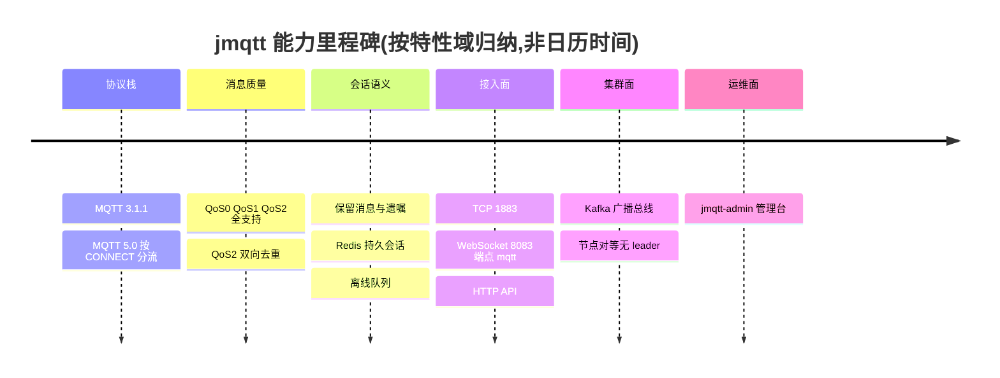
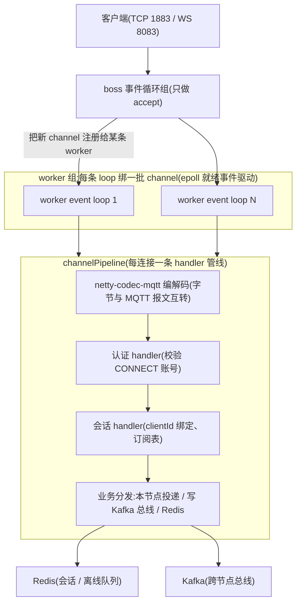
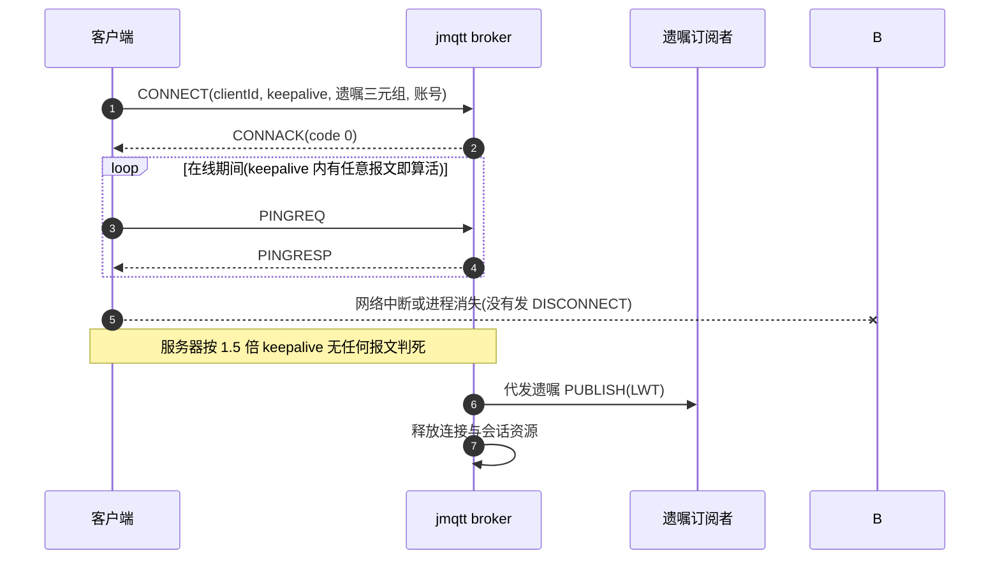
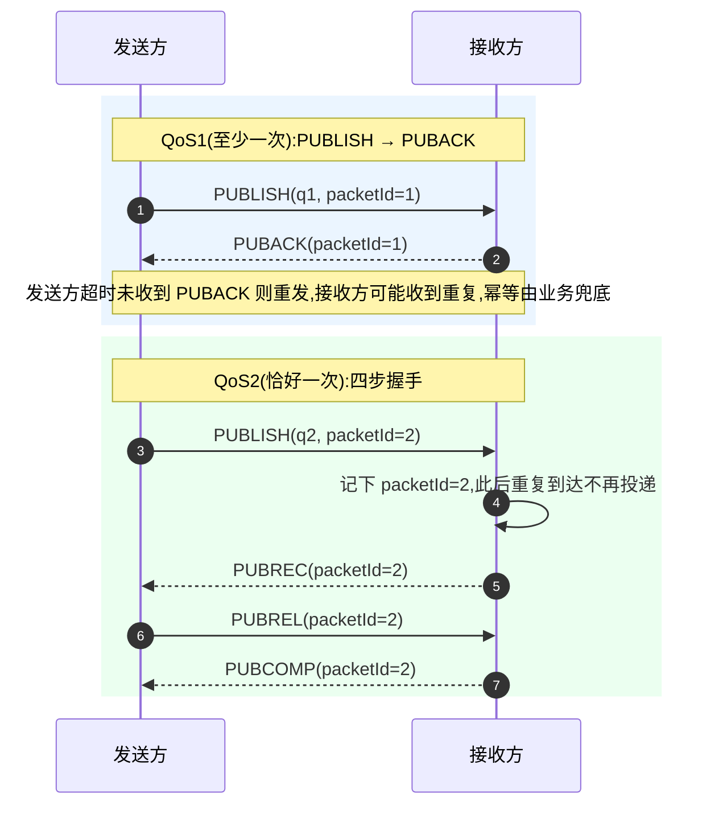
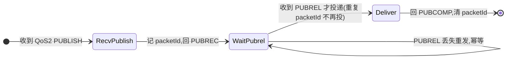
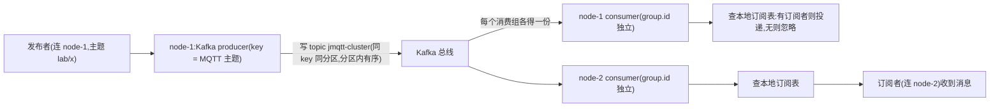
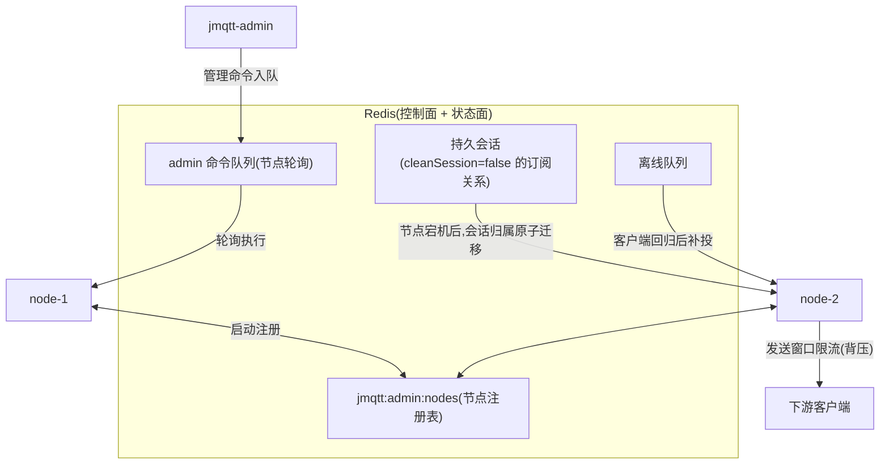

# jmqtt 部署与运维(jmqtt-broker + jmqtt-admin)

> - **版本基线**:jmqtt-broker / jmqtt-admin `main@028f439`(0.1.0-SNAPSHOT,自建镜像;上游 Spring Boot 2.7.18 + Java 21)。**本项目是笔者自己的开源作品**,本文档集是第一份基于真机实测的运维手册。
> - **实测环境**:PVE 虚机 jmqtt-1/2(10.10.12.137/138,4C/8G,`--net=host`),依赖复用本实验场的 Redis(137 本机)与 Kafka(10.10.12.128),2026-10-01。**实测覆盖**:镜像构建、单机部署、MQTT 协议功能矩阵(QoS1/2、保留、遗嘱、WS、认证)、双节点集群(跨节点路由经 Kafka 总线)、节点宕机自治、admin 构建部署与 **UI 真浏览器验证**。
> - **重要**:实测发现两个上游缺陷(QoS2 下行断连、deploy 镜像 logs 目录权限),详见第 3 篇与第 1 篇——**在修复发布前,本文对应的部署命令均带绕过措施**。

## 文章索引

| 编号 | 文章 | 内容 | 状态 |
| --- | --- | --- | --- |
| 1 | [安装部署-单机](1.安装部署-单机.md) | 构建、镜像、依赖、启动(含 logs 坑) | ✅ 已实测 |
| 2 | [参数与配置](2.参数与配置.md) | 六组参数、env 占位与覆盖机制 | ✅ 已实测 |
| 3 | [MQTT功能矩阵实测](3.MQTT功能矩阵实测.md) | QoS/保留/遗嘱/WS/认证 + QoS2 缺陷 | ✅ 已实测 |
| 4 | [集群部署](4.集群部署.md) | 双节点、跨节点路由、宕机自治 | ✅ 已实测 |
| 5 | [jmqtt-admin](5.jmqtt-admin.md) | 构建、Redis 覆盖、UI 验证 | ✅ 已实测 |
| 6 | [日常运维与排障](6.日常运维与排障.md) | 排障字典(实测错误集) | ✅ 已实测 |

## 阅读路径

从零搭:1 → 2 → 3(单机闭环)→ 4(集群)→ 5(管理台);接手在跑的:6 → 5。

## 组件介绍

> jmqtt 是笔者对"理想 MQTT broker"的一次亲手作答:EMQX 们功能全但体量重,开源里"Java 技术栈 + 集群可控 + 会话持久化"三样齐的找不到,那就自己写——Netty 管网络,Kafka 管集群总线,Redis 管会话。

### 诞生背景

jmqtt 是笔者自己的 Apache-2.0 开源项目——**项目起始时间以仓库提交历史为准,本文不杜撰**。

IoT 对消息中间件的要求与传统 MQ 很不相同:海量设备、弱网长连接、上行远多于下行、单条消息小、离线与唤醒是常态。MQTT 协议用极少的报文(CONNECT / PUBLISH / SUBSCRIBE / PINGREQ)加上分级 QoS、遗嘱、保留消息,成了 IoT 接入的事实标准;3.1.1 是最普及的版本,5.0 补齐了原因码等现代化特性。

选型背景:生产在用的 EMQX 这类商用方案功能全但体量重;开源实现里"Java 技术栈、集群可控、会话持久化"三样齐的并不多。于是自研:Java 21 + Spring Boot 2.7 做容器与配置面;**Netty 做网络面**,编解码直接用官方 netty-codec-mqtt,不自己造协议轮子。协议面 3.1.1 / 5.0 双栈按 CONNECT 分流;接入面 TCP、WebSocket(`/mqtt`)、HTTP API;状态面交 Redis(持久会话、离线队列);集群面交 Kafka(广播总线);管理面配 jmqtt-admin。

性能口径为**笔者的 README 自述**:单节点 8C16G 30 万持久连接、上行 5k TPS 零丢失——笔者尚未在本文档环境复测。

> ⚠️ **复测环境不具备(2026-10-09 核实)**:jmqtt-bench 是全链路闭环压测(需 Kafka + backend + Redis + 双 8C 设备机,broker 规格要求 8C16G/JVM 12G),本实验室两台 8G VM 无法承载 30 万连接口径的复测——保留待专环境执行。
> ✅ **小规模冒烟已补**(2026-10-09,jmqtt-1):单订阅者 100 条 QoS1 串行发布,**100/100 无丢失、顺序完整**(msg-1…msg-100),全程 1.67s;keepalive 判死(下)与 PING/重连等基础面同日复核正常。

### 功能特色

| 功能 | 说明 | 语法/入口 |
| --- | --- | --- |
| 双协议栈 | MQTT 3.1.1 与 5.0,按 CONNECT 报文分流 | TCP `1883` / WS `8083 /mqtt` |
| QoS0/1/2 | 完整握手;QoS2 收发双方各去重 packetId | 客户端 `-q 0/1/2` |
| 保留消息 | 新订阅者立即收到该主题末值 | `mosquitto_pub -r` |
| 遗嘱(LWT) | 非正常断连时由 broker 代发 | CONNECT 报文遗嘱三元组 |
| WebSocket | 浏览器直连,与 TCP 互通 | `8083` 端点 `/mqtt` |
| 认证 | 实测默认账号 jmqtt/jmqtt | `-u jmqtt -P jmqtt` |
| 持久会话 / 离线队列 | Redis 存会话与离线消息,断连期间不丢 | 配置 Redis 连接(第 2 篇) |
| 发送窗口背压 | 慢客户端限窗,保护节点内存与事件循环 | 配置项(第 2 篇) |
| Kafka 集群总线 | 每节点独立 group.id 广播;producer 按 MQTT 主题为 key 保序 | topic `jmqtt-cluster` |
| HTTP API / 管理台 | 管理面命令与 UI | jmqtt-admin(第 5 篇) |
| 性能 | 8C16G 单节点 30 万持久连接、上行 5k TPS 零丢失(**笔者自述**) | 复测环境不具备;小规模冒烟 100/100 无损(2026-10-09) |

### 使用速查

实测命令(mosquitto 容器客户端,**一律显式 `-i <clientId>`**):

| 场景 | 命令 |
| --- | --- |
| 发布(QoS1) | `docker run --rm --net=host eclipse-mosquitto:2 mosquitto_pub -h <broker> -i my-client-1 -t lab/qos1 -m "hello" -q 1 -u jmqtt -P jmqtt` |
| 订阅一条即退 | `mosquitto_sub -h 127.0.0.1 -i lab-sub-1 -t lab/t1 -q 1 -C 1 -W 10 -u jmqtt -P jmqtt` |
| WebSocket 订阅 | WS 客户端连 `8083` 的 `/mqtt` 端点(实测 TCP 发布、WS 订阅互通) |
| 看集群节点注册 | `docker exec jmqtt-redis redis-cli SMEMBERS jmqtt:admin:nodes` |
| 集群节点命名 | 每节点唯一 `JMQTT_ID`(node-1 / node-2),其余 env 一致 |
| 客户端纪律 | 空 clientId 被拒(CONNACK code 2,实测);必须显式带 id |

### 核心原理

#### 1. Netty 事件循环:一条连接的一生

Netty 的线程模型是 reactor 变体:**boss 组**只负责接受新连接,接受完就把 channel 注册给某个 **worker 事件循环**;每条事件循环是单线程,靠 epoll 就绪事件驱动,绑一批 channel——**同一条连接的所有读写与处理都在同一条线程上串行完成**,会话内状态天然免锁,这是 broker 高连接密度的根基。

每条连接挂一条 channelPipeline:首位是官方 **netty-codec-mqtt** 编解码(字节流 ↔ MQTT 报文),后接认证、会话、业务分发等 channelHandler,按序经过;协议栈分流(3.1.1 / 5.0)在 CONNECT 解码后决定。WebSocket 与 TCP 共用同一套管线模型,差别只在传输层——第 3 篇实测 TCP 发布、WS 订阅互通即是证明。

线程数与连接数解耦:worker 事件循环数量按 CPU 核数量级规划,不随连接数增长——笔者 README 口径的 30 万持久连接也只需少量线程。通用纪律:**channelHandler 里不能阻塞**(同步 IO、慢调用),否则同 loop 上所有连接一起卡顿;jmqtt 把跨节点消息交给 Kafka producer 异步发送、状态读写交给 Redis,事件循环内只做编解码与投递编排;发送窗口背压(见第 5 小节)是给慢客户端上的第二道保险。

#### 2. 连接生命周期与 keepalive

MQTT 建连只需一对报文:**CONNECT / CONNACK**。clientId、keepalive(秒)、cleanSession、遗嘱三元组(主题 / QoS / payload)、账号密码全在 CONNECT 里,broker 校验后回 CONNACK;code 0 才算入网。

**keepalive 判死**:客户端承诺 keepalive 秒内有报文(业务报文也算,不必等 PINGREQ);静默期用 PINGREQ 探活、broker 回 PINGRESP;**服务器按"超过 1.5 倍 keepalive 无任何报文"判死**——这是协议给服务端的边界。**遗嘱**只在非正常断连时由 broker 代发(keepalive 超时、网络断、协议错误);客户端主动发 DISCONNECT 优雅退出则不发遗嘱。第 3 篇实测:kill 客户端后,订阅者收到遗嘱消息 `device-7-offline`。

**保留消息**与遗嘱互补:保留是"给未来的订阅者补看末值"(实测发布后新订阅者立即收到 `sticky-value`),遗嘱是"掉线即广播"。

两个边界:keepalive 为 0 表示不启用判活(长稳链路自行保活);遗嘱与保留按客户端在 CONNECT / PUBLISH 里声明的 QoS 投递。规范对 3.1.1 空 clientId 的态度是服务端应代为分配、不允许一拒了之——jmqtt 实测直接拒绝(CONNACK 2),属**实现选择**,对应的客户端纪律就是一律显式 `-i`(第 3 篇)。

> ✅ **keepalive 判死已实测**(2026-10-09):裸 TCP 客户端(CONNECT keepalive=60 + 遭嘱,认证后**完全静默**),broker 在 **90.1 秒**关闭连接——精确 1.5×keepalive(60×1.5=90),遗嘱 `ka/will "silent-gone"` 同步投递给订阅者。
> **实测方法坑**:mosquitto 客户端库**自己会发 PINGREQ**,拿它当"静默客户端"永远测不出判死——必须裸 TCP 手搓 CONNECT 后不发任何包。

#### 3. QoS1 / QoS2 消息握手状态机

三个 QoS 等级是"重复"与"开销"的阶梯:**QoS0** 发完即忘;**QoS1** 一次 PUBLISH + 一次 PUBACK,发送方超时重发,换"至少一次"、代价是可能重复;**QoS2** 四步:PUBLISH → PUBREC → PUBREL → PUBCOMP,收发双方**各自对 packetId 去重**,换"恰好一次"。packetId 是 16 位标识,只在同一方向的在途报文范围内唯一;接收侧状态机的关键是"先记 packetId、回 PUBREC,收到 PUBREL 才真正投递"——重复到达的 PUBLISH 在 PUBREL 之前就被去重掉了。

实测衔接(第 3 篇):发布侧(客户端 → broker)四步握手完整(RC:0);**下行存在缺陷**——订阅者收 QoS2 消息时,broker 在收到订阅端 PUBREC 后、发出 PUBREL 前关闭了连接:broker 日志 `本地投递=1` 后 17 毫秒订阅者连接被断,干净关闭无异常栈,4/4 复现。修复发布前的运维口径:业务侧统一 QoS1、网关打开 QoS2 降级开关、修复后重跑第 3 篇矩阵。

排障视角的分层预期:QoS0 丢即无迹;QoS1 的重复要靠业务幂等吸收,消费端按 at-least-once 设计;QoS2 出问题先看四步卡在哪——第 3 篇正是用订阅端 debug 抓包加 broker 日志的 17 毫秒时间差,定位到断连发生在 PUBREL 之前。

#### 4. Kafka 广播总线:跨节点路由

jmqtt 集群**节点对等、无 leader**:每个节点都能接受发布与订阅,跨节点的 pub/sub 全量经 Kafka 总线 topic `jmqtt-cluster` 转发。

**广播的实现**靠 Kafka 消费组语义:每个节点以**独立 group.id** 加入消费——Kafka 按组各投一份,于是每个节点都拿到全量消息;节点收到后再查本地订阅表,有订阅者才投递,没有就只当路由信息丢弃。**保序**靠 producer 以 **MQTT 主题为 key**:同 key 落同一分区、分区内有序,同一主题的跨节点顺序不乱。`broadcast-filters` 可收敛广播范围,配合 admin 的"跨节点订阅重叠检查",避免静默收不到。

与 MGR(单主共识)、KRaft(多数派元数据)都不同:**jmqtt 的元数据面就是 Redis/共享件**,天然无脑裂窗口——共享件活,集群就活。第 4 篇实测:订阅者连 node-2、发布到 node-1,订阅者收到 `cross-node-via-kafka`,日志可见 `from=node-1 topic=lab/cluster/msg 本节点投递=1`。上行数据面(uplink-topic,上行消息镜像进独立 topic)默认关闭、未实测。

代价与容量:全量广播意味着节点要消费与自己无关的消息再丢弃;**共享件的容量就是集群的天花板**——Redis 按本实验场哨兵基线、Kafka 按 RF=2 基线(第 4 篇)。

#### 5. Redis 控制面:会话、离线队列与背压

Redis 在架构里是**共享状态面**,四类内容:**节点注册表**(`jmqtt:admin:nodes`,实测 `SMEMBERS` 返回 node-1 / node-2 两 memberId);**持久会话**(cleanSession=false 的订阅关系,断连后仍存活);**离线队列**(断连期间为持久会话暂存消息,客户端回归后补投);**admin 命令队列**(管理台命令入队、各节点轮询执行——控制面消息也走共享件,不在节点间开直连通道)。

**会话归属原子迁移**:节点宕机后,它名下的会话在 Redis 中被原子地移交给幸存节点,配合每节点独立 group.id 的总线广播,订阅关系不因节点故障丢失——第 4 篇 `docker stop node-1` 后 node-2 独立收发正常(survivor-ok)即此机制的外显。

**发送窗口背压**:向慢客户端的下行在途报文按窗口限额,窗满则暂缓并把消息留驻离线队列——防止一个慢消费者堆爆内存、拖垮所在 worker 事件循环。排障时可据此区分"下游慢"与"broker 慢",再对照第 6 篇排障字典按现象索引。

### 与本文档集的衔接

| 原理点 | 实测印证 | 文章 |
| --- | --- | --- |
| 空 clientId 处理 | CONNACK code 2(identifier rejected),4/4——MQTT 3.1.1 规范不允许服务端拒绝空 clientId 的 3.1.1 客户端(服务端应代为分配),jmqtt 选择直接拒绝,属**实现选择**,如实记录 | [第 3 篇 MQTT功能矩阵实测](3.MQTT功能矩阵实测.md) |
| 遗嘱 / 保留 | kill 客户端后订阅者收到遗嘱 `device-7-offline`;新订阅者立即收到保留值 `sticky-value` | [第 3 篇 MQTT功能矩阵实测](3.MQTT功能矩阵实测.md) |
| QoS2 握手 | 发布侧四步完整(RC:0);**下行缺陷**:订阅侧 4/4 复现断连,`本地投递=1` 后 17 毫秒关闭 | [第 3 篇 MQTT功能矩阵实测](3.MQTT功能矩阵实测.md) |
| Kafka 广播总线 | 跨节点发布订阅实测(`cross-node-via-kafka`);节点宕机自治 survivor-ok;节点注册表两条 | [第 4 篇 集群部署](4.集群部署.md) |
| WebSocket / 双栈 | TCP 发布 → WS 订阅者收到 `cross-tcp-ws` | [第 3 篇 MQTT功能矩阵实测](3.MQTT功能矩阵实测.md) |
| 部署坑 | deploy 镜像 logs 目录权限;镜像 save → scp → load 分发 | [第 1 篇 安装部署-单机](1.安装部署-单机.md) |
| 管理面 | admin 构建、Redis 覆盖、UI 真浏览器验证 | [第 5 篇 jmqtt-admin](5.jmqtt-admin.md) |

排障时先定位"哪一层"(Netty 接入 / 会话与 keepalive / QoS 握手 / Kafka 总线 / Redis 状态面),再到第 6 篇字典按现象索引。

> ✅ **MQTT 5.0 支持面已实测**(2026-10-09):`mosquitto_sub -V 5` 连接直接报 **"A network protocol error occurred when communicating with the broker"**——**jmqtt 不支持 MQTT 5.0 协议层**(v3.1.1 同参数连接正常)。原因码/会话过期/消息过期/共享订阅等 5.0 特性面整体不可用,矩阵以 3.1.1 为界是**协议现实**而非待补测试;v5 需求出现前无动作项。

## 资料索引(上游)

- jmqtt-broker:https://github.com/passiolin/jmqtt-broker(README + docs/configuration.md)
- jmqtt-admin:https://github.com/passiolin/jmqtt-admin
- 压测工具 jmqtt-bench:仓库内 `jmqtt-bench/`(未实测)
- MQTT 3.1.1 / 5.0 规范:http://docs.oasis-open.org/mqtt/mqtt/v3.1.1/

## 关联

- 依赖组件的部署与排障 → [../redis/](../redis/README.md)、[../kafka/](../kafka/README.md);
- EMQX(生产在用的商用同位替代)巡检见 inspect-middleware;jmqtt 的巡检项积累期后按新增组件流程补 references/jmqtt.md。

## 新增与修改

本篇结论全部出自笔者实测;上游代码变更后跟版复核——QoS2 缺陷修复后,第 3 篇的协议矩阵要整表重跑。
