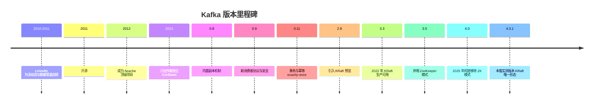
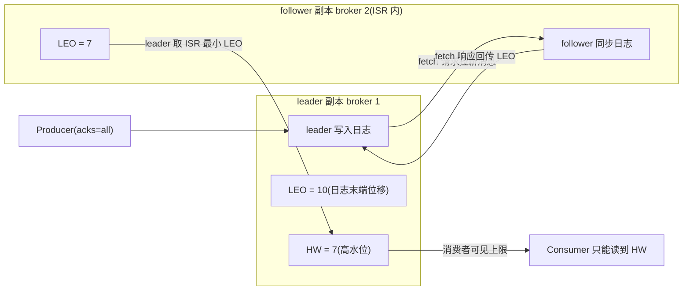
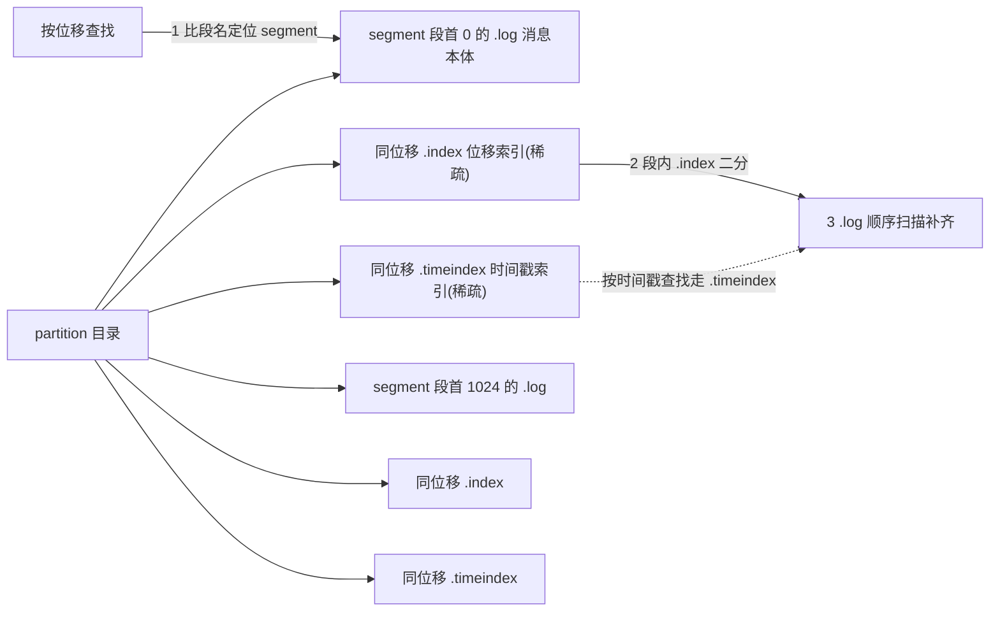
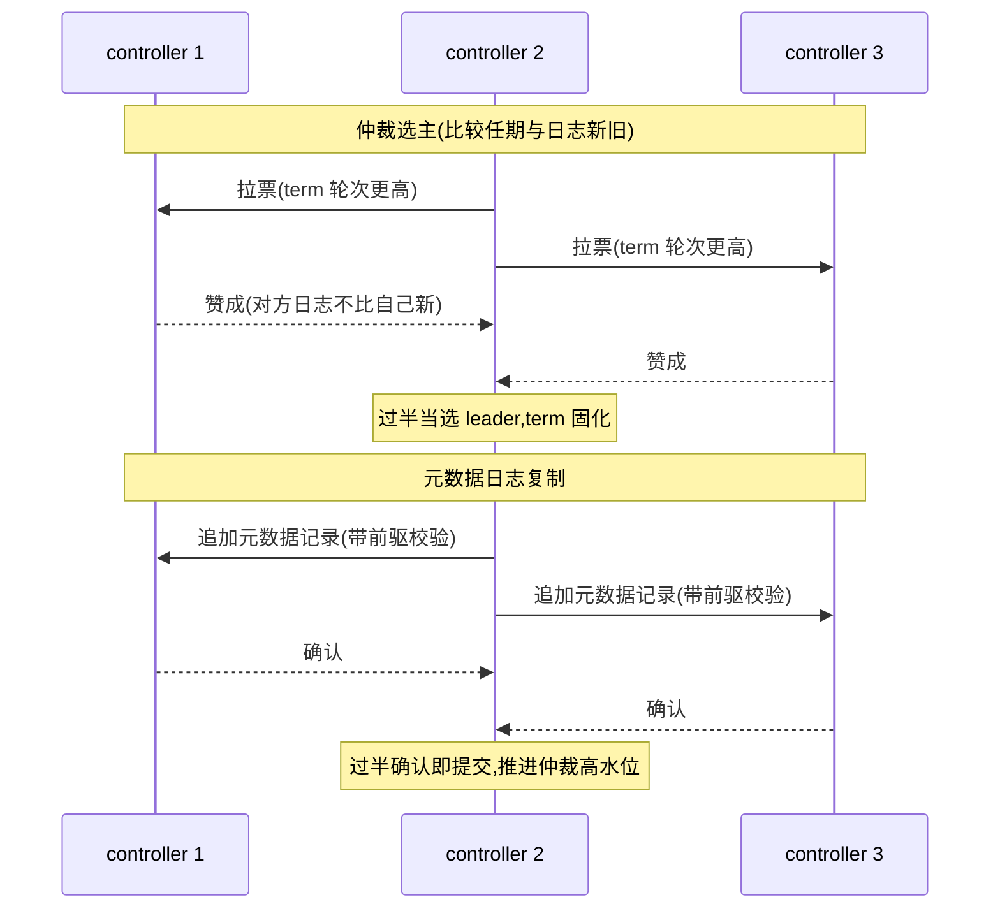
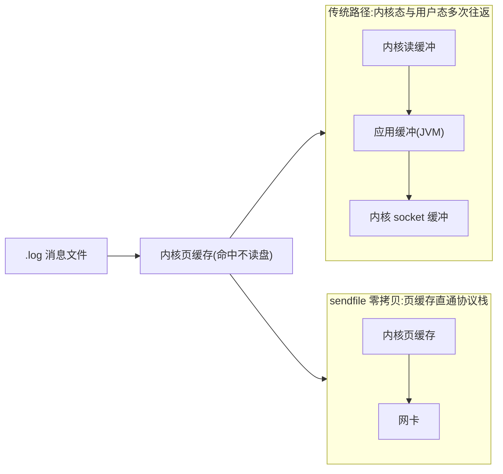
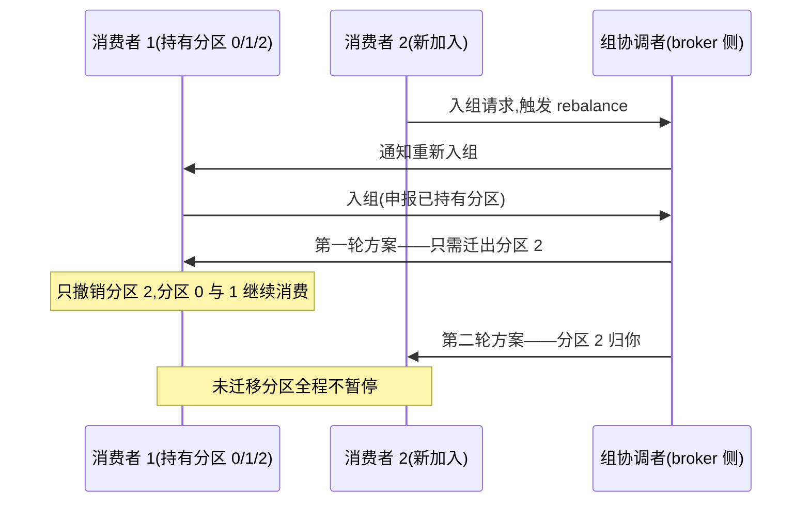

# Kafka 部署与运维(kafka)

> - **版本基线**:Kafka 4.3(实测 4.3.1,官方镜像 `apache/kafka:4.3.1`,**KRaft 模式,无 ZooKeeper 依赖**)。与巡检文档(4.3.1)同版本。老 README 的 2.8.2 + ZooKeeper 形态已被本文取代。
> - **实测环境**:PVE 虚机 kafka-1/2/3(10.10.12.128/129/130,4C/4G,`--net=host`),2026-10-01。**实测覆盖**:KRaft 仲裁、topic/副本/ISR、生产消费与 offset/lag、杀 broker(Leader 迁移 + ISR 收缩 + 单副本可写 + 回归)、kafka_exporter(385 指标)。**kafka-3 于 2026-10-09 正式并入三节点**(此前该机残留单机实验集群与仲裁幽灵 voter,清理过程见第 2 篇),分区重分配/时间戳回溯/页缓存/协作式 rebalance 随之实测。
> - **参数基线**:[conf/](conf/) 双层 env(`kafka-common.env` 三台一致 + `gen-node-env.sh` 注入节点差异)。

## 文章索引

| 编号 | 文章 | 内容 | 状态 |
| --- | --- | --- | --- |
| 1 | [安装部署-单机](1.安装部署-单机.md) | 单节点 KRaft(自举仲裁、RF=1) | ✅ 已实测 |
| 2 | [安装部署-KRaft集群](2.安装部署-KRaft集群.md) | CLUSTER_ID、env 双文件、uid 坑 | ✅ 已实测 |
| 3 | [参数基线与配置模板](3.参数基线与配置模板.md) | 六组参数、副本与 ISR 语义 | ✅ 已实测 |
| 4 | [数据面:topic 与收发](4.数据面topic与收发.md) | 建 topic、生产消费、lag | ✅ 已实测 |
| 5 | [容灾实测](5.容灾实测.md) | 杀 broker 全流程 | ✅ 已实测 |
| 6 | [日常运维与排障](6.日常运维与排障.md) | 排障字典(实测错误集) | ✅ 已实测 |
| 7 | [监控与告警](7.监控与告警.md) | kafka_exporter、K 编号对齐 | ✅ 已实测 |

## 阅读路径

从零搭:1(单机)→ 3 → 4(单机闭环)→ 2 → 5(进集群);接手在跑的:6 → 7。

## 组件介绍

> Kafka 是**分布式提交日志**:生产者顺序追加、消费者按位移拉取(pull),消息落盘 + 多副本即持久化——一套系统同时充当消息队列、存储与流处理底座。本套基线 4.3.1,KRaft 模式(ZK 模式已随 4.0 移除)。

### 诞生背景

2010~2011 年,LinkedIn 为**活动流与数据管道**自研了 Kafka——作者 Jay Kreps、Neha Narkhede、Rao Jun;名字取自作家 Franz Kafka,寓意系统要像卡夫卡的笔一样"高性能而枯燥地"运转。2011 年开源,2012 年成为 Apache 顶级项目,2014 年三位作者创立 Confluent。

本套实测的 4.3.1 已是 KRaft 唯一形态:**没有外挂 ZK 的 2181 口**——老文档、老监控的 ZK 探活项退役(第 2 篇坑 4)。

### 功能特色

| 能力 | 说明 | 本套锚点 |
| --- | --- | --- |
| 高吞吐持久化 | 顺序追加写盘;消息按保留策略存放,可反复重放 | 第 4 篇 `--from-beginning` |
| 分区并行 | topic 切分区;**分区内有序,跨分区无序** | 第 4 篇 sticky 分区实测 |
| 多副本与 ISR | RF 副本、ISR 动态收缩/回归;故障时读写语义可控 | 第 5 篇杀 broker |
| 拉模式消费 | 消费者 pull,自控节奏、按位移重放 | 第 4 篇 |
| 消费者组 | 组内分摊分区;offset 提交管理进度,lag 可对账 | 第 4 篇(K02) |
| 事务与幂等 | 0.11 起跨分区 exactly-once 语义 | 通用能力,本套未实测 |
| KRaft 自治元数据 | 元数据即事件日志,controller 多数派仲裁 | 第 2 篇 quorum describe |
| 监控生态 | JMX 全量指标,exporter 直出 | 第 7 篇(385 指标) |

### 使用速查(bin 脚本)

铁律:镜像内脚本在 `/opt/kafka/bin/`(不在 PATH);`--bootstrap-server` 指 9092;CLI 一律 `timeout` 包装(第 2 篇坑 3)。

| 脚本 | 用途 | 常用参数 |
| --- | --- | --- |
| `kafka-topics.sh` | topic 建删查 | `--create --topic t --partitions 3 --replication-factor 2`;`--describe --topic t`;`--list` |
| `kafka-console-producer.sh` | 命令行生产 | `--topic t`;stdin 管道必须 `docker exec -i`(第 4 篇坑) |
| `kafka-console-consumer.sh` | 命令行消费 | `--from-beginning --group g --max-messages N --timeout-ms ms` |
| `kafka-consumer-groups.sh` | 消费组与 lag 对账 | `--describe --group g`(K02);`--reset-offsets` 重置位点 |
| `kafka-metadata-quorum.sh` | KRaft 仲裁状态 | `describe --status`——LeaderId/CurrentVoters(K06) |
| `kafka-log-dirs.sh` | 各 broker 日志目录占用 | `--describe --topic-list t`(磁盘排障) |
| `kafka-configs.sh` | broker/topic/用户动态配置 | `--describe --all`;`--alter --add-config k=v` |
| `kafka-broker-api-versions.sh` | broker 清单与 API 版本 | `--bootstrap-server`(第 2 篇验证) |
| `kafka-leader-election.sh` | 优先选举,leader 回迁 | `--election-type preferred --all-topic-partitions`(第 5 篇) |
| `kafka-reassign-partitions.sh` | 分区重分配,扩容均衡 | `--reassignment-json-file plan.json --execute`(K10) |

### 核心原理

#### ISR 与水位线(LEO/HW)

每个副本维护两个位移:**LEO**(Log End Offset,日志末端位移——下一条待写位置)与 **HW**(High Watermark,高水位——已复制到 ISR 全体副本的消息上限)。**消费者只能读到 HW 以下**;leader 已写入但过不了 HW 的消息,视作"还没站稳"。

HW 的推进权在 leader:leader 依赖 **ISR 副本的 fetch 回传**——取 **ISR 中最小 LEO** 推进 HW,慢副本会拖住全体消费者的可见上限。ISR 本身动态进出:`replica.lag.time.max.ms` 内没跟上 leader 的副本被踢出(踢出后 HW 不再等它),追平后自动回归。acks 与 `min.insync.replicas` 把这套机制暴露成用户开关:

| 配置 | 语义 | 杀 1 台 broker 时 |
| --- | --- | --- |
| `acks=0` | 发出即忘 | 最快;故障窗口内消息丢 |
| `acks=1` | leader 落盘即确认 | leader 挂且未同步的消息可能丢 |
| `acks=all` + `min.insync.replicas=1` | ISR 至少 1 副本可写 | **本套基线**:读写双可用,存在丢失窗口 |
| `acks=all` + `min.insync.replicas=2` | ISR 至少 2 副本才可写 | 写入报 NotEnoughReplicas——保一致、弃可用 |

**实测衔接**(第 5 篇):`docker stop` kafka-1 后 12 秒,三分区 Leader 全迁 broker 2,**ISR 从 [1,2] 收缩为 [2]**;minISR=1 使单副本仍可写;128 回归后副本自动追平、ISR 回到 [1,2]。

#### 稀疏索引与日志分段

partition 在磁盘上不是一个文件,而是一族 **segment** 段:默认 `segment.bytes=1GB` 滚一段,段文件名即段首消息位移。每段三件套:`.log` 消息本体、`.index` 位移索引、`.timeindex` 时间戳索引。

**两个索引都是稀疏的——并非每条消息建索引项**(默认 `index.interval.bytes=4096`,即每写 4KB 日志追加一条索引项)。代价与收益:定位要"索引 + 顺序扫几条";换来索引文件极小、可整体常驻内存,二分查找不碰盘。查找路径:位移 → 比段名定位 segment → 段内 `.index` 二分取 ≤ 目标位移的最近索引项 → `.log` 顺序扫描补齐。`.timeindex` 记录"时间戳 → 位移",服务按时间定位:时间回溯消费、按时间保留策略的删除都依赖它。

> ✅ **timeindex 按时间戳回溯已实测**(2026-10-09):三批消息分时刻写入(批A 0-199 / 批B 200-399 / 批C 400-599),`kafka-get-offsets.sh --time <epochMillis>` 把分界时刻精确换算到 **offset 200(批B 起点)**,按该位移消费到末尾恰好 400 条;`.timeindex` dump 可见稀疏条目(ts→offset:137/199/268/337/399/468/537)。**两个实测坑**:① 4.3.1 的 `kafka-console-consumer --offset` **只认 earliest/latest/数字**——网传的"直接传 datetime"姿势不存在,必须走 get-offsets 两步换算;② 指定位移消费必须同时给 `--partition`。

#### KRaft:元数据即事件日志

KRaft 把集群元数据(topic/broker/配置的每次变更)写成一条**事件日志**,由若干 controller 组成仲裁(quorum)复制;broker 从仲裁消费已提交的元数据。仲裁协议是 **Raft 变体**,三个关键词:**任期**(LeaderEpoch 单调递增,旧 leader 复活也抢不走权)、**日志匹配**(复制时校验前驱记录,保证元数据日志全局一致)、**多数派提交**(过半确认才推进仲裁 HW,broker 只生效 HW 以下的元数据)。

与 ZK 模式对比:老架构元数据外挂在 ZK ensemble,controller 故障转移要经 ZK 会话失效/重选;KRaft 把元数据日志内置进 Kafka 自身,少一层外挂系统与切换链路——3.5 弃用 ZK 模式、4.0 彻底移除。**实测衔接**:第 2 篇 `describe --status` 输出 `LeaderId: 2 / LeaderEpoch: 1 / HighWatermark: 731`,CurrentVoters 三台齐;第 5 篇:仲裁 3 选 2,杀 1 台元数据多数派仍在、集群自治;同时挂 2 台全集群停摆——容错边界就是 1 台。

#### 零拷贝与页缓存

Kafka 吞吐三件套:**顺序写、页缓存、sendfile**。写入只追加;消费读优先命中操作系统**页缓存**——追平/近实时消费大概率不落盘;把消息发给消费者走 **sendfile 零拷贝**:数据从内核页缓存直通协议栈/网卡,**不进 broker 的 JVM 堆**,省掉内核态与用户态之间的反复拷贝。推论:broker 堆不必装下数据量——本套 4C/4G 虚机即可承载实验流量;但也要留心"数据全在页缓存"的错觉:冷读/重启后首轮消费仍要读盘,压测看冷热两面。

> ✅ **页缓存命中已实测**(2026-10-09):200000×256B(≈50MB,RF=1)写入后,`drop_caches` 前后各消费一轮,dm-0 磁盘读增量**冷 162MB → 热 0MB**——热读全程命中页缓存,磁盘读计数是命中判定的硬证据。注意吞吐列受 CLI JVM 冷启动扰动(冷 17.4 vs 热 11.5 MB/s,方向都反了),**不能拿吞吐比命中率**;观测姿势:容器内 `kafka-consumer-perf-test` + 宿主 `/proc/diskstats` 扇区差分(LVM 设备在 diskstats 里叫 dm-0,不叫 mapper 名)。

#### 消费者组与 rebalance

一个消费组瓜分 topic 全部分区,同一分区同一时刻只归组内一个消费者;成员增减触发 **rebalance** 重新分配。老协议(eager)一刀切:全员撤销、暂停消费、等新方案落定;**2.4 起增量协作式(cooperative)**分两轮:先算出必须迁移的少数分区,只撤销这些、其余照常消费;第二轮再把让出的分区分给新主人——停顿窗口显著收敛。进度与分配用 `kafka-consumer-groups.sh --describe` 对账(第 4 篇实测的 CURRENT-OFFSET/LOG-END-OFFSET/LAG 三列)。

> ✅ **增量协作式 rebalance 两轮收敛已实测**(2026-10-09,device-events 3 分区 + `CooperativeStickyAssignor` 两个 console consumer):
> - T0:c1(c1-lab)独占 0/1/2;c2 加入后 **+4s 快照:c1 仍持有 0/1 且未停顿,仅分区 2 已归 c2**——增量协作式的签名画面(eager 此刻会让 c1 全量退出,describe 会出现全员空窗);
> - +14s 收敛稳定为 c1(0,1)/ c2(2);再杀 c1,8s 内 c2 接管全部 0/1/2;
> - 观测姿势:`kafka-consumer-groups --describe` 间隔快照对比 CONSUMER-ID 列(用 `client.id` 前缀区分成员);console consumer 默认日志级别抓不到协作式日志行,快照差分就是证据。另:4.3 启动时提示 **KIP-848 新消费再均衡协议(group.protocol=consumer)已生产可用**,新集群可评估,本基线仍用 classic + cooperative。

### 与本文档集的衔接

- **ISR/水位线**:参数语义 → [第 3 篇](3.参数基线与配置模板.md);实测 → [第 5 篇](5.容灾实测.md):杀 kafka-1 后 12 秒 Leader 迁移、**ISR [1,2]→[2]**、单副本可写(minISR=1)、回归自动补齐;
- **KRaft 仲裁**:[第 2 篇](2.安装部署-KRaft集群.md) `quorum describe --status` 实测输出(LeaderId: 2 / LeaderEpoch: 1 / HighWatermark: 731);
- **数据面**:sticky 分区、offset/lag 对账 → [第 4 篇](4.数据面topic与收发.md);
- 老组件仍需 ZK 的 → [../zookeeper/](../zookeeper/README.md)。

## 资料索引

- 官方文档:https://kafka.apache.org/documentation/
- KRaft 模式:https://kafka.apache.org/documentation/#kraft
- 官方镜像用法:https://hub.docker.com/r/apache/kafka
- 配置项大全:https://kafka.apache.org/documentation/#brokerconfigs(链接为主,不整本入库,同 MySQL 篇纪律)

## 关联

- **巡检**:K01~K12 命令面/阈值见 [skills/巡检/inspect-middleware/references/kafka.md](../../skills/巡检/inspect-middleware/references/kafka.md);第 7 篇以 K 编号对齐指标面;
- 老 ZooKeeper 模式组件仍需 ZK → [../zookeeper/](../zookeeper/README.md);
- kafdrop(旧 UI)可继续用,另见其目录。

## 新增与修改

同 MySQL 篇纪律:先实测再入文;参数唯一真源是 [conf/kafka-common.env](conf/kafka-common.env)。
