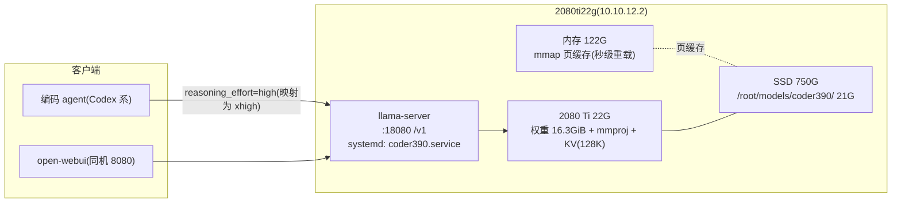

# llama.cpp 本地推理 2080ti22g（Coder390-27B）

## 一、部署了什么

2080ti22g（PVE 虚拟机，RTX 2080 Ti 22G 魔改）上跑一个本地代码大模型服务：llama.cpp 的 `llama-server` 承载 **Qwen3.8-27B-Coder390**（HuggingFace 用户 nerkyor 发布、魔搭 Merkyor 镜像的微调模型，Apache-2.0，带 uncensored 标签），全部权重进显存，对外暴露 OpenAI 兼容 API，systemd 开机自启。



接入参数（2026-10-10 实测可用）：

```text
Base URL:  http://10.10.12.2:18080/v1
API Key:   存放于目标机 /root/.coder390-api-key
模型名:    Coder390-27B（-a 别名，请求里填什么都会被接受）
能力:      文本 + 图像输入，131072 上下文，生成 ~25 tok/s，prompt ~750 tok/s
```

## 二、为什么是这个模型、这种部署形态

### 2.1 选型依据：Qwen3.8-27B-Coder390

- 代码向微调，模型作者（nerkyor）公布的 GGUF 各档自测（GPQA/MMLU/LCB 三基准）里量化档位差距在噪声级：Q3 为 173/449/92，Q6_K 为 174/448/91，Q8 为 171/443/90——**Q3 和 Q6 打平，MMLU 和代码基准上 Q3 反而略高**；
- 稠密 27B（GGUF 元数据 n_params=27.32B），qwen35 架构，训练上下文 262144，支持图像/视频输入（mmproj 629M）；
- 魔搭镜像完整（GGUF 目录逐文件核对过），国内下载 ~60MB/s，SHA256SUMS 校验通过。

### 2.2 关键取舍：不做「Strata 式」内存分层

最初的需求是"照 Strata 的思路把权重摊到内存+硬盘，跑尽可能强的"。实测后放弃，原因在稠密与 MoE 的差别：

| | Strata 方案（Qwen3.8-Flash-Next 125B MoE） | 本部署（Coder390 稠密 27B） |
| --- | --- | --- |
| 每 token 读取量 | 只激活 24576 专家中的 10 个，冷专家放内存几乎不亏 | 全部 16.3GiB 权重 |
| 内存分层的代价 | 无感（30 tok/s 实测） | 分出多少慢多少：内存带宽 ~50GB/s vs 显存 ~600GB/s |
| 换来的收益 | 125B 的能力 | 无——Q3≈Q6≈Q8 已证明显存放得下的档位质量持平 |

结论：稠密模型上"Strata 思路"的唯一正确翻译是**显存吃满、内存做 mmap 页缓存（重启秒级加载）、磁盘只做持久化**。122G 内存在这套部署里的角色是页缓存和系统余量，不硬塞权重。

### 2.3 量化档位：Q3LynnStyle-Q8MTP（17.5G）

22G 显存的对号入座（模型作者同表）：

| 档位 | 体积 | 22G 卡结论 |
| --- | --- | --- |
| Q6_K-MTP | 23.2G | 超显存，物理放不下 |
| Q4LynnStyle | 19.6G | 权重后几乎留不出 KV，OOM 风险高 |
| **Q3LynnStyle-Q8MTP** | **17.5G** | **采用**：权重 16.3GiB + 视觉 + KV(128K) 后仍留余量 |
| Q2LynnStyle | 13.3G | 备选（换更大上下文时再考虑，MMLU 433 vs 449） |

## 三、部署实录

### 3.1 模型下载（魔搭直链 + 校验）

```bash
mkdir -p /root/models/coder390 && cd /root/models/coder390
BASE="https://www.modelscope.cn/models/Merkyor/Qwen3.8-27B-Coder390-EfficientThink-Opus5.5-GPT6Astra-Grok4.7-DSV4Pro-K3-SFT-RLOO-MTP-DFlash2/resolve/master"
curl -L -C - -O "$BASE/GGUF/Qwen3.8-27B-Coder390-EfficientThink-Q3LynnStyle-Q8MTP.gguf"   # 17.5G
curl -L -C - -O "$BASE/GGUF/mmproj-Qwen3.8-27B-Q8_0.gguf"                                  # 629M
curl -L -C - -O "$BASE/GGUF/mtp-Qwen3.8-27B-Coder390-EfficientThink-Q8_0.gguf"             # 3.16G,投机解码用,最终未启用
curl -L -O "$BASE/GGUF/SHA256SUMS" && sha256sum -c SHA256SUMS 2>/dev/null | grep -v FAILED
```

### 3.2 编译 llama.cpp（CUDA，仅 sm_75）

机器有 CUDA 13.4 toolkit（`/usr/local/cuda-13.4`），系统仓库装 cmake 后约 15 分钟编完：

```bash
apt-get install -y cmake
git clone --depth 1 https://github.com/ggml-org/llama.cpp /root/llama.cpp
cd /root/llama.cpp
export PATH=/usr/local/cuda-13.4/bin:$PATH
cmake -B build -DGGML_CUDA=ON -DCMAKE_CUDA_ARCHITECTURES=75 -DLLAMA_CURL=OFF
cmake --build build --target llama-server -j 14
```

只编 `llama-server` 目标；`llama-bench` 后续按需加编（`--target llama-bench`）。

### 3.3 systemd 服务

`/etc/systemd/system/coder390.service`（全文，2026-10-10 生效版）：

```ini
[Unit]
Description=Qwen3.8-27B-Coder390 llama.cpp server
After=network.target

[Service]
Type=simple
WorkingDirectory=/root/models/coder390
ExecStart=/root/llama.cpp/build/bin/llama-server -m /root/models/coder390/Qwen3.8-27B-Coder390-EfficientThink-Q3LynnStyle-Q8MTP.gguf --mmproj /root/models/coder390/mmproj-Qwen3.8-27B-Q8_0.gguf -ngl 99 -fa on -ctk q4_0 -ctv q8_0 -c 131072 --jinja --chat-template-file /root/models/coder390/chat-template.jinja -a Coder390-27B --host 0.0.0.0 --port 18080 --api-key <见 /root/.coder390-api-key>
Restart=on-failure
RestartSec=10
Environment=PATH=/usr/local/cuda-13.4/bin:/usr/local/bin:/usr/bin:/bin
Environment=LD_LIBRARY_PATH=/usr/local/cuda-13.4/lib64

[Install]
WantedBy=multi-user.target
```

日常运维：

```bash
systemctl status|restart|stop coder390      # 服务管理
journalctl -u coder390 -f                   # 实时日志(每请求有 eval time 统计)
nvidia-smi                                  # 常态 20.9G/22.5G,满载 246W/1680MHz
```

### 3.4 上下文：128K（K=q4_0 / V=q8_0）

KV 缓存随上下文线性增长，显存只剩 ~4G 可给 KV，逐档实测（nvidia-smi 常态值）：

| 配置 | 显存 | 余量 | 结论 |
| --- | --- | --- | --- |
| 256K，KV 全 q8 | 装不下 | — | `failed to fit params to free device memory` |
| 128K，KV 全 q8 | 21874 MiB | 654 MiB | 能跑但零余量，视觉/长会话易 OOM |
| **128K，K q4_0 / V q8_0** | **20866 MiB** | **1.7G** | **采用**。K 量化在 flash-attn 下基本无损，V 保持 q8 保质量 |
| 96K，KV 全 q8 | 20626 MiB | 1.9G | 想要全 q8 KV 的备选 |
| 64K，KV 全 q8 | 19378 MiB | 3.2G | 最保守 |

256K 的两条路都试算过、都不采纳：KV 全卸内存（`-nkvo`）每 token 经 PCIe 读全部 KV，长上下文会掉到 1~2 tok/s；换 Q2 主体 + KV 全 q4 理论贴到 ~22.8G，零余量且 MMLU 掉 16 分。

### 3.5 对话模板补丁（reasoning_effort=high → 500 的修复）

模型内置模板只认 `xhigh`（默认）/`medium`/`low` 三档思考档位，编码 agent 默认发 `high`，命中模板的 `raise_exception` 返回 500，客户端表现为无限"重新连接"。修复不改客户端：导出模板插入一行映射，systemd 以 `--chat-template-file` 加载补丁版（`/root/models/coder390/chat-template.jinja`），模型文件本体不动：

```jinja



```

即客户端的 high = 模型的 xhigh 全力思考档。原始 GGUF 升级重新下载后，此补丁需重新打。

## 四、实测性能（2026-10-10）

| 项目 | 数值 | 条件 |
| --- | --- | --- |
| 生成速度 | **25.2 tok/s** | llama-bench tg128：Q3LynnStyle 25.4，同族底座 IQ4_NL 对照 28.2 |
| Prompt 处理 | **711~808 tok/s** | llama-bench pp512 |
| 端到端短请求 | 6.2 s | 笔记本 → 10.10.12.2，含思考链与代码生成 |
| 显存/功耗 | 20.9G / 246W / 1680MHz | 满载无降频；ComfyUI 同卡共存占 156M |
| 加载 | ~70 s | systemd 起到 health OK |

**首请求慢约 10 秒是一次性 CUDA 内核 JIT/图捕获开销**，不是配置问题——排查时曾把首请求的计时（14.8 tok/s）误读为持续速度，逐项配置对照后确认所有组合稳态都是 ~25 tok/s。判断速度一律看第二个请求以后、或 `journalctl` 里 `eval time` 行。

**MTP 投机解码不可用**：仓库附带的 mtp-Q8_0 草稿（3.16G）+ 主模型 + mmproj 在 131072 上下文下超出 22.5G，llama.cpp 自动 fit 直接 `GGML_ASSERT` 中止。不值得为它砍上下文。

## 五、已知坑速查

| 症状 | 原因 | 处理 |
| --- | --- | --- |
| `error: invalid argument: -ct` | llama.cpp master 已把 `-ct` 拆为 `-ctk`/`-ctv` | 用 `-ctk q4_0 -ctv q8_0` |
| `error: invalid argument: --model-name` | 该参数不存在 | 用 `-a Coder390-27B`（alias） |
| 客户端无限重连，服务端日志 `Unexpected reasoning effort high` | 模板只认 xhigh/medium/low | 见 3.5 模板补丁 |
| 重启后第一个请求慢 10 秒 | CUDA 内核 JIT/图捕获一次性开销 | 正常现象，或启动后先发一条预热请求 |
| `failed to fit params to free device memory` | 上下文/KV/草稿组合超出显存 | 参照 3.4 的表砍档位 |
| 加载日志警告 `Qwen-VL ... 1024 image tokens` | 视觉定位类任务建议最低 1024 token | 需要 grounding 精度时加 `--image-min-tokens 1024` |

## 六、文件位置清单（目标机）

| 路径 | 内容 |
| --- | --- |
| `/root/models/coder390/` | 主模型 17.5G、mmproj 629M、mtp 草稿 3.16G（未启用）、SHA256SUMS、chat-template.jinja（补丁模板） |
| `/root/llama.cpp/` | 源码与 build（llama-server / llama-bench） |
| `/etc/systemd/system/coder390.service` | 服务单元 |
| `/root/.coder390-api-key` | API key |
| `/root/models/qwen3.8-27b/` | 同族底座 Qwen3.8-27B-IQ4_NL（16G，未启用，留作对照/备胎） |
