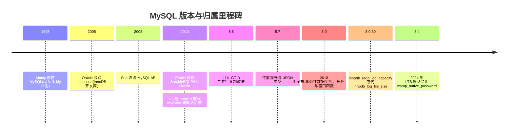
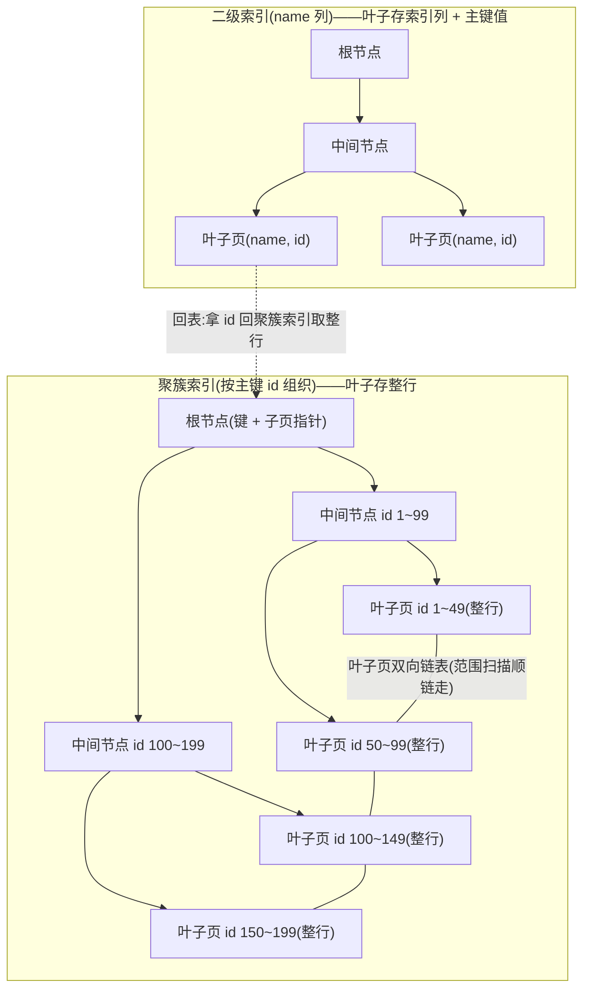
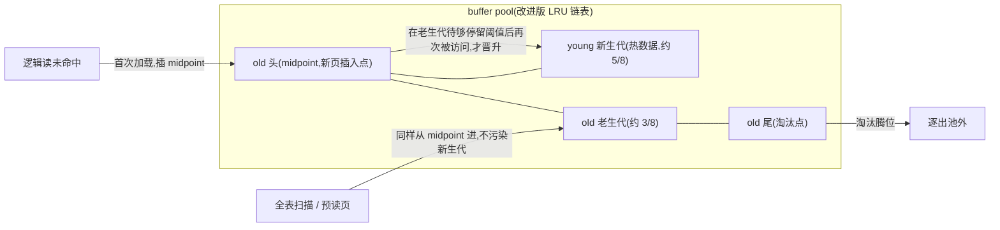
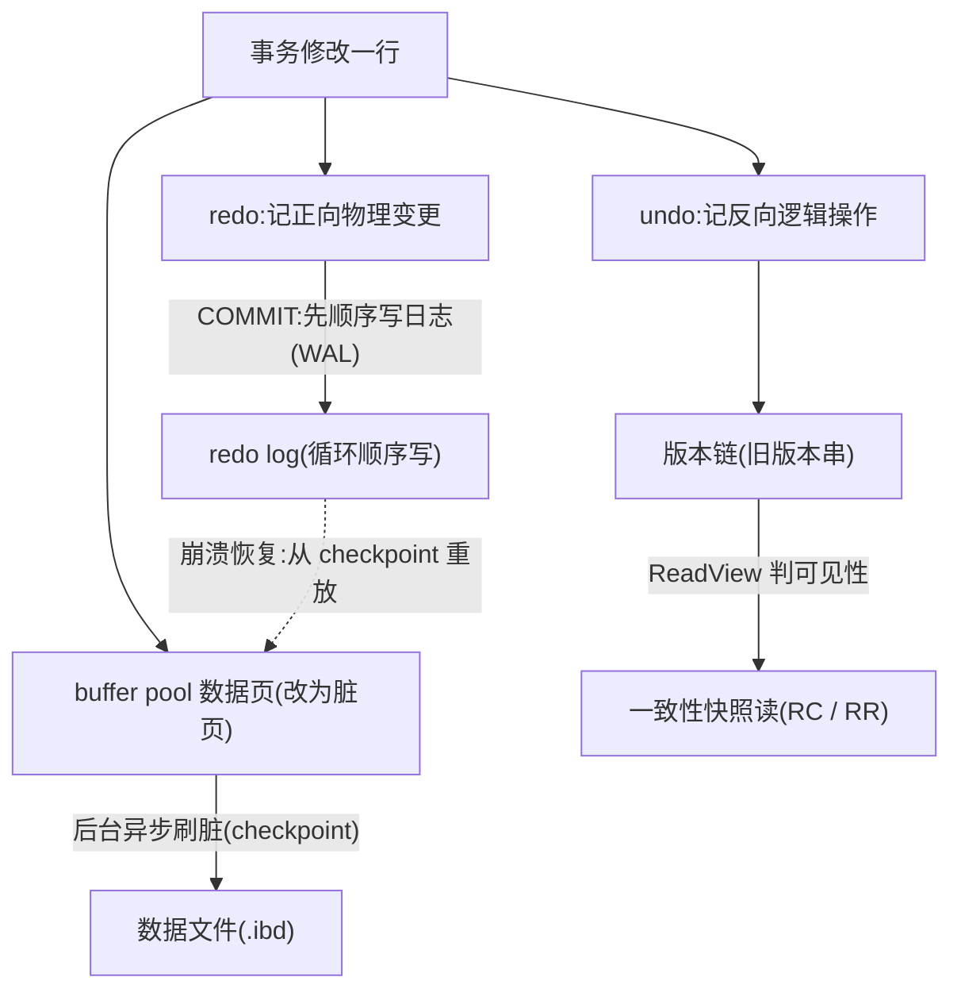
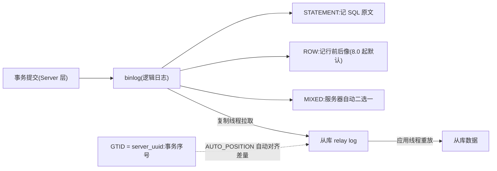
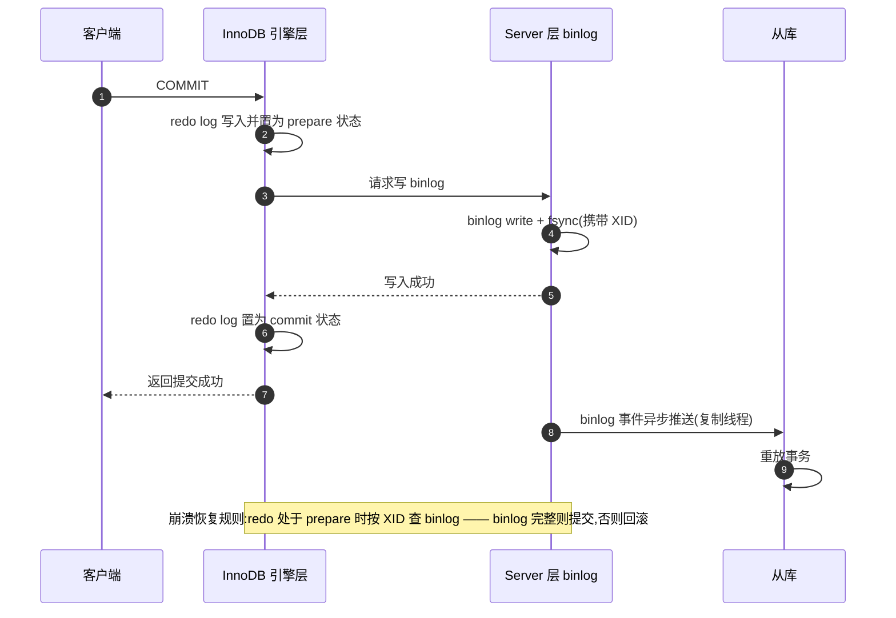
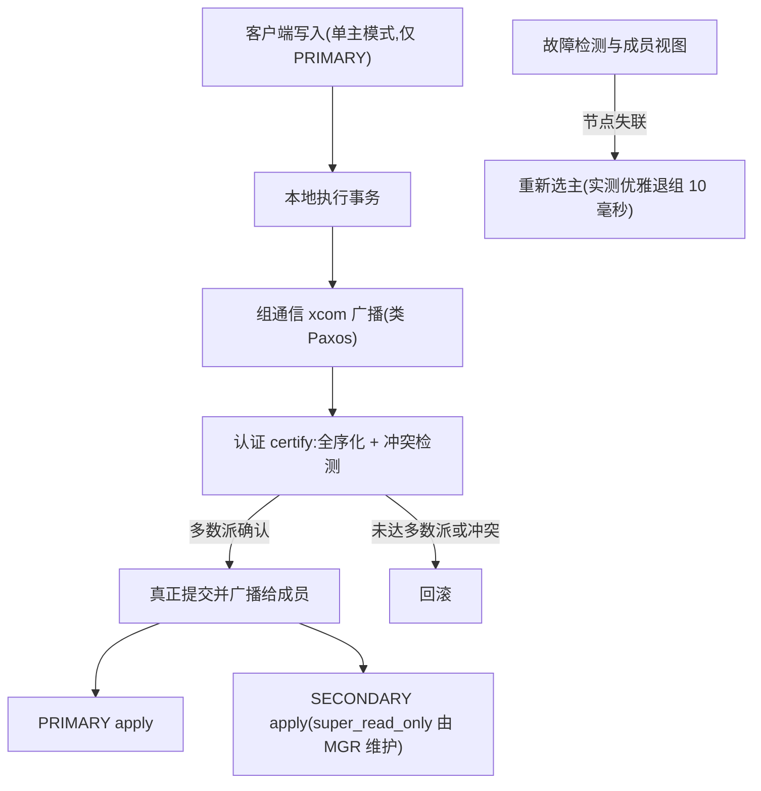

# MySQL 部署与运维(mysql)

> - **版本基线**:MySQL 8.4(实测 8.4.11,官方 docker 镜像 `mysql:8.4`)。**其他版本(5.7 / 8.0 / 9.x)一律不覆盖**,不做版本差异表,不写跨大版本升级。
> - **实测环境**:PVE 虚机 3 台(4C / 8G / 100G 盘),Ubuntu 26.04 LTS,docker 29.1.3(Ubuntu 仓库 `docker.io` 包),2026-09-30。**所有命令与输出均来自该环境实测**,未经实测的内容会明确标注。
> - **部署形态**:docker 单机 → 三台 docker 组 MGR → MySQL Router 访问层。参数以 [conf/](conf/) 三层模板管理(`common` + `role-standalone` / `role-mgr`)。

## 文章索引

| 编号 | 文章 | 内容 | 状态 |
| --- | --- | --- | --- |
| 1 | [安装部署-单机docker](1.安装部署-单机docker.md) | docker 安装与镜像加速、目录规划、启动命令与验证 | ✅ 已实测 |
| 2 | [参数基线与配置模板](2.参数基线与配置模板.md) | 六组参数、30 个决策参数、conf/ 三层模板、配置漂移纪律 | ✅ 已实测 |
| 3 | [账号与安全](3.账号与安全.md) | 认证插件、账号规划、最小权限(巡检/监控/备份) | ✅ 已实测 |
| 4 | [备份与恢复](4.备份与恢复.md) | 物理全备 + binlog 点恢复、恢复演练 | ✅ 已实测 |
| 5 | [MGR集群](5.MGR集群.md) | 三台 docker 组网、bootstrap 纪律、故障与仲裁 | ✅ 已实测 |
| 6 | [MySQLRouter](6.MySQLRouter.md) | 双 Router、读写口、故障切换行为 | ✅ 已实测 |
| 8 | [日常运维与排障](8.日常运维与排障.md) | 慢查询治理、大表 DDL、排障字典(实测错误集) | ✅ 已实测 |
| 9 | [监控与告警](9.监控与告警.md) | mysqld_exporter、按巡检项编号对齐的 PromQL 与告警 | ✅ 已实测 |

## 阅读路径

- **新环境从零搭**:1 → 2 → 3 → 4(单机闭环)→ 5 → 6(进集群);
- **只管单机**:1 → 2 → 3 → 4 → 8;
- **接手在跑的库**:8 → 4 → 2(对照基线找漂移)。

## 组件介绍

> 开源关系型数据库的事实标准:1995 年 Monty 写下它,两度易主(Sun→Oracle)仍稳坐 LAMP 的 M;InnoDB 的 B+ tree 与 binlog 复制,撑起了互联网的二十年。

### 诞生背景

1995 年,Michael "Monty" Widenius 创建了 MySQL,名字取自女儿 My。它赶上互联网第一波浪潮,靠三件事铺开:**快而简单**、**网络原生**、**GPL 双许可**——开源场景按 GPL 免费用,闭源商业嵌入则购买商业授权,这套双许可延续至今。LAMP 架构里那个 M,就是它。

InnoDB 并非 MySQL 亲生:由芬兰 Heikki Tuuri 的 Innobase 公司开发,以可插拔引擎身份外挂,补上了 MyISAM 缺的事务、行级锁与崩溃安全。2005 年 Oracle 收购 Innobase;2010 年 Oracle 又收购 Sun(MySQL AB 已于 2008 年卖给 Sun),MySQL 与 InnoDB 从此同归一门。同年 MySQL 5.5 把 InnoDB 扶正为默认引擎,MyISAM 退居只读类特种场景。

之后的版本主线是**规模与可靠**:5.6 引入 GTID 与并行复制改进,主从切换摆脱手工数 binlog 位点;5.7 提升性能并带来 JSON 类型;8.0(2018)是最大换代——事务性数据字典(frm 文件进系统表)、角色、CTE 与窗口函数;8.0.30 起以 `innodb_redo_log_capacity` 统一管理 redo 容量,取代 `innodb_log_file_size`;8.4(2024)LTS 默认禁用 `mysql_native_password`——第 3 篇的"第一大坑"正源于此。

本文档集以 8.4 LTS 为基线,理由:长期支持窗口、复制与 MGR 能力齐整、账号体系全面进入 caching_sha2 时代。

生态与周边:除官方手册外,最常用的外围是 Percona 家族——XtraBackup(物理热备)与 Toolkit(慢查询与大表治理),链接见下方资料索引,是否采用以第 4 / 8 篇实测为准;访问层由 MySQL Router(第 6 篇)承担读写分离与故障切换入口,与 MGR(第 5 篇)合起来构成"一写多读、故障可切"的完整形态。

### 功能特色

| 功能 | 说明 | 语法/入口 |
| --- | --- | --- |
| InnoDB 存储引擎 | 聚簇 B+ 树、行级锁、MVCC、WAL 崩溃恢复;默认引擎 | `SHOW ENGINES;`(建表默认) |
| 索引体系 | 聚簇索引存整行;二级索引叶子存主键值;覆盖索引免回表 | `CREATE INDEX` / `EXPLAIN` |
| 事务与多版本 | ACID;undo 版本链 + ReadView 一致性读 | `START TRANSACTION` |
| binlog 复制 | STATEMENT / ROW(8.0 起默认)/ MIXED;GTID 全局事务定位 | `CHANGE REPLICATION SOURCE TO` |
| MGR 组复制 | 类 Paxos 认证全序化,多数派确认才提交;自动选主 | `START GROUP_REPLICATION;` |
| 账号与安全 | 8.4 默认 caching_sha2_password;组件化密码策略;失败锁定 | `CREATE USER ... FAILED_LOGIN_ATTEMPTS 3` |
| 现代 SQL | JSON 类型(5.7 起);CTE、窗口函数、角色(8.0 起) | `WITH ...` / `OVER()` / `CREATE ROLE` |
| 参数持久化 | `SET PERSIST` 落 mysqld-auto.cnf,重启保留 | `SET PERSIST` / `RESET PERSIST` |
| 许可模型 | GPL 双许可(GPL 开源 / 商业授权) | — |

### 使用速查

完整上下文见"出处"列:

| 场景 | 命令 | 实测出处 |
| --- | --- | --- |
| 容器健康检查 | `mysqladmin ping -h127.0.0.1 --silent` | 第 1/5 篇 |
| 参数动态持久化 | `SET PERSIST max_connections = 650;` | 第 2 篇 |
| 清持久化配置 | `RESET PERSIST;`(8.4 实测坑:`RESET PERSIST ALL` 报 ERROR 1064) | 第 2 篇 |
| 建最小权限账号 | `GRANT SELECT, PROCESS, REPLICATION CLIENT ON *.* TO monitor@'%';` | 第 3 篇 |
| 密码强度组件 | `INSTALL COMPONENT 'file://component_validate_password';` | 第 3 篇 |
| 清 docker 首启本地 GTID | `RESET BINARY LOGS AND GTIDS;`(空节点入 MGR 前) | 第 5 篇 |
| MGR 引导(仅建组首次) | bootstrap ON → `START GROUP_REPLICATION;` → OFF | 第 5 篇 |
| 看集群成员 | `SELECT member_host, member_state, member_role FROM performance_schema.replication_group_members;` | 第 5 篇 |

### 核心原理

#### 1. B+ 树:聚簇索引、二级索引与回表

InnoDB 里**表即索引**:整张表按主键组织成一棵聚簇 B+ 树,叶子页存**整行数据**;非叶子节点只存键与子页指针,树高很低,一次点查的页面访问次数等于树高。叶子页之间以双向链表相连,范围扫描不必回根重走。

二级索引是另一棵"小树":叶子只存**索引列 + 主键值**。走二级索引命中后若还要其余列,得拿叶子里的主键回聚簇索引再查一次——**回表**;若查询所需列全部落在二级索引里(覆盖索引),免回表,EXPLAIN 的 Extra 显示 `Using index`。由此两条设计纪律:**高频查询优先做覆盖索引**;主键选自增或趋势递增列,顺序插入"页写满再裂新页",随机主键会加剧页分裂与空间碎片。

这套原理在本文档集的落点:第 8 篇慢查询治理(执行计划与索引手段)、第 2 篇参数基线(buffer pool 尺寸要放得下热索引页)。

> ✅ **回表 vs 覆盖索引已实测**(2026-10-09,8.4,20 万行表 / idx_name 命中 200 行):`EXPLAIN` 是第一判据——`SELECT val`(需回表)Extra 为 **NULL**,`SELECT id`(索引含主键)Extra 为 **Using index**;**实测发现:Handler 计数器两边完全相同**(read_key=1 / read_next=200)——回表发生在 InnoDB 引擎内部,Handler 层不计数,**判回表不能靠 Handler 计数器**,只能看 EXPLAIN Extra(或 performance_schema 的引擎内部分解)。

#### 2. Buffer pool:改进版 LRU

buffer pool 是数据页的内存缓存:**读**先查池,未命中才读盘;**写**先改池内页(成为脏页),后台异步刷盘。缓存替换策略决定池的效率。

朴素 LRU 的坑:全表扫描、预读这类"一次性页"会把真正的热数据挤出去(缓存污染)。InnoDB 的改进版 LRU 把链表按 **midpoint** 切成两段:**新生代(young)**与**老生代(old)**。新读入的页不从链表头进,而是插在 midpoint(老生代头部);一页要在老生代里待够一段可配的停留时间(默认约 1 秒)之后**再次**被访问,才晋升新生代;扫描页大多等不到第二次访问,直接从老生代尾部淘汰——热数据不受扰动。

参数落点:`innodb_buffer_pool_size` 通常是实例里最大的一块内存(第 2 篇基线);读路径看命中率,写路径看脏页刷新节奏(`io_capacity`、`flush_method=O_DIRECT`,第 2 篇持久化组),监控走第 9 篇 exporter 指标面。运维含义一句话:**命中率是第一健康指标;池应尽量容纳热工作集**——否则索引再好,也在陪磁盘转。

#### 3. redo / undo:WAL 与 MVCC

**WAL(Write-Ahead Logging)**是 InnoDB 性能与可靠性的支点:提交只需把 redo 日志**顺序写**落盘,不必等数据页的随机写;脏页由后台按 checkpoint 节奏慢慢刷。顺序写远快于随机写,这是"先写日志、后刷数据页"的全部动机。redo 记录物理页级变更,循环写、空间可控;崩溃后从 checkpoint 起重放,找回已提交事务的效果。8.0.30 起容量统一由 `innodb_redo_log_capacity` 管理(取代 `innodb_log_file_size`),第 2 篇参数基线即按新写法。

**undo** 记录逻辑上的反向操作,身兼两职:回滚与多版本。旧版本沿指针串成**版本链**;事务做一致性读时生成 **ReadView**,沿链找到第一个对自己可见的版本——RC 隔离级别每条语句一个 ReadView,RR 沿用事务内首个,快照读语义由此而来。版本在"没有更老的事务需要它"之后才由 purge 清理——长事务会拖住版本链,第 8 篇排障字典的长事务项就是这条原理的运维面。

redo/undo 在引擎层,binlog 在 Server 层——两份日志如何对齐,见下节两阶段提交。

#### 4. binlog:三种格式与 GTID 复制

binlog 是 Server 层逻辑日志,复制与基于时间点的恢复(PITR)都靠它。三种格式:**STATEMENT** 记 SQL 原文,量小,但 `NOW()`、`UUID()` 这类不确定性函数可能导致主从不一致;**ROW** 记行级前后像,确定性最强,**8.0 起默认**,代价是日志体积;**MIXED** 由服务器按语句风险自动二选一。

**GTID** 给每个事务一个全局身份 `server_uuid:序号`;从库用 `SOURCE_AUTO_POSITION` 自动计算差量,不再人工对"文件名 + 位点"。第 4 篇的 binlog 点恢复、第 5 篇 MGR 新节点入组时的 GTID 对齐,都是它的应用面。注意实测 8.4 默认 `gtid_mode=OFF` 且必须重启切换——第 2 篇的决策是**单机就把 GTID 开上**,为将来进 MGR 省一次停机窗口。

从运维视角,复制链路上有两个可"换挡"的点:**格式挡**(ROW 的确定性 vs 日志体积)与**定位挡**(GTID 自动对齐 vs 文件位点)。第 4 篇演练的"物理全备 + binlog 点恢复",落点正是这套坐标体系;第 2 篇还把 binlog 保留期收紧到 7 天联动巡检 M07,磁盘按保留期预留。

> ✅ **binlog_format 三值已实测**(2026-10-09,8.4.11):默认 **ROW**;`SET GLOBAL binlog_format=STATEMENT/MIXED` **仍可用**(动态生效,无需重启),但**每次设置都报 Warning 1287 `'@@binlog_format' is deprecated and will be removed in a future release`**——三值尚未移除、弃用告警已实锤,新代码别再依赖 STATEMENT/MIXED,基线维持 ROW。

#### 5. 两阶段提交:redo 与 binlog 对齐

redo(引擎)与 binlog(Server)是**两份独立日志**,落盘时机不同,顺序不能各写各的:若 redo 已提交而 binlog 没写就崩溃,主库有、从库无,复制丢事务;反之 binlog 先落、redo 回滚,从库会重放主库从未提交过的事务,数据悄悄漂移。

InnoDB 的解法是内部**两阶段提交**:COMMIT 时 **redo 先写并置 prepare**;随后 **binlog write + fsync**(事务带 XID);最后 redo 置 commit。崩溃恢复时,凡 redo 处于 prepare 的事务按 XID 查 binlog——**binlog 完整则提交,否则回滚**,即"从库拥有的,主库一定拥有"。并发事务还会做组提交(group commit),多个提交合并一次 fsync,摊薄刷盘成本。

这套机制在参数上的投影,就是第 2 篇的"双1"基线:`innodb_flush_log_at_trx_commit=1` 让每次提交都把 redo fsync 到盘,`sync_binlog=1` 让 binlog 同样——两阶段提交的两端各守一个"1",合起来才是不丢事务的底线;实测 8.4 双1 即默认值,基线明确"别动"。第 4 篇备份恢复演练敢用 binlog 做点恢复,依赖的正是这份崩溃一致性。

#### 6. MGR:类 Paxos 的认证协议

传统异步复制是"本地先提交、再传播",主库崩溃可能丢已应答的事务。MGR 把确认顺序反过来:事务在主库执行后进入组通信层(xcom),经**认证(certify)**阶段做冲突检测与全序化,**多数派成员确认后**才真正提交——类 Paxos 的多数派语义:少数派故障不影响已确认事务的存活,也天然规避双主脑裂。

单主模式下仅 PRIMARY 可写,SECONDARY 的 `super_read_only` 由 MGR 自动维护(第 5 篇实测 1/1)。故障检测驱动成员视图变更与选主:实测优雅退组场景**选主 10 毫秒**;硬故障(kill -9 / 断电)要等故障检测超时,典型多等数秒。`group_replication_consistency=BEFORE_ON_PRIMARY_FAILOVER`(role-mgr.cnf 基线)保证新主先补齐本地事务再放行写入,客户端不会在切换瞬间读到旧数据。与传统复制的关系:组内日常事务传播走认证流;新成员加入时的差量补齐则走独立的 `group_replication_recovery` 通道(第 5 篇为 rpl_user 配置的恢复账号;实测 8.4 权限关键字仍是 `REPLICATION SLAVE`,写 `REPLICATION REPLICA` 反报 1064)。所以 MGR 没有抛弃 binlog / GTID,而是把"谁先谁后"的裁决权从主从拓扑收进了认证协议。三台 docker 组网、克隆加入、整组冷启动 Runbook 的完整实测见第 5 篇。

### 与本文档集的衔接

通用原理在本 README 编号文章里的实测印证,速查如下:

| 原理点 | 实测印证 | 文章 |
| --- | --- | --- |
| 8.4 默认禁 `mysql_native_password` | `ERROR 1524: Plugin ... is not loaded` 原文;`--mysql-native-password=ON` 重新启用实测有效 | [第 3 篇 账号与安全](3.账号与安全.md) |
| `SET PERSIST` 与漂移纪律 | **8.4 实测坑:`RESET PERSIST ALL` 报 ERROR 1064**,清空用不带参数的 `RESET PERSIST;` | [第 2 篇 参数基线与配置模板](2.参数基线与配置模板.md) |
| GTID 与 MGR 入组对齐 | docker 首启本地 GTID 冲突,入组前 `RESET BINARY LOGS AND GTIDS;` | [第 5 篇 MGR集群](5.MGR集群.md) |
| MGR 多数派、选主、只读提升 | bootstrap 三行纪律;选主 10 毫秒时间线;`super_read_only` 实测 1/1 | [第 5 篇 MGR集群](5.MGR集群.md) |
| binlog 与崩溃一致性 | 物理全备 + binlog 点恢复、恢复演练 | [第 4 篇 备份与恢复](4.备份与恢复.md) |
| 账号最小权限边界 | monitor / app 越权实测(ERROR 1142 报错集) | [第 3 篇 账号与安全](3.账号与安全.md) |

读法建议:先读本节建立模型,再进编号文章看实测——上表每个"实测印证"都能在对应文章里找到命令与输出原文;反过来,排障遇到现象(克隆后自动重启失败、GTID 冲突被拒入组)先回本节找对应机制,再查第 8 篇字典。两份材料互为索引。

> ✅ **半同步复制已实测,三形态 RPO 对比成立**(2026-10-09,mysql-1 为 source、mysql-2 临时摘出 MGR 做从库,演练后已克隆归队):
> - **搭建**:source 装 `rpl_semi_sync_source`(semisync_source.so)、replica 装 `rpl_semi_sync_replica`,双方 `SET GLOBAL ..._enabled=1`,replica 重启复制通道握手;实测 `Rpl_semi_sync_source_clients=1`、`_status=ON`、`_yes_tx` 随事务累加;
> - **半同步 ON:提交 89~92ms**(含网络 ACK);**杀从库:第一次提交阻塞 8430ms** 等 ACK 到超时(默认 10s),随后**自动退化为异步**(`_status=OFF`),后续提交 90ms——**"半同步超时后静默降级为异步"是它的隐藏行为,RPO=0 只在退化发生前成立**,监控必须盯 `_status` 与 `_timeouts`;
> - **动态变量重启即失效**(replica 侧 `rpl_semi_sync_replica_enabled=1` 在 docker restart 后丢失,需重设或写 my.cnf);
> - **RPO 三形态实测结论**:异步=主库提交不等副本,断开窗口内主 15 行/从 13 行(丢窗口=复制延迟);半同步=ACK 前不返回客户端(RPO=0),但超时静默退化是缺口;MGR=多数派认证提交(RPO=0,无静默降级,第 5 篇)。**要 RPO=0 且不伪装:MGR 或 GTID+半同步+告警盯退化**。
> - 经典复制两个实测坑:复制账号走 `caching_sha2_password` 必须 `CHANGE REPLICATION SOURCE ... GET_SOURCE_PUBLIC_KEY=1`(否则 "Authentication requires secure connection");116 归队 MGR 时 `RESET REPLICA ALL` 会**连 group_replication_recovery 通道凭据一起清掉**,重入组前要重新 `CHANGE REPLICATION SOURCE ... FOR CHANNEL 'group_replication_recovery'`。

## 资料索引(官方与工具文档)

原则:**链接为主、摘录为辅、整本离线包不进仓库**。写文章需要引用官方内容时直接摘录进正文,注明"摘自 8.4 手册 ×节"+链接;如需离线手册(隔离网段),到下面入口下载 8.4 的 HTML/EPUB/PDF 归档到对象存储,这里记归档路径即可。

- MySQL 8.4 参考手册(在线):https://dev.mysql.com/doc/refman/8.4/en/
- 手册离线版下载入口(按版本):https://dev.mysql.com/doc/
- 高频深链:
  - 系统变量(默认值/动态性):https://dev.mysql.com/doc/refman/8.4/en/server-system-variables.html
  - Group Replication:https://dev.mysql.com/doc/refman/8.4/en/group-replication.html
  - 错误码检索:https://dev.mysql.com/doc/mysql-errors/8.4/en/
  - MySQL Router:https://dev.mysql.com/doc/mysql-router/8.4/en/
  - Percona XtraBackup 8.4:https://docs.percona.com/percona-xtrabackup/8.4/
  - Percona Toolkit(pt-query-digest 等):https://docs.percona.com/percona-toolkit/
- 离线包归档:(暂无,需要时补充对象存储路径)

## 关联

- **巡检**:命令面巡检项、阈值与处置见 [skills/巡检/inspect-middleware/references/mysql.md](../../skills/巡检/inspect-middleware/references/mysql.md)(M01~M11)。本文档集与巡检互补:巡检管"点状健康检查",部署文档管"怎么搭、怎么修";
- **监控**:第 9 篇以巡检项编号为对齐键,同一套阈值两种表达(命令面 / PromQL);
- 服务器层面(CPU/内存/磁盘/容器运行时)的巡检归 [inspect-server](../../skills/巡检/inspect-server/SKILL.md) 域。

## 新增与修改

1. 命令、参数、输出先在实验机(mysql-1/2/3,PVE 115-117)实测,再入文;文档头部标注实测版本与日期;
2. 参数基线的唯一真源是 [conf/](conf/) 模板与第 2 篇的决策参数表,巡检脚本、监控告警引用它们,不自行发明;
3. 新增文章 = 本文件索引表加行 + 按统一骨架写(头部实测 blockquote → 适用场景 → 正文 → 已知坑 → 互链)。
