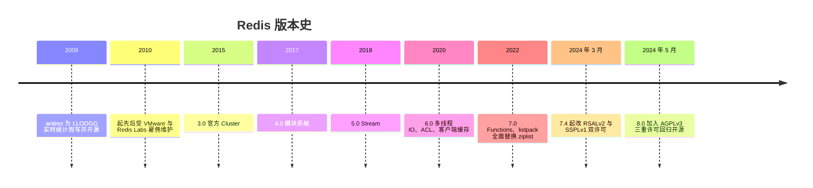
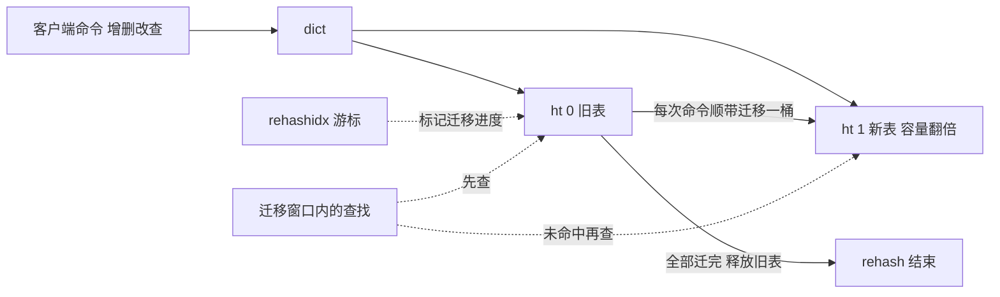
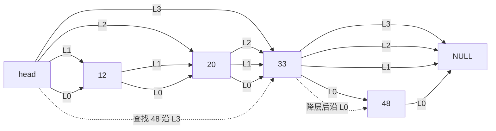
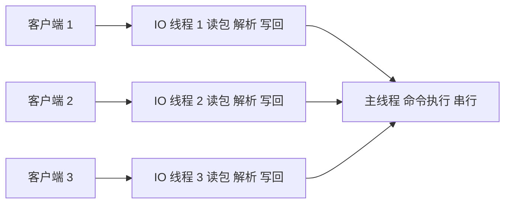
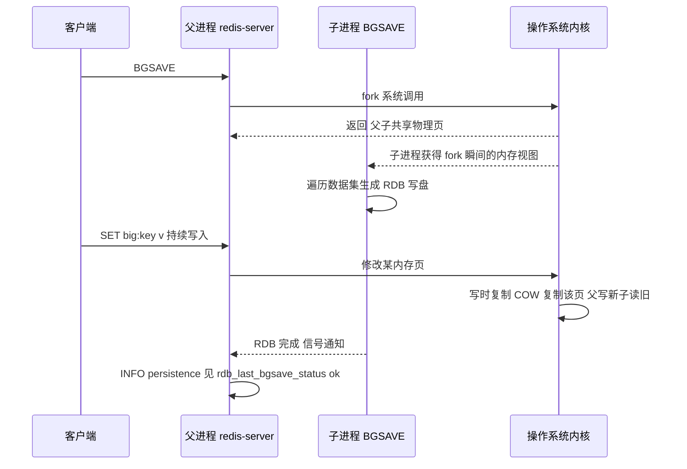
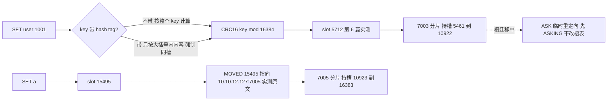
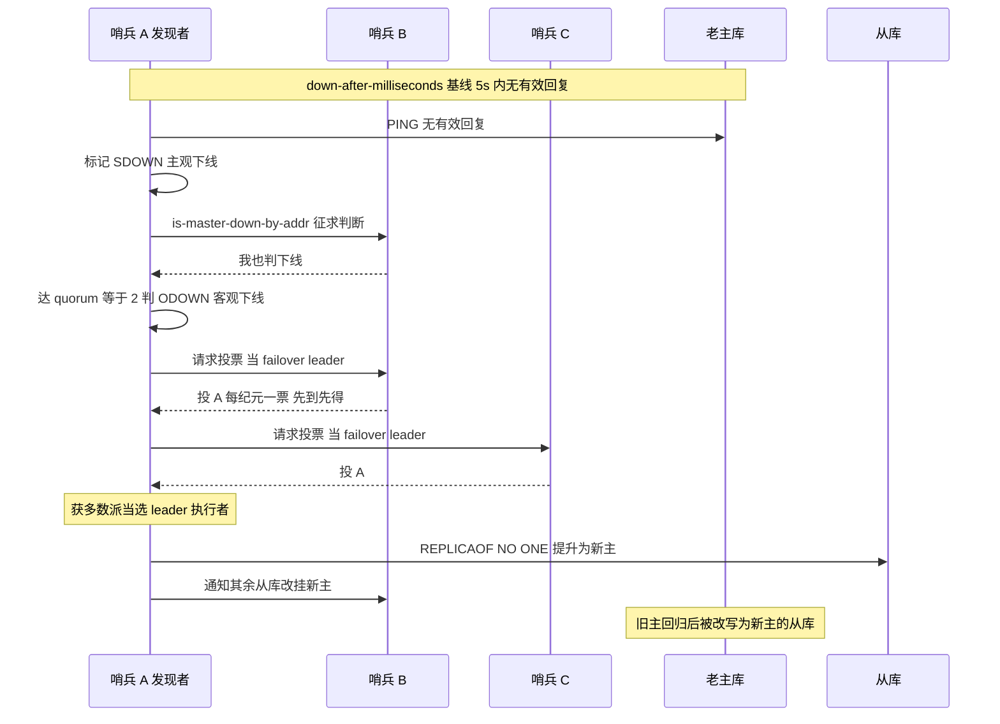

# Redis 部署与运维(redis)

> **版本基线**:Redis 8.0(实测 8.0.6,官方 docker 镜像 `redis:8.0`)。与巡检文档(实测 8.0.5 打包版)同一大版本;不覆盖 7.x 及以下差异。
> **实测环境**:PVE 虚机 redis-1/2/3(10.10.12.118/119/127,2C/4G/60G,Ubuntu 26.04,docker 29.1.3),2026-09-30。**所有命令与输出均来自实测**:单机、ACL、持久化崩溃恢复、主从+哨兵(故障切换 18 秒)、三主三从 Cluster(杀主接管)、redis_exporter。
> **参数基线**:以 [conf/](conf/) 分层模板管理(common + standalone/replica/sentinel/cluster 四种角色)。

## 文章索引

| 编号 | 文章 | 内容 | 状态 |
| --- | --- | --- | --- |
| 1 | [安装部署-单机docker](1.安装部署-单机docker.md) | 容器启动、验证清单 | ✅ 已实测 |
| 2 | [参数基线与配置模板](2.参数基线与配置模板.md) | 六组参数、动态修改语义、漂移纪律 | ✅ 已实测 |
| 3 | [账号与安全(ACL)](3.账号与安全.md) | requirepass、ACL 用户、最小权限实测 | ✅ 已实测 |
| 4 | [持久化与备份恢复](4.持久化与备份恢复.md) | RDB/AOF、kill -9 恢复实测 | ✅ 已实测 |
| 5 | [主从与哨兵](5.主从与哨兵.md) | 复制、哨兵、故障切换计时 | ✅ 已实测 |
| 6 | [Cluster集群](6.Cluster集群.md) | 三主三从、MOVED、杀主接管 | ✅ 已实测 |
| 8 | [日常运维与排障](8.日常运维与排障.md) | 排障字典(实测错误集)、大 key 扫描 | ✅ 已实测 |
| 9 | [监控与告警](9.监控与告警.md) | redis_exporter、按巡检 R 编号对齐 | ✅ 已实测 |

## 阅读路径

- **从零搭**:1 → 2 → 3 → 4(单机闭环);
- **要高可用**:5(主从+哨兵,首选);**要水平扩展/多分片**:6;
- **接手在跑的库**:8 → 9。

## 架构选型(实测后的一句结论)

- 数据量单机可扛、写多读少:主从+哨兵(第 5 篇),部署与运维都最轻;
- 数据量/写入超过单机内存:Cluster(第 6 篇),代价是多 key 操作受限、客户端要支持集群协议;
- Valkey(Redis 的 BSD 开源分叉)的兼容性与迁移实测见 [../valkey/](../valkey/README.md)。

## 组件介绍

> antirez 为实时统计系统写的"快得不像数据库的数据库":数据全内存、命令单线程、五种结构各配最优编码——快是设计出来的,不是调出来的。

### 诞生背景

2009 年,意大利开发者 Salvatore Sanfilippo(antirez)为初创公司 LLOOGG 的实时统计系统而写:这类业务每秒海量小读写、要求毫秒级响应,基于磁盘的数据库模型不适合;antirez 干脆自己实现了一个**把全部数据放在内存、经网络提供字典服务**的进程,Redis 由此得名(REmote DIctionary Server)。开源后增长远超个人项目体量:2010 年起,antirez 先后受 VMware、Redis Labs(现 Redis Inc)雇佣专职维护;Redis 也从"一个缓存"长成带持久化、高可用、水平扩展与可编程能力的内存数据平台。

版本主线与本套文档能力对齐:3.0(2015)官方 Cluster;4.0 模块系统;5.0 Stream;6.0(2020)多线程 IO、ACL、客户端缓存;7.0(2022)Functions、listpack 全面替换 ziplist。2024 年 3 月,Redis 7.4 起许可证由 BSD 改为 RSALv2/SSPLv1 双许可(BSD 不再适用于新版本),直接催生了 BSD 分叉 Valkey(见 [../valkey/](../valkey/README.md));2024 年 5 月 Redis 8 又加入 AGPLv3 三重许可,回归开源。**本套实测基线 8.0**。

### 功能特色

数据类型五件套 **string / list / hash / set / zset**,外加封装出的 bitmap、hyperloglog、geo、streams(5.0);每个 key 按数据形态**自动选择底层编码**,小数据用紧凑结构,长大再切换:

| 类型 | 小数据编码 | 长大后切换 |
| --- | --- | --- |
| string | int(纯整数)/ embstr(短串) | raw |
| list | quicklist(底层节点为 listpack) | 结构不变、节点增减 |
| hash | listpack | hashtable |
| set | intset(纯整数)/ listpack | hashtable |
| zset | listpack | skiplist + dict 双结构 |

编码阈值由 `*-max-listpack-entries` / `*-max-listpack-value` 族参数控制(如 `hash-max-listpack-entries` 8.x 默认 128),`OBJECT ENCODING` 可现场观察。能力全景:

| 能力域 | 内容 | 版本节点 | 本套实测锚点 |
| --- | --- | --- | --- |
| 持久化 | RDB 快照、AOF 日志、混合持久化;7.0 起 manifest 多部分 AOF | 7.0 | [第 4 篇](4.持久化与备份恢复.md)kill -9 恢复 |
| 高可用 | 异步复制、PSYNC2 部分重同步、哨兵自动 failover | — | [第 5 篇](5.主从与哨兵.md)18 秒切换 |
| 水平扩展 | Cluster:16384 槽、MOVED/ASK、gossip | 3.0 | [第 6 篇](6.Cluster集群.md)杀主接管 |
| 安全 | ACL 用户级命令与 key 模式授权 | 6.0 | [第 3 篇](3.账号与安全.md)最小权限 |
| 性能 | 命令单线程 + 6.0 IO 线程;客户端缓存 tracking | 6.0 | ✅ 压测与 tracking 实测(见文末) |
| 可编程 | 模块系统、Functions | 4.0 / 7.0 | 本套未覆盖 |

### 使用速查

命令速查(全部在本套实测环境验证过):

| 场景 | 命令 | 备注 |
| --- | --- | --- |
| 连通与信息 | `PING` / `INFO server` / `DBSIZE` | 巡检 R01 起 |
| 内存与编码 | `MEMORY USAGE key` / `OBJECT ENCODING key` | 大 key 治理联动第 8 篇 |
| 持久化 | `BGSAVE` / `LASTSAVE` / `INFO persistence` | 只用 BGSAVE;SAVE 阻塞 |
| 复制与哨兵 | `ROLE` / `SENTINEL get-master-addr-by-name mymaster` | 应用寻主入口 |
| 集群 | `CLUSTER INFO` / `CLUSTER KEYSLOT key` / `CLUSTER NODES` | cluster_state:ok 是健康线 |
| 账号 | `ACL LIST` / `ACL WHOAMI` | 第 3 篇 |

配置速查(参数唯一真源是 [conf/](conf/) 模板与第 2 篇决策表,此处仅作语义索引):

| 参数 | 语义 | 基线口径 |
| --- | --- | --- |
| `save` | RDB 自动触发条件 | 第 2 篇 common |
| `appendfsync` | AOF 刷盘策略 always / everysec / no | 基线 everysec(丢失窗口 ≤1s) |
| `aof-use-rdb-preamble` | 混合持久化(AOF base 以 RDB 开头) | 第 4 篇实测 base 即 RDB 开头 |
| `hash-max-listpack-entries` | hash 编码切换阈值 | 8.x 默认 128,以配置为准 |
| `io-threads` | IO 线程数(命令执行仍单线程) | 维持不开(2026-10-09 压测:4C/200 连接/4KB 下 -8%,见文末) |
| `down-after-milliseconds` | 哨兵主观下线判定窗口 | 基线 5s |
| `cluster-node-timeout` | 集群节点失联判定 | 基线 15s |

### 核心原理

#### SDS 与渐进式 rehash

string 不用 C 字符串,而是 SDS(simple dynamic string):头部记录已用长度与分配长度,换来三个工程收益——**取长度 O(1)**(不必遍历);**二进制安全**(以长度而非 `\0` 判界,值里可以存图片字节、序列化块);**预分配与惰性释放**(追加时多分配、缩短时暂不归还,平摊 realloc 开销)。短串走 embstr(SDS 与对象头一次分配、内存连续),长串拆成 raw。

hash/set 底层的 dict 是"两张表"结构:平时只用 ht 0;触发扩容/缩容时给 ht 1 分配目标容量,然后**渐进式迁移**——不做一次全量 rehash(百万 key 一次搬完会长时间卡住主线程,与单线程模型冲突),而是把迁移摊到后续每一次增删改查:每处理一个命令顺带迁移 ht 0 上一个桶,`rehashidx` 游标记录进度;迁移窗口内查找先查 ht 0 再查 ht 1,新增只写 ht 1;全部迁完释放旧表、游标复位。这是"大 dict 扩容也不停顿"的机制,代价是窗口期内一次查找要走两张表。

#### zskiplist 跳表

zset(有序集合)长大后的编码是**双结构**:dict 负责 member→score 的 O(1) 点查,skiplist 负责按 score 有序的范围操作;两套结构共享元素与分值,空间换时间。

skiplist 是多层有序链表:节点插入时随机决定层数,抛硬币式晋升——**每层晋升概率 1/4**(源码常量 ZSKIPLIST_P),最大 32 层(8.x 源码常量),整体服从幂次定律分布:绝大多数节点只有 1~2 层,极少数高节点充当"高速公路"。查找从最高层出发,每层"能前进就前进、走不动就降层",平均 **O(logN)**。下图虚线是查找 48 的路径:L3 一步跳到 33,降层后 L0 命中 48——大步跳过无关区间,正是跳表快的原因;而 ZRANGEBYSCORE 这类范围查询在定位起点后,沿 L0 全量链顺序扫描即可。

**为什么不用红黑树等平衡树**(antirez 在讨论中给过口径):其一,**范围遍历友好**——跳表底层就是有序链表,范围操作"定位 + 顺序走"天然支持;平衡树范围遍历要中序回溯,别扭且易错。其二,**实现简单**——插入删除只改前驱指针,没有旋转与重平衡,实现、调试、改造成本都低。其三,**内存不吃亏**——按 1/4 晋升概率,每节点平均约 1.33 个指针,且层数随机使结构分布稳定、无最坏退化路径。

#### 单线程命令执行与 6.0 IO 线程

Redis 的核心承诺来自一个朴素决定:**所有命令在一个线程里串行执行**。收益:数据结构全免锁;单条命令天然原子(`INCR` 不需要任何额外同步);行为可预测,没有竞态类 bug。内存操作是纳秒级,CPU 很少是瓶颈,瓶颈通常在网络 IO 与系统调用——这是"单线程也不慢"的底气。

但网络 IO 会先到顶:海量连接、大 value 时,read / 协议解析 / write 占用的 CPU 超过命令执行本身。6.0 起 Redis 引入 **io-threads**:网络读写与协议解析可分摊到多个 IO 线程并行处理,**命令执行仍然只在主线程串行**——只分形 IO 层、不动内核模型,无锁前提保持不变,`MULTI/EXEC` 语义照旧。所以 Redis 的"多线程"是 IO 层的、不是计算层的;是否开启、开几个线程对吞吐的影响已压测定论(2026-10-09:4C VM、200 连接、4KB value 下 io-threads=3 反而 -8%,49456 vs 53908 rps——连接数与 value 未到 IO 瓶颈时多线程只添争核,维持不进基线)。

#### fork 与 COW:RDB 快照与 AOF 重写的统一机制

BGSAVE(RDB)与 AOF 重写共用同一套机制:**fork 一个子进程 + 操作系统写时复制(COW)**。父进程调 fork,内核不复制内存,只让父子共享物理页;子进程看到的逻辑内存定格在 fork 瞬间,于是可以从容遍历整个数据集生成 RDB(或按当前数据状态写出最小命令集),父进程同时继续接客。期间父进程的任何写操作触发**页级 COW**:内核把被写的页复制一份,父写新页、子读旧页,快照一致性保住。

工程含义:**快照期间新增内存成本 ≈ 被写过多少页**。写入越猛 COW 复制越多,最坏接近内存翻倍——所以宿主机必须在 maxmemory 之外留余量、`vm.overcommit_memory=1` 是常规前置(第 4 篇已知坑;巡检 R07 里 fork 失败的第一嫌疑)。

AOF 侧:日常写命令进 aof_buf,按 `appendfsync`(always / everysec / no)刷盘,基线 everysec 意味着丢失窗口 ≤1s(第 4 篇 kill -9 实测数据完好);重写同样走 fork,期间新写命令同时进重写缓冲,重写完成后追加、原子替换;7.0 起 AOF 是**目录形态**(manifest 清单 + base + incr),混合持久化下 base 以 RDB 格式开头——即第 4 篇 appendonlydir 三件套的由来。

#### Cluster:16384 槽与 CRC16

Cluster 把键空间切成 **16384 个槽**,每个主节点负责一段;`slot = CRC16(key) mod 16384`。为什么是 16384:节点用位图声明自己持有哪些槽,16384 个槽即 2KB 位图,gossip 心跳携带的体积小(官方口径:设计上的集群规模远用不满 65536 个槽)。槽是**可迁移资产**——reshard 在线搬槽,数据跟着槽走,客户端按槽找节点,扩缩容不改应用。

**hash tag**:`{user:1001}.name` 与 `{user:1001}.tags` 只对大括号内的内容计算槽,从而强制同槽——多 key 命令与事务要求同槽,业务建模时就定好(第 6 篇)。**MOVED 与 ASK**(第 6 篇实测原文:`MOVED 15495 10.10.12.127:7005`):MOVED 表示"槽已归属别的节点",客户端应更新本地槽表后重发;ASK 表示"槽正在迁移中,目标节点临时受理",客户端先发 ASKING 再重试、不改槽表。节点间通过 **gossip 协议**交换 PING/PONG 传播拓扑与故障判定,总线端口 = 实例端口 + 10000;`cluster-node-timeout`(基线 15s)决定故障接管速度(第 6 篇杀主实测)。

#### 哨兵:quorum、选举与 failover

哨兵解决"主库挂了,谁去切"的问题,流程分三步。**第一步,主观下线(SDOWN)**:某个哨兵在 `down-after-milliseconds`(基线 5s)内收不到主库有效回复,先自己标记疑似。**第二步,客观下线(ODOWN)**:该哨兵向其他哨兵发 `SENTINEL is-master-down-by-addr` 征求判断,认同数达到配置的 **quorum**(本套 =2)才认定主库真挂——quorum 是"多少个哨兵同意才算客观下线"的门槛,防单点误判。**第三步,failover**:先在哨兵间选出**一个 leader 执行者**——发现者先发起,各哨兵**先到先得**投票(Raft-like:每个纪元每个哨兵只投一票,需**多数派**当选;注意当选门槛是 majority 而非 quorum);随后 leader 按从库优先级与复制偏移挑选新主,执行 `REPLICAOF NO ONE` 提升,并让其余从库改挂新主;旧主回归后自动降级为从(实测)。

第 5 篇实测的 **18 秒切换** = 5s 主观下线判定 + 哨兵协商 ODOWN + 选举 + 提升从库的合计;同篇教训:`announce-ip` 配错时 `num-other-sentinels=0`,quorum 永远凑不齐、永不切换——部署验收必查。

### 与本文档集的衔接

| 原理小节 | 实测文章 | 锚点结论 |
| --- | --- | --- |
| fork 与 COW、AOF | [第 4 篇](4.持久化与备份恢复.md) | appendonlydir 三件套;everysec 下 kill -9 数据完好 |
| 哨兵 quorum 选举 | [第 5 篇](5.主从与哨兵.md) | 18 秒切换;旧主回归自动降级 |
| Cluster 槽与 CRC16 | [第 6 篇](6.Cluster集群.md) | `MOVED 15495`;`CLUSTER KEYSLOT user:1001 = 5712`;杀主接管 |
| 编码与内存 | [第 8 篇](8.日常运维与排障.md) | 大 key 扫描 |
| 许可变更与分叉 | [../valkey/](../valkey/README.md) | RDB v12(Redis 8.0 写)被 Valkey 8.1 拒载,跨软件复制被挡([第 2 篇实测](../valkey/2.与Redis兼容性实测.md)) |

待补实测:

> ✅ **编码切换已实测**(2026-10-09,8.0.6,`zset-max-listpack-entries=128`):逐个 ZADD 到 **128 元素(含)仍 listpack,第 129 个触发 skiplist**——精确贴着配置值;另一触发路径独立生效:单个元素超 `zset-max-listpack-value=64`(实测 100B),**2 个元素即切 skiplist**。判据:`OBJECT ENCODING`。
> ✅ **io-threads 压测已实测**(2026-10-09,4C VM,redis-benchmark 200 连接 × 4KB × 10 万请求):基线 GET **53908 rps / p50 1.81ms**,`io-threads=3` 后 **49456 rps / p50 1.94ms(-8%)**——连接数与 value 尺寸未到 IO 瓶颈时,多 IO 线程在本机回环上反而争核,**维持不进基线**,上量(万级连接 / 大 value / 多核专用机)后重测。
> ✅ **客户端缓存 tracking 已实测**(2026-10-09):A 客户端 `HELLO 3` + `CLIENT TRACKING ON` + `GET trk:k`,B 客户端 `SET trk:k` 后,A 连接收到 RESP3 push 原始字节 `>2 $10 invalidate *1 $5 trk:k`(即 `invalidate ["trk:k"]`)。**工具面发现:redis-cli 非 tty(管道/文件重定向)模式不渲染 push 消息**——验证 tracking 要么交互式终端,要么裸 TCP 读字节。

## 资料索引

- Redis 官方文档:https://redis.io/docs/latest/
- Redis 配置示例(redis.conf 全量注释版):https://redis.io/docs/latest/operate/oss_and_stack/management/config/
- 哨兵文档:https://redis.io/docs/latest/operate/oss_and_stack/management/sentinel/
- Cluster 规范:https://redis.io/docs/latest/operate/oss_and_stack/management/scaling/
- 离线包:Redis 无整本手册形态,按主题页归档即可。

## 关联

- **巡检**:命令面巡检项 R01~R13、阈值与处置见 [skills/巡检/inspect-middleware/references/redis.md](../../skills/巡检/inspect-middleware/references/redis.md);第 9 篇以 R 编号对齐指标面;
- 宿主机/容器层巡检归 [inspect-server](../../skills/巡检/inspect-server/SKILL.md)。

## 新增与修改

1. 命令、参数、输出先在实验机实测再入文,头部标注实测版本与日期;
2. 参数基线唯一真源是 [conf/](conf/) 模板与第 2 篇决策表;
3. 新增文章 = 本文件索引表加行 + 统一骨架(实测 blockquote → 场景 → 正文 → 已知坑 → 互链)。
