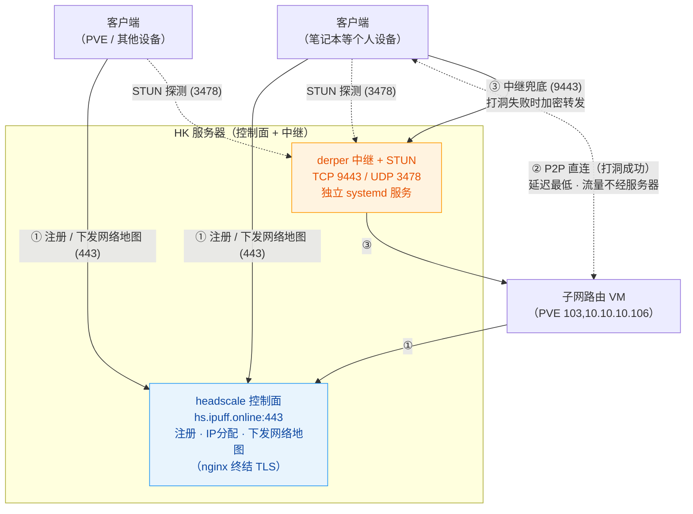

# Tailscale 自组网

> **实测状态**:✅ 2026-10-09 复核 —— 控制面/中继/STUN/面板端点实测存活:headscale **v0.29.1**(`/health` pass)、derper 9443(`/generate_204` 204)、STUN 3478 可达、headplane 8070 存活(302);**子网路由节点(PVE VM 103)实测配置已补入(第 1.4 节)**。服务器内部布局沿用原部署记录。

## 一、Tailscale 相关组件说明

### 1.1 整体架构



> ① 控制面：注册与地图下发，只走管理流量；② 打洞成功时设备间点对点直连（延迟最低、流量不经服务器）；③ 打洞失败回落自建中继（HK 节点，国内访问 10~40ms）。

### 1.2 组件职责

| 组件                 | 角色                 | 部署形态                          | 说明                                                         |
| -------------------- | -------------------- | --------------------------------- | ------------------------------------------------------------ |
| **headscale**        | 控制面（协调服务器） | Docker 容器（0.29.1,实测存活）    | 自托管的开源 Tailscale 控制服务器。负责节点注册、Tailscale 虚拟地址段（100.64.0.0/10，协议标准段）分配、下发网络地图与 DERP 列表。**只做管理，不承载业务流量**。对外域名 `hs.ipuff.online` |
| **tailscale 客户端** | 数据面               | 各个人设备                        | WireGuard 隧道 + 打洞（disco）。设备间优先 P2P 直连（流量不经任何服务器），直连失败回落 DERP 中继 |
| **子网路由节点**     | 进内网的入口         | PVE VM 103（Ubuntu 24.04,tailscale 1.102.4） | 通告实验室网段,外网设备经它访问内网(见 1.4) |
| **derper**           | 中继 + STUN          | systemd 服务（v1.102.4 源码构建） | Tailscale 官方仓库的中继服务端。打洞失败时中继加密流量；内置 STUN（UDP 3478）供 NAT 探测。中继流量端到端加密，derper 本身不可解密 |
| **headplane**        | 网页管理面板         | Docker 容器（0.7.1）              | headscale 的 Web UI，可管理节点/路由/密钥，已启用 Docker 集成（网页端可操作 headscale 容器） |

### 1.3 关键机制说明

- **打洞（P2P 直连）**：客户端通过 STUN 探测自己的公网映射，互换候选地址后直接互发 UDP。直连成功时延迟最低、流量不经过任何服务器。
- **DERP 中继（兜底）**：打洞失败时流量经 derper 转发（端到端加密，derper 不可解密）。
- **STUN 映射的坑**：STUN 探测学到的公网映射由**网络路径**决定。若所在网络的边界设备对 UDP 有代理/映射策略（如国际流量走隧道），客户端学到的就是被污染的假身份，打洞必败。自建国内/近端 derper 的价值在于：探到的映射真实有效，且中继延迟可控。
- **路由器 UDP 策略**：本地路由器/边界若对 UDP 3478（STUN）、41641（WireGuard/disco）有拦截或代理，需放行直连，否则打洞与中继均受影响。

### 1.4 子网路由节点（PVE VM 103,实测）

tailnet 外的设备经此节点进实验室网段，是"在外网进内网"的入口：

```text
主机名:tailscale(PVE VM 103)   内网 IP:10.10.10.106
系统:Ubuntu 24.04.3 LTS         tailscale:1.102.4(与 derper 同版本)
通告路由(AdvertiseRoutes):
  10.10.10.0/24        ← PVE/实验室管理网
  192.168.3.0/24       ← 另一办公网段
  192.168.0.200/32     ← 单主机路由(定点放行)
```

客户端要吃到这些路由,接入时必须带 `--accept-routes`(见 3.2);通告变更需在控制面(headplane 面板 Routes 页)批准。

**管理命令**(登 VM 103 执行):

```bash
tailscale set --advertise-routes=10.10.10.0/24,192.168.3.0/24,192.168.0.200/32
tailscale status   # 自查
```

---

## 二、部署及配置

### 2.0 资产与端口总览

| 资产             | 说明                                                  |
| ---------------- | ----------------------------------------------------- |
| HK 服务器        | Ubuntu 20.04，Docker 部署，公网域名 `hs.ipuff.online` |
| headscale 控制面 | Docker 容器，nginx 443 反代 → 127.0.0.1:38080         |
| derper           | systemd 服务（官方源码构建）                          |
| headplane        | Docker 容器，对外端口 8070                            |
| 子网路由节点     | PVE VM 103（10.10.10.106）                            |
| MagicDNS 域      | `tailnet.ipuff.online`                                |
| 数据目录         | `/data/headscale/`（config + lib + derper）           |

**端口占用清单（HK 服务器）：**

| 端口      | 协议 | 用途                                            | 备注                                               |
| --------- | ---- | ----------------------------------------------- | -------------------------------------------------- |
| 443       | TCP  | 控制面入口（nginx 反代，`*.ipuff.online` 证书） | nginxwebui 管理                                    |
| 9443      | TCP  | derper 中继                                     | 443 被 nginx 占用、8443 被 OpenVPN 占用，故用 9443 |
| 3478      | UDP  | derper STUN                                     |                                                    |
| 8070      | TCP  | headplane 面板                                  | 公网 HTTP 明文，注意密钥安全                       |
| 80 / 8443 | TCP  | nginx / OpenVPN（既有服务）                     | 与本套件无关                                       |

### 2.1 tailscale（headscale 控制面）部署

**部署形态**：Docker Compose，位于 `/data/headscale/`。

```
/data/headscale/
├── docker-compose.yml           # headscale 服务
├── config/
│   ├── config.yaml              # headscale 主配置
│   ├── derp-hk.yaml             # 自建 DERP map（region 999 hk）
│   └── headplane/config.yaml    # headplane 配置
└── lib/                         # 数据库 + DERP/Noise 私钥（核心数据）
```

**关键配置项（config/config.yaml）：**

```yaml
server_url: https://hs.ipuff.online     # 客户端接入地址
dns:
  magic_dns: true
  base_domain: tailnet.ipuff.online     # MagicDNS 后缀，不能与 server_url 同域
derp:
  server:
    enabled: false                      # 内置 DERP 已关闭，由独立 derper 承担
  config:
    urls: []
    paths:
      - /etc/headscale/derp-hk.yaml     # 自建中继地图（挂载自 config 目录）
```

**TLS 反代要点**：`hs.ipuff.online` 的 443 由 nginx 终结（`*.ipuff.online` 证书，acme.sh 自动续期于 `/data/nginxWebUI/.acme.sh/`），反代至 `127.0.0.1:38080`；`proxy_set_header Host $host` 必须保留；headscale 必须挂独立域名根路径。

**注意**：headscale 容器端口仅映射到 `127.0.0.1`（38080/39090），不直接暴露公网。

### 2.2 derper 部署

**部署形态**：官方源码构建的静态二进制 + systemd。

```
/data/headscale/derper/
├── bin/derper           # v1.102.4，与客户端同版本，官方源码构建（CGO_ENABLED=0）
├── certs/               # hs.ipuff.online.crt/.key（取自 *.ipuff.online 通配符证书）
└── derper.service       # systemd 单元（/etc/systemd/system/derper.service）
```

**构建方法**（升级版本时重复执行）：

```bash
export GOROOT=<Go工具链目录> GOPATH=<构建工作目录>
export PATH=$GOROOT/bin:$PATH GOPROXY=https://goproxy.cn,direct CGO_ENABLED=0 GOTOOLCHAIN=local
go install tailscale.com/cmd/derper@<与客户端一致的版本>
```

**systemd 单元要点**（`/etc/systemd/system/derper.service`）：

```ini
ExecStart=/data/headscale/derper/bin/derper -hostname=hs.ipuff.online \
  -certmode=manual -certdir=/data/headscale/derper/certs \
  -a :9443 -stun -http-port=-1
Restart=always
```

三个易踩的坑：

1. **443 被 nginx 占用、8443 被 OpenVPN 占用**，故中继端口用 9443；
2. **derper 默认监听 80 端口**（ACME 用），会被 nginx 顶掉导致启动失败，必须 `-http-port=-1` 禁用（manual 证书模式不需要 80）；
3. 证书为 acme.sh 通配符自动续期（约 60 天一换），derper 不会热加载，已配置 **cron 每月 1 日重启 derper** 保证证书更新。

**DERP map**（`config/derp-hk.yaml`，headscale 下发给所有客户端）：

```yaml
regions:
  999:
    regionid: 999
    regioncode: hk
    regionname: Hong Kong
    nodes:
      - name: 999a
        regionid: 999
        hostname: hs.ipuff.online
        ipv4: <服务器公网地址>
        derpport: 9443
        stunnerport: 3478
        stunonly: false
```

修改后 `docker restart headscale` 生效；客户端在下次连上控制面时自动更新（或重启 tailscaled 立即生效）。

### 2.3 headplane 部署

**部署形态**：Docker 容器（与 headscale 同 compose 网络 `headscale_default`），镜像 `ghcr.io/tale/headplane:0.7.1`。

- 访问地址：`http://hs.ipuff.online:8070/admin`（登录方式：粘贴 headscale API key）
- 配置文件：`config/headplane/config.yaml`，关键字段：

```yaml
server:
  base_url: <面板对外地址>
  cookie_secure: false                  # 套 HTTPS 后改 true
headscale:
  url: http://headscale:8080            # compose 网络内容器名直连
  public_url: https://hs.ipuff.online
  config_path: /etc/headscale/headscale-config.yaml   # docker 集成用（网页端可管理 headscale 容器）
integration:
  docker:
    enabled: true                       # 依赖挂载 docker.sock（ro）与 headscale 配置文件
```

- 面板登录密钥即 headscale API key：`docker exec headscale headscale apikeys create --expiration 90d`（**密钥本体不落盘**，创建时记入密码管理器）。
- **面板当前为公网 HTTP 明文访问**，API key 登录时明文传输——后续建议套 HTTPS 子域名（nginx + 通配符证书现成）。

---

## 三、使用说明

### 3.1 客户端下载

| 平台          | 来源                                                  | 说明                         |
| ------------- | ----------------------------------------------------- | ---------------------------- |
| Windows       | Tailscale 官网下载页                                  | MSI 安装包                   |
| macOS         | 官网下载页 或 Mac App Store                           | 要求 macOS Monterey 12+      |
| Linux         | `curl -fsSL https://tailscale.com/install.sh | sh`    | 支持 Debian/Ubuntu/CentOS 系 |
| iOS / Android | App Store / Google Play（或官方 GitHub Releases APK） | App 内选择自定义登录服务器   |

### 3.2 客户端组网

1. 生成**预授权密钥（Pre-auth key）**：

```bash
docker exec headscale headscale preauthkeys create --user <用户ID> --expiration <时长>
```

2. 设备执行接入命令：

```bash
# Windows / macOS（PowerShell 或终端）
tailscale up --login-server https://hs.ipuff.online --authkey <你的密钥>

# Linux（如需访问其他节点广播的网段，必须带 --accept-routes）
tailscale up --login-server https://hs.ipuff.online --authkey <你的密钥> --accept-routes
```

3. 验证：

```bash
tailscale status        # 应看到自己与其他个人设备
ping <对端虚拟地址>      # 内网连通性（100.64.0.x）
```

4. 设备间即可通过虚拟地址互相访问。也可在 headplane 面板（`http://hs.ipuff.online:8070/admin`）中直接生成密钥、查看节点状态、管理路由。

**诊断速查**：`tailscale ping <目标IP>`——输出 `via IP:41641` 为直连（正常），`via DERP(hk)` 为中继（本套件的兜底通道），`via DERP(xxx海外)` 说明客户端网络环境对 UDP 有限制。

### 3.3 headplane 密钥轮换

Headplane 登录使用 headscale 的 API key，轮换流程（零中断）：

```bash
# 1. 生成新 key
docker exec headscale headscale apikeys create --expiration 90d

# 2. 浏览器打开面板，退出登录，用新 key 重新登录

# 3. 作废旧 key（列表中查看 ID/前缀）
docker exec headscale headscale apikeys expire -i <旧keyID>
# 或按前缀：headscale apikeys expire -p "<旧key前缀>"
```

- 密钥有 90 天自然有效期，到期自动失效；定期轮换即"提前作废 + 换新"。
- `apikeys list` 只显示前缀，**完整 key 丢失无法找回**，只能作废重建。
- 密钥疑似泄露：立即执行第 3 步作废，再走 1-2 步换新。
