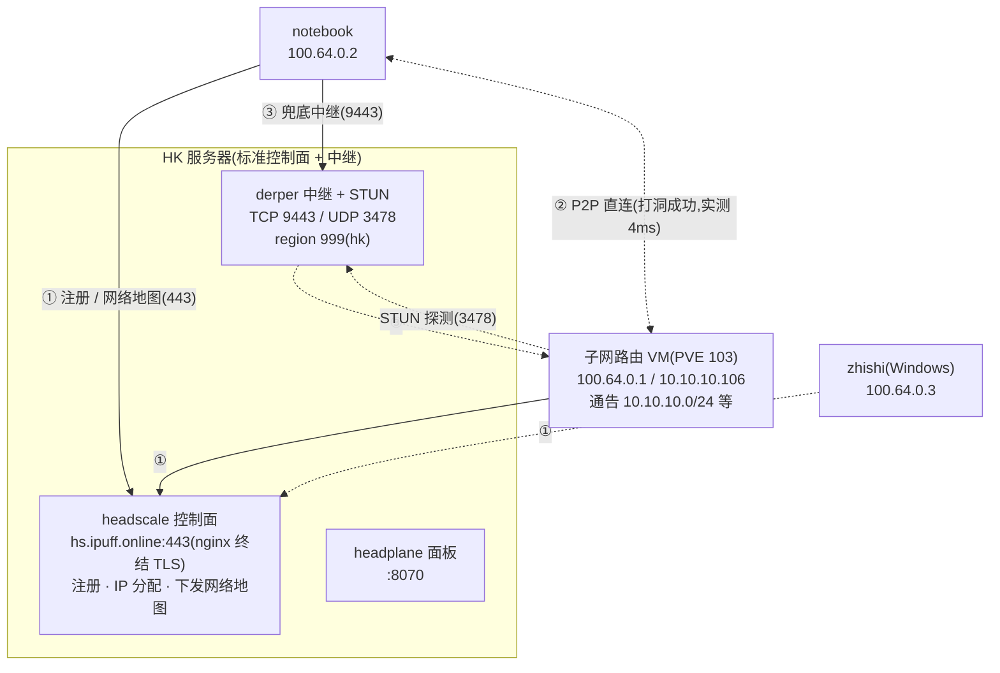

# Tailscale 自组网(headscale 自建控制面 + 子网路由)

> **标准域名:ipuff.online**——本套组件的控制面/中继/MagicDNS 一律以 `hs.ipuff.online` / `tailnet.ipuff.online` 为准(2026-10-09 拍板)。
>
> **⚠️ 现网处于过渡态(2026-10-09 实测)**:客户端实际 ControlURL 指向 `hs.gsjhdev.top`(另一套控制面,阿里云深圳),属于**待纠正的偏差**,不是标准态。两套栈当日均实测存活,对照与切回步骤见第五节;选定收敛路径后,另一套按待办下线。

## 一、标准架构(ipuff.online 口径)



> ① 控制面只走管理流量;② 打洞成功走 P2P 直连(流量不经服务器);③ 打洞失败回落自建中继。

## 二、两套栈现状对照(2026-10-09 实测)

| 项 | **标准:ipuff.online 栈**(HK) | 过渡:gsjhdev.top 栈(阿里云深圳)——待收敛 |
| --- | --- | --- |
| 控制面 headscale | `hs.ipuff.online`,**v0.29.1**,`/health` pass | `hs.gsjhdev.top`(120.79.223.240),v0.29.2,`/health` pass |
| 客户端 ControlURL | 标准值(待切回) | **当前实际指向这里** |
| derper | `:9443` → `/generate_204` 204,region **999/hk** | `:9443` → 204,region **901/gsjh**(GSJH Shenzhen,netcheck 12.8ms) |
| STUN | UDP 3478 可达 | UDP 3478 可达 |
| headplane | `http://hs.ipuff.online:8070/admin`(302,活) | 443 根路径 SPA(8070 已废弃) |
| MagicDNS 后缀 | `tailnet.ipuff.online` | `ts.gsjhdev.top` |
| 服务器 IP | 223.254.128.189 | 120.79.223.240(安全组禁 ICMP,探活用 curl) |

tailnet 节点(2026-10-09 快照):notebook 100.64.0.2(Linux,tailscale 1.98.8)、tailscale VM 100.64.0.1(1.102.4,子网路由)、zhishi 100.64.0.3(Windows,离线)。节点在两套控制面上**各有独立注册态**,切控制面 = 重新注册(见第五节)。

## 三、子网路由节点(PVE VM 103,实测)

tailnet 外的设备经此节点进实验室网段,是"在外网进内网"的入口。

```text
主机名:tailscale(PVE VM 103)   IP:10.10.10.106
系统:Ubuntu 24.04.3 LTS          tailscale:1.102.4
通告路由(AdvertiseRoutes,实测):
  10.10.10.0/24        ← PVE/实验室管理网
  192.168.3.0/24       ← 另一办公网段
  192.168.0.200/32     ← 单主机路由(定点放行)
客户端侧必须 RouteAll=true(tailscale up --accept-routes)才吃这些路由
```

实测:notebook → `10.10.10.44`(PVE)走该子网路由,隧道对端 `10.10.10.106:41641` 直连,`tailscale ping` 4ms。

**管理命令**(登 VM 103 执行):

```bash
tailscale set --advertise-routes=10.10.10.0/24,192.168.3.0/24,192.168.0.200/32
# 通告变更需在控制面批准路由(headplane 面板 Routes 页)
```

## 四、使用说明(ipuff.online 口径)

### 4.1 客户端接入

1. 生成预授权密钥(headplane 面板 `http://hs.ipuff.online:8070/admin`,或 CLI):

```bash
docker exec headscale headscale preauthkeys create --user <用户ID> --expiration <时长>
```

2. 设备接入:

```bash
# Windows / macOS
tailscale up --login-server https://hs.ipuff.online --authkey <密钥>
# Linux(要访问子网路由通告的网段必须带 --accept-routes)
tailscale up --login-server https://hs.ipuff.online --authkey <密钥> --accept-routes
```

3. 验证:

```bash
tailscale status        # 节点与直连/中继状态
tailscale ping <对端>   # via IP:41641=直连;via DERP(hk)=自建中继;via DERP(海外官方)=UDP 受限
tailscale netcheck      # NAT/UDP 探测,看 Nearest DERP 应为 hk
```

MagicDNS:节点名可直接解析(实测 `notebook` 返回节点地址,含 tailnet IPv6 `fd7a:115c:a1e0::/48` 记录)。

### 4.2 headplane 密钥轮换(零中断)

```bash
docker exec headscale headscale apikeys create --expiration 90d   # 1. 生成新 key
# 2. 面板退出登录,用新 key 重新登录
docker exec headscale headscale apikeys expire -i <旧keyID>        # 3. 作废旧 key
```

90 天自然过期;`apikeys list` 只显示前缀,完整 key 丢失无法找回;疑似泄露立即作废。

## 五、切回 ipuff.online 的两条路径(选其一收敛)

> 无论哪条:notebook 与子网路由 VM **都要重新注册**;子网路由短暂下线会导致外网进实验室中断,建议在能直连实验室时操作。路由(AdvertiseRoutes)在新控制面需重新批准。

### 路径 A:客户端迁回旧控制面(HK,现状已活)——改动最小

1. 在旧 headplane(`http://hs.ipuff.online:8070/admin`)创建 preauth key;
2. 两台设备依次执行(`--force-replace` 覆盖旧注册,防重复节点):

```bash
tailscale up --login-server https://hs.ipuff.online --authkey <密钥> --accept-routes --force-replace
```

3. 在旧 headplane 批准子网路由(VM 103 的三条通告);
4. 验证 `tailscale status`/`netcheck`(Nearest DERP 应为 hk)后,按第六节下线 gsjhdev.top 栈。

### 路径 B:新控制面(阿里云)换绑 ipuff.online 域名——保留新栈,需登服务器

1. DNS:`hs.ipuff.online` A 记录指向 120.79.223.240(旧 HK 记录先摘或降权);
2. 服务器侧:nginx 增加 `hs.ipuff.online` vhost(ipuff 通配符证书现成)→ headscale 上游;headscale `server_url` 改 `https://hs.ipuff.online`;derper 换 ipuff 证书并 `-hostname=hs.ipuff.online` 重启;DERP map hostname 同步;
3. 客户端按路径 A 第 2 步重指重新注册;
4. 验证后按第六节下线 gsjhdev.top 域名解析。

## 六、下线清单(收敛后执行)

- [ ] 另一套控制面停服(选定路径后,未被选者按此下线);
- [ ] 域名解析摘除(gsjhdev.top 或按路径 B 的旧记录);
- [ ] 确认无客户端依赖旧控制面(headplane 节点列表全离线数日)后再删数据目录。

## 七、已知坑(实测)

| 坑 | 实测现象 | 解/口径 |
| --- | --- | --- |
| **STUN 假映射** | 本机 netcheck 实测 `MappingVariesByDestIP: true`(边界对 UDP 按目的地变映射) | 该类网络打洞必败、回落 DERP;自建近端 derper 为此兜底 |
| 落到海外官方 DERP | `tailscale ping` 显示 `via DERP(nyc)` 等 | UDP 3478/41641 被边界拦截,查路由器策略;正常时 `Nearest DERP` 应为 hk(切回后) |
| 安全组禁 ICMP | `ping` 控制面 100% 丢包但服务正常 | 探活用 `curl /health`,别用 ping |
| DNS fight | 健康提示 `/etc/resolv.conf overwritten` | systemd-resolved 与 tailscale 抢 DNS;功能不受影响 |
| derper 证书不热加载 | 通配符证书约 60 天轮换 | 保留定时重启 derper 的 cron(登服务器时核查) |
| mosquitto 类客户端库自带 PING | 借"订阅客户端"测 keepalive 判死永远测不出(库自己发 PINGREQ) | 测判死要裸 TCP 手搓 CONNECT 后完全静默(参见 jmqtt 篇同款坑) |

## 八、服务器内部布局(存档,登机后复核)

> 未登机核对,以下为旧 HK 服务器存档;阿里云机(若走路径 B)布局需登机后补记。

```
/data/headscale/
├── docker-compose.yml           # headscale(+headplane 同网络)
├── config/config.yaml           # server_url / magic_dns / derp 配置
├── config/derp-hk.yaml          # DERP map(region 999 hk)
└── lib/                         # 数据库 + Noise 私钥(核心数据)
```

```yaml
server_url: https://hs.ipuff.online
dns:
  magic_dns: true
  base_domain: tailnet.ipuff.online   # 不能与 server_url 同域
derp:
  server:
    enabled: false                    # 内置 DERP 关闭,独立 derper 承担
```

derper(systemd,源码构建 v1.102.4,与子网路由节点同版本):

```bash
CGO_ENABLED=0 GOPROXY=https://goproxy.cn,direct GOTOOLCHAIN=local \
  go install tailscale.com/cmd/derper@<与客户端一致的版本>

# ExecStart 要点:443/8443 被占故用 9443;-http-port=-1 防 80 被 nginx 顶掉
ExecStart=<路径>/derper -hostname=hs.ipuff.online -certmode=manual \
  -certdir=<证书目录> -a :9443 -stun -http-port=-1
```
