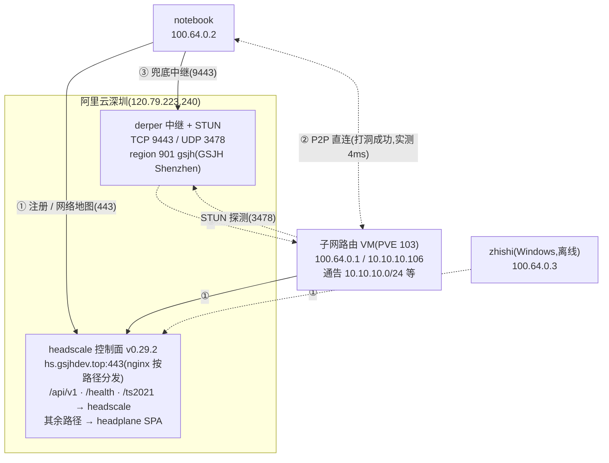

# Tailscale 自组网(headscale 自建控制面 + 子网路由)

> **实测状态**:✅ 已实测 —— 客户端(notebook)、子网路由节点(PVE VM 103)、服务端端点三面复测,2026-10-09。**架构较旧版有迁移**:控制面域名 `hs.ipuff.online` → `hs.gsjhdev.top`,服务器 HK → 阿里云深圳,DERP region `999/hk` → `901/gsjh`,headplane 独立端口 8070 → 443 根路径。服务器内部配置(容器/文件布局)**本次未登机核对**,旧布局以存档形式保留在文末,登机后需复核。

## 一、现状总览(2026-10-09 实测)

### 1.1 资产与节点

| 资产 | 地址 | 现状(实测) |
| --- | --- | --- |
| 控制面 headscale | `https://hs.gsjhdev.top`(120.79.223.240,阿里云深圳) | v0.29.2,`/health` → `{"status":"pass"}` |
| derper 中继 + STUN | 同机,`hs.gsjhdev.top:9443` / UDP 3478 | `:9443` 200、`/generate_204` 204、STUN 可达 |
| headplane 面板 | `https://hs.gsjhdev.top/`(443 根路径) | SPA 正常返回;**旧 8070 端口已废弃**(连接拒绝) |
| MagicDNS 域 | `ts.gsjhdev.top` | 实测可解析节点名(如 `notebook`) |
| 子网路由节点 | PVE VM 103(hostname `tailscale`,10.10.10.106) | Ubuntu 24.04 / tailscale 1.102.4,常驻 |
| 客户端 notebook | 100.64.0.2 | Linux,tailscale 1.98.8 |
| 客户端 zhishi | 100.64.0.3 | Windows,离线(2026-10-09 快照) |
| 旧控制面 | `hs.ipuff.online`(223.254.128.189) | **仍在线**(`/health` 200)但已非现行控制面,待下线 |

### 1.2 架构(实测更新)



### 1.3 当日实测记录(摘录)

```text
# 本机(notebook,100.64.0.2)
$ tailscale status
100.64.0.2  notebook   admin  linux    -
100.64.0.1  tailscale  admin  linux    active; direct 10.10.10.106:41641
100.64.0.3  zhishi     admin  windows  offline

$ tailscale ping -c 3 100.64.0.1
pong from tailscale (100.64.0.1) via 10.10.10.106:41641 in 4ms     ← P2P 直连

$ tailscale netcheck(节选)
* UDP: true      * IPv4: yes, 14.155.201.148:47889
* MappingVariesByDestIP: true                ← 本网络按目的地变 UDP 映射(见"已知坑")
* Nearest DERP: GSJH Shenzhen
* DERP latency: gsjh: 12.8ms

$ curl https://hs.gsjhdev.top/health
{"status":"pass"}
$ curl https://hs.gsjhdev.top/version
{"version":"v0.29.2", "buildTime":"2026-07-01T14:47:39Z", ...}
```

### 1.4 客户端侧生效配置

```text
$ tailscale debug prefs(节选)
"ControlURL": "https://hs.gsjhdev.top"    ← 控制面(客户端接入点)
"RouteAll": true                           ← 接受子网路由(访问 10.10.10.0/24 靠它)
"CorpDNS": true                            ← MagicDNS 接管解析
```

> 健康提示实测存在一条:`System DNS config not ideal. /etc/resolv.conf overwritten`(DNS fight)——本机 systemd-resolved 与 tailscale 的 DNS 接管冲突,功能不受影响,已知即可。

---

## 二、子网路由节点(PVE VM 103,实测)

tailnet 外的设备经此节点访问实验室网段,是"在外网进内网"的入口。

```text
主机名:tailscale(PVE VM 103)   IP:10.10.10.106
系统:Ubuntu 24.04.3 LTS          tailscale:1.102.4
通告路由(AdvertiseRoutes,实测):
  10.10.10.0/24        ← PVE/实验室管理网
  192.168.3.0/24       ← 另一办公网段
  192.168.0.200/32     ← 单主机路由(定点放行)
客户端侧必须 RouteAll=true(tailscale up --accept-routes)才吃这些路由
```

实测路径:notebook → `10.10.10.44`(PVE)即走该子网路由,隧道对端 `10.10.10.106:41641` 直连,`tailscale ping` 4ms。

**管理命令**(登 VM 103 执行):

```bash
tailscale set --advertise-routes=10.10.10.0/24,192.168.3.0/24,192.168.0.200/32
# 通告变更需控制面批准(headplane 面板 Routes 页或 headscale approve routes)
tailscale status   # 自查
```

---

## 三、服务端(阿里云 hs.gsjhdev.top)

> **本次未登机复核**:以下 3.1 的域名/端口/版本/DERP 均为端点实测;3.2 的容器与文件布局为**旧服务器存档**(HK 时代),登阿里云机后需按实况修订。

### 3.1 端口与路径(端点实测,2026-10-09)

| 端口/路径 | 协议 | 用途 | 实测 |
| --- | --- | --- | --- |
| 443 `/` | TCP | headplane 管理面板(SPA 根路径) | 200,登录入口即根路径 |
| 443 `/api/v1/*` | TCP | headscale API(面板与 CLI 共用) | 401(未带 key,路由证明) |
| 443 `/health`、`/version` | TCP | headscale 健康与版本 | pass / v0.29.2 |
| 443 `/ts2021` | TCP | 客户端 Noise 控制协议通道 | 500(无升级头时的预期报错,路由证明) |
| 9443 | TCP | derper 中继(region 901 gsjh) | 200;`/generate_204` 204 |
| 3478 | UDP | derper 内置 STUN | 可达 |
| 8070 | TCP | **已废弃**(旧 headplane 直连端口) | 连接拒绝 |

**DERP map 现状**(客户端 `tailscale debug derp-map` 实测):自建 region **901 / gsjh / "GSJH Shenzhen"**(节点 gsjh1 @ hs.gsjhdev.top:9443),同时下发 **28 个 Tailscale 官方 region** 兜底——netcheck 报"via DERP(xxx海外)"即落到官方节点,见已知坑。

**ICMP 注意**:阿里云安全组禁 ping(`ping hs.gsjhdev.top` 100% 丢包,实测)——**探活一律用 curl/TCP**,别用 ping 误判宕机。

### 3.2 服务器内部布局(旧 HK 服务器存档,未复核)

以下为迁移前布局,迁移到阿里云后**路径与部署形态可能已变**,登机后按实况修订再当操作依据:

```
/data/headscale/
├── docker-compose.yml           # headscale(+headplane 同网络)
├── config/config.yaml           # server_url / magic_dns base_domain / derp 配置
├── config/derp-hk.yaml          # 旧 DERP map(region 999 hk)→ 现应为 region 901 gsjh
└── lib/                         # 数据库 + Noise 私钥(核心数据,迁移时整目录搬运)
```

旧版关键配置项(语义不变,值以现行 config.yaml 为准):

```yaml
server_url: https://hs.gsjhdev.top
dns:
  magic_dns: true
  base_domain: ts.gsjhdev.top    # 实测后缀;不能与 server_url 同域
derp:
  server:
    enabled: false               # 内置 DERP 关闭,独立 derper 承担
```

**derper**(systemd,源码构建 v1.102.4,与子网路由节点客户端同版本):

```bash
# 构建(升级时重复;需 Go 工具链)
CGO_ENABLED=0 GOPROXY=https://goproxy.cn,direct GOTOOLCHAIN=local \
  go install tailscale.com/cmd/derper@<与客户端一致的版本>

# systemd ExecStart 要点(旧单元存档)
ExecStart=/data/headscale/derper/bin/derper -hostname=hs.gsjhdev.top \
  -certmode=manual -certdir=<证书目录> -a :9443 -stun -http-port=-1
```

三个旧坑仍需带入新服务器核查:443/8443 被占故用 9443;`-http-port=-1` 防 80 被 nginx 顶掉启动失败;证书 acme.sh 自动续期约 60 天一换而 derper 不热加载——**需确认新机保留"每月重启 derper"的 cron**。

**headplane**(现于 443 根路径,旧 8070 直连已废):面板登录密钥即 headscale API key,生成 `headscale apikeys create --expiration 90d`;密钥本体不落盘,丢失只能作废重建(`apikeys list` 只显示前缀)。

---

## 四、使用说明

### 4.1 客户端接入(控制面 URL 用新域名)

1. 生成预授权密钥(headplane 面板或 CLI):

```bash
docker exec headscale headscale preauthkeys create --user <用户ID> --expiration <时长>
```

2. 设备接入:

```bash
# Windows / macOS
tailscale up --login-server https://hs.gsjhdev.top --authkey <密钥>
# Linux(要访问子网路由通告的网段必须带 --accept-routes)
tailscale up --login-server https://hs.gsjhdev.top --authkey <密钥> --accept-routes
```

3. 验证(实测输出见 1.3):

```bash
tailscale status            # 节点与直连/中继状态
tailscale ping <对端>       # via IP:41641=直连;via DERP(gsjh)=自建中继;via DERP(海外官方)=UDP 受限
tailscale netcheck          # NAT/UDP 探测,看 Nearest DERP
```

MagicDNS 实测可用:节点名可直接解析(如 `getent hosts notebook` 返回节点地址,含 tailnet IPv6 `fd7a:115c:a1e0::/48` 记录)。

### 4.2 headplane 密钥轮换(零中断)

```bash
docker exec headscale headscale apikeys create --expiration 90d   # 1. 生成新 key
# 2. 浏览器打开 https://hs.gsjhdev.top/,用新 key 重新登录
docker exec headscale headscale apikeys expire -i <旧keyID>        # 3. 作废旧 key
```

90 天自然过期;`apikeys list` 只显示前缀,完整 key 丢失无法找回;疑似泄露立即作废。

---

## 五、已知坑(实测)

| 坑 | 实测现象 | 解/口径 |
| --- | --- | --- |
| 安全组禁 ICMP | `ping hs.gsjhdev.top` 100% 丢包,但 443/9443 正常 | 探活用 `curl /health`,别用 ping |
| **STUN 假映射** | 本机 netcheck 实测 `MappingVariesByDestIP: true`(网络边界对 UDP 按目的地变映射) | 该类网络打洞必败、回落 DERP;自建近端 derper(深圳 12.8ms)就是为此兜底 |
| 落到海外官方 DERP | `tailscale ping` 显示 `via DERP(nyc)` 等 | UDP 3478/41641 被边界拦截,查路由器策略;自建 region 正常时 `Nearest DERP` 应为 GSJH Shenzhen |
| DNS fight | 健康提示 `/etc/resolv.conf overwritten` | systemd-resolved 与 tailscale 抢 DNS;功能不受影响,介意则统一由 tailscale 管或 `--accept-dns=false` |
| derper 证书不热加载 | 通配符证书约 60 天轮换,derper 不跟随 | 保留定时重启 derper 的 cron(新服务器需核查,见 3.2) |
| 旧域名仍在线 | `hs.ipuff.online` 仍解析且 `/health` 200 | 已非现行控制面;下线前确认无客户端依赖,避免误连 |

---

## 六、遗留与待办

- [ ] 登阿里云服务器复核内部布局(3.2 存档待修订):compose 路径、derp map 文件名(region 901)、derper systemd、证书 cron;
- [ ] 旧服务器(HK,hs.ipuff.online)下线:先在面板/CLI 确认无活跃节点连旧控制面,再停服务;
- [ ] headplane 版本未从外部确认(旧档 0.7.1),登机时核对;
- [ ] zhishi(Windows)长期离线,确认是否还在 tailnet 保留名单。
