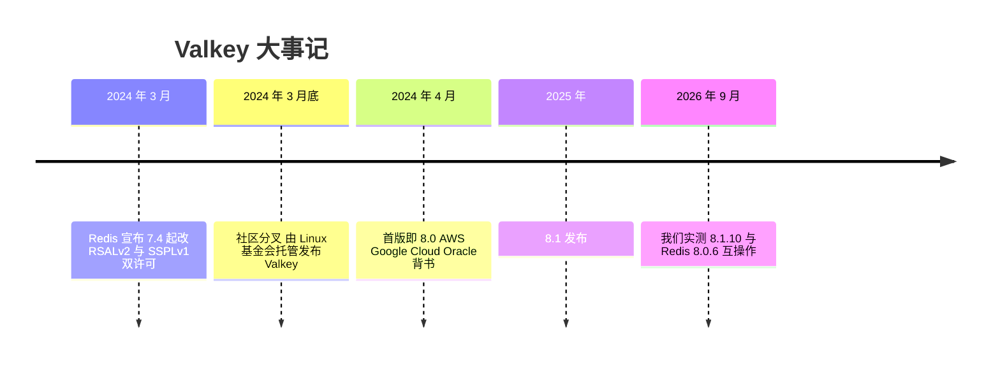
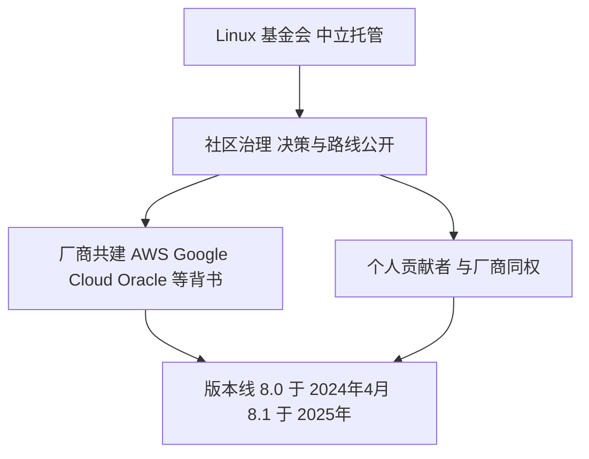
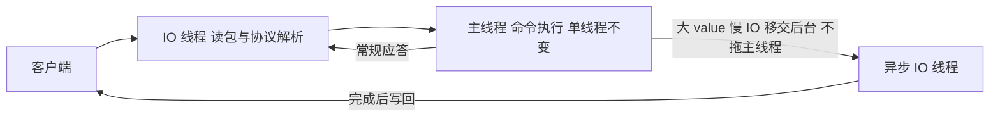
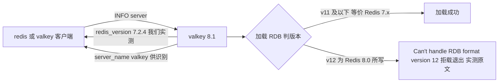

# Valkey 部署与选型(valkey)

> - **版本基线**:Valkey 8.1(实测 8.1.10,官方 docker 镜像 `valkey/valkey:8.1`;其对外协议兼容层报告 `redis_version:7.2.4`)。
> - **实测环境**:PVE 虚机 valkey-1/2/3(10.10.12.121/122/123,2C/4G,Ubuntu 26.04,docker),2026-09-30,另借 redis-1(118,Redis 8.0.6)做跨软件互操作。
> - **定位**:Valkey 是 Redis 2024 年改许可证后由 Linux 基金会托管的开源(BSD)分叉。本文档集**不重复 Redis 通用运维**(单机/哨兵/Cluster/监控全套见 [../redis/](../redis/README.md)),只覆盖:部署差异、**与 Redis 的兼容性实测矩阵**、以及**迁移路径实测**。

## 文章索引

| 编号 | 文章 | 内容 | 状态 |
| --- | --- | --- | --- |
| 1 | [安装部署-docker](1.安装部署-docker.md) | valkey-server/valkey-cli、与 redis 容器的差异 | ✅ 已实测 |
| 2 | [与Redis兼容性实测](2.与Redis兼容性实测.md) | 客户端/ACL/RESP3/RDB 互导矩阵 | ✅ 已实测 |
| 3 | [主从复制与迁移路径](3.主从复制与迁移路径.md) | 自身复制、跨软件复制实测、迁移三路线 | ✅ 已实测 |

## 一分钟选型结论(实测依据见第 2/3 篇)

- **新缓存/队列场景**:Redis 8 已回归开源(AGPLv3)且 Valkey 协议兼容 Redis 7.2——两者运维心智一致,按团队偏好选;要纯 BSD 与社区治理选 Valkey,要 Redis 8 新特性(新 hash、客户端缓存增强等)选 Redis;
- **存量 Redis 8 想换 Valkey**:**没有搬运工捷径**——实测 RDB 快照与主从复制两条"物理"通道都被 RDB v12 挡死,只能走逻辑迁移(第 3 篇);
- **存量 Redis ≤7.4 换 Valkey**:物理通道可用(RDB v11 及以下),复制法/快照法均可。

## 关联

- Redis 通用运维全套(参数/ACL/持久化/哨兵/Cluster/监控)→ [../redis/](../redis/README.md),Valkey 同样适用;
- 巡检:巡检 redis.md 的 R01~R13 命令面(valkey-cli 同语法)对 Valkey 直接可用,`INFO` 字段一致(实测)。

## 组件介绍

> Valkey 与 Redis 7.2 同源同内核——跳表、渐进式 rehash、fork/COW、16384 槽这些**通用原理**展开见 [../redis/README.md](../redis/README.md)「组件介绍」。

### 诞生背景

Valkey 的诞生就是一次许可证事件的直接结果:2024 年 3 月,Redis 宣布 7.4 起由 BSD 改为 RSALv2/SSPLv1 双许可(BSD 不再适用于新版本);社区随即 fork,Valkey 于 **2024 年 3 月底由 Linux 基金会托管发布**,AWS、Google Cloud、Oracle 等厂商背书——这些正是过去多年为 Redis 贡献代码与负载的主要玩家。**2024 年 4 月首版即 8.0**(不以 7.2.x 续版号,表明独立版本线的姿态);2025 年发布 8.1;我们实测基线 8.1(8.1.10)。

两个月后,Redis 8 加入 AGPLv3 三重许可回归开源,两边重新同台竞技;本目录的选型口径见上文「一分钟选型结论」,Redis 侧的完整版本叙事见 [../redis/README.md](../redis/README.md)「组件介绍·诞生背景」。

### 功能特色

| 能力域 | 内容 | 口径 |
| --- | --- | --- |
| 协议兼容 | RESP/RESP3、命令与 ACL 同构 Redis 7.2 | 第 2 篇双向实测全通 |
| 许可 | BSD,可放心商用与内网分发 | 对比改许可后的 Redis 新版本 |
| 治理 | Linux 基金会托管、多厂商共建 | 官方公告 |
| 性能方向 | 异步 IO 线程增强、内存效率、大集群改进 | ✅ 已实测(2026-10-09):RSS -24%,IO 线程小机反噬(见文末) |
| 版本线 | 8.0(2024-04)→ 8.1(2025) | 官方发布记录 |
| 兼容层 | 对外报 `redis_version:7.2.4` | 我们 8.1.10 实测 |

### 使用速查

| 场景 | 命令 / 入口 | 备注 |
| --- | --- | --- |
| 服务端与客户端 | `valkey-server` / `valkey-cli` | 语法与 redis 同构,第 1 篇 |
| redis-cli 直连 valkey | `redis-cli -h <valkey 主机>` | 第 2 篇实测全通 |
| 识别服务端类型 | `INFO server` 看 `server_name` | 值为 `valkey`;redis 无此字段,出现即 valkey |
| 判断兼容能力集 | `INFO server` 看 `redis_version` | 实测 7.2.4,按 Redis 7.2 能力集对待 |
| 巡检 | redis.md 的 R01~R13 命令面 | valkey-cli 同语法,INFO 字段一致(实测) |

### 核心原理

#### 与 Redis 共享的内核原理

跳表(zskiplist)、SDS 与渐进式 rehash、单线程命令执行 + IO 线程、fork/COW 持久化、Cluster 16384 槽 CRC16、哨兵 quorum 选举——**原样适用于 Valkey**,展开见 [../redis/README.md](../redis/README.md)「组件介绍·核心原理」的对应小节。redis 目录 [第 4 篇](../redis/4.持久化与备份恢复.md)(kill -9 恢复)、[第 5 篇](../redis/5.主从与哨兵.md)(18 秒切换)、[第 6 篇](../redis/6.Cluster集群.md)(MOVED、杀主接管)的实测方法在 Valkey 上同样可复用——命令同构、INFO 字段一致(实测)。

#### 差异一:fork 治理——Linux 基金会与社区民主化

分叉的直接动机不是技术,是**治理**:开源项目被单一商业公司单方面转向(改许可)的风险,Redis 2024 年已成现实。Valkey 的解法是把项目交给 **Linux 基金会**做中立托管:技术决策与路线公开、社区化流程;AWS、Google Cloud、Oracle 等厂商共同背书,个人贡献者与厂商同权。对使用者的含义:**没有哪家厂商能单方面决定 Valkey 的许可证或方向**,版本节奏(8.0 → 8.1)由社区按贡献治理推进——这是选型时"纯 BSD + 社区治理"一派的核心理由。

#### 差异二:异步 IO 线程增强与内存效率

上游 release notes 口径(不给具体百分比,数值待实测):8.x 的演进主线是**异步 IO 线程**(async I/O threading)——把大 value 场景下读写 socket 这类慢 IO 从主线程移走,减少主线程被单个慢客户端拖住;以及**内存效率**(同数据集更省 RSS)与**大集群改进**(更大规模集群的行为)三个方向。三者都是工程优化,不动协议与功能面,因此不影响与 Redis 7.2 的兼容性。命令执行的单线程模型未变(共享内核),异步化加深的是 Redis 6.0 io-threads 的思路:IO 层继续做减法,计算层保持简单。

#### 差异三:兼容层机制——对外报 redis_version 7.2.4

客户端生态普遍以 `redis_version` 协商行为(版本探测、特性开关),Valkey 对外报 **7.2.4**(我们 8.1.10 实测),语义是"**请按 Redis 7.2 的能力集对待我**"——这保证 Jedis/Lettuce/go-redis 等主流客户端零改动接入(第 2 篇双向实测全通,含 ACL 账号跨用);巡检与管理面用 `server_name:valkey` 区分。**兼容的硬边界在文件格式**:RDB 只认到 v11(等价 Redis 7.x),Redis 8.0 写的 **v12 拒载**——实测报 `Can't handle RDB format version 12` 后 Fatal error 退出;跨软件主从复制同样被版本协商挡住(第 3 篇)。这个边界随双方版本演进会移动,搬运数据前先核对第 2 篇矩阵的实测日期。

### 与本文档集的衔接

- 通用原理与运维全套 → [../redis/](../redis/README.md)「组件介绍」及其第 4/5/6 篇(哨兵 18 秒切换、MOVED、kill -9 恢复的方法在 Valkey 同样适用);
- 兼容性矩阵(客户端/ACL/RESP3/RDB 互导)→ [第 2 篇](2.与Redis兼容性实测.md):**RDB v12(Redis 8.0 写)被 Valkey 8.1 拒载**,反向 valkey → redis 8.0 加载成功;
- 迁移路径(跨软件复制被挡后的逻辑迁移三路线)→ [第 3 篇](3.主从复制与迁移路径.md);
- Redis 侧视角(2024 许可变更完整叙事)→ [../redis/README.md](../redis/README.md)。

待补实测:

> ✅ **异步 IO 线程压测已实测**(2026-10-09,4C VM,valkey-benchmark 200 连接 × 4KB × 10 万请求):基线(io-threads=1)GET **58617 rps / p50 1.67ms**(同参数下比 Redis 8.0 基线 53908 高 ~9%),**开 io-threads=3 后暴跌 59%**(23844 rps / p50 7.34ms)——小核 + 回环 + 中小 value 场景异步 IO 线程是纯负资产;与 Redis 8.0 的 io-threads 压测(同法,-8%)同结论:**本套基线不开 IO 线程**,万级连接/大 value/多核专用机再议。
> ✅ **RSS 对比已实测**(2026-10-09):同 63123 键数据集(redis-shake 迁移后),Redis 8.0 used_memory 12.81MB / RSS 30.86MB,Valkey 8.1 used_memory 11.71MB / **RSS 23.47MB(-24%)**——上游"内存效率"口径在本套硬件量化成立。

## 资料索引

- Valkey 官方文档:https://valkey.io/topics/overview/
- Valkey 镜像:https://hub.docker.com/r/valkey/valkey
- Valkey 与 Redis 兼容性官方说明:https://valkey.io/topics/compatibility/
