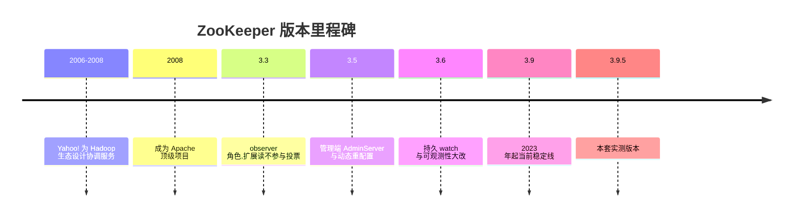
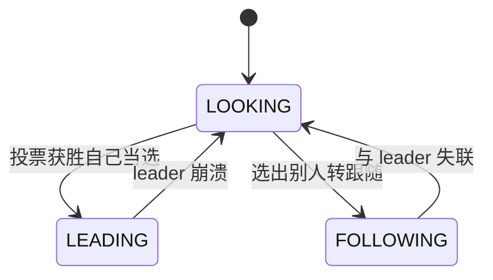
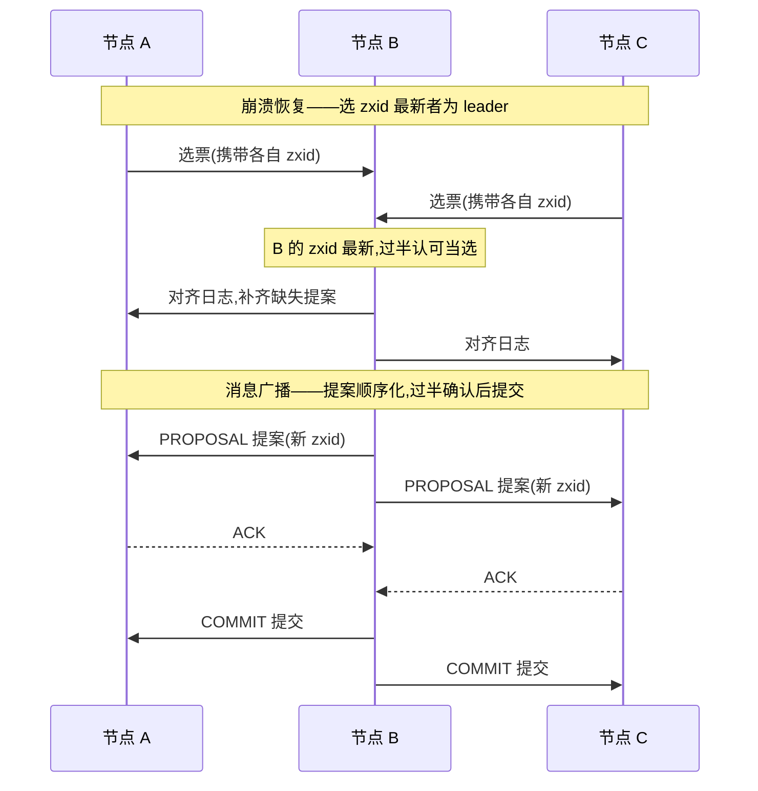
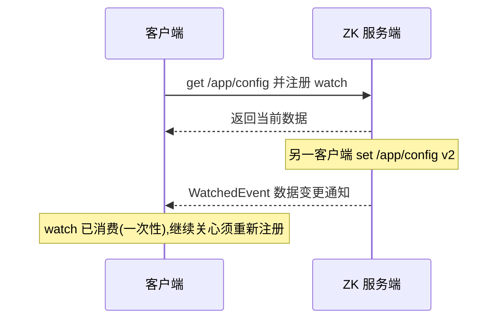
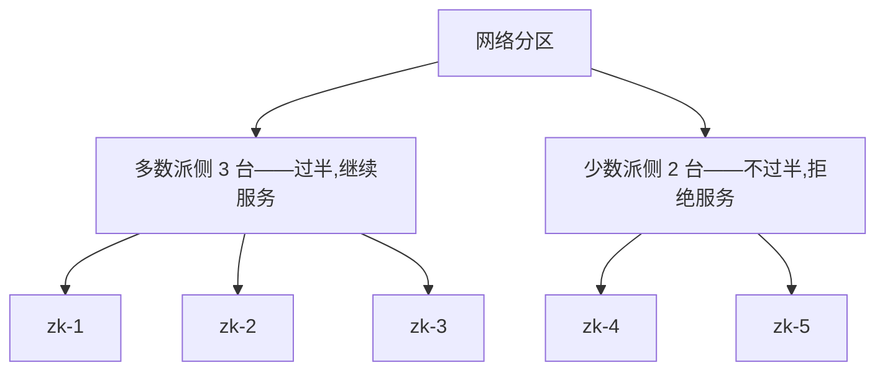

# ZooKeeper 部署与运维(zookeeper)

> **版本基线**:ZooKeeper 3.9(实测 3.9.5,官方 docker 镜像 `zookeeper:3.9.5`)。与巡检文档(3.9.5 打包版)同版本;3.5+ 的配置体系一致。
> **实测环境**:PVE 虚机 zk-1/2/3(10.10.12.131/132/133,2C/2G/40G,Ubuntu 26.04,docker),2026-09-30。**三节点 ensemble 全链路实测**:部署、四字命令、znode 语义、杀 leader 切换、节点回归、mntr 指标。
> **定位**:分布式协调(元数据/选主/分布式锁)。**Kafka 4.x KRaft 已不需要它**——新部署前先想清楚是否真的需要自建 ZK。

## 文章索引

| 编号 | 文章 | 内容 | 状态 |
| --- | --- | --- | --- |
| 1 | [安装部署-单机](1.安装部署-单机.md) | standalone、admin server 实测 | ✅ 已实测 |
| 2 | [安装部署-集群](2.安装部署-集群.md) | ensemble 搭建、ZOO_MY_ID | ✅ 已实测 |
| 3 | [参数基线与配置模板](3.参数基线与配置模板.md) | zoo.cfg 决策项、四字命令白名单 | ✅ 已实测 |
| 4 | [数据与命令面](4.数据与命令面.md) | znode CRUD、ephemeral、一致性 | ✅ 已实测 |
| 5 | [容灾与监控](5.容灾与监控.md) | 杀 leader 实测、mntr、排障字典 | ✅ 已实测 |

## 阅读路径

从零搭:1(单机)→ 3 → 4 → 2(集群)→ 5;接手在跑的:5 → 3。

## 组件介绍

> 配置维护、命名、分布式锁、选主、组服务——这些每个分布式系统都要重写的协调逻辑,ZooKeeper 把它们收敛成一颗线性一致的 znode 树,由 ensemble 多数派保证可用与一致,只做**分布式协调**这一件事。

### 诞生背景

源自 Yahoo!:2006~2008 年为 **Hadoop 生态**提供协调服务而设计(设计灵感包括 Google Chubby 论文)——把"锁与元数据"做成共享基础设施,而不是每个系统自己再发明一遍;2008 年成为 Apache 顶级项目。此后长期是分布式系统的隐形协调层(老模式 Kafka 即用户之一),如今 Kafka 4.x KRaft 自带仲裁,ZK 疆域收缩,但纯协调场景仍是标配。

### 功能特色

| 能力 | 说明 | 本套锚点 |
| --- | --- | --- |
| znode 树 | 层级命名空间;持久/临时/顺序三类节点 | 第 4 篇 CRUD 实测 |
| 线性一致读 | ZAB 提交后全局可见 | 第 4 篇 follower 立即可见 |
| 临时节点 | 绑定会话,断连自动删除——注册/锁的基石 | 第 4 篇 ephemeral 实测 |
| watcher 通知 | 数据变更推给订阅者 | persistent watch 已实测(见下) |
| ACL | digest 口令权限,按 znode 授权 | 通用(第 3 篇配置面) |
| ensemble 高可用 | n 节点容忍 ⌊n/2⌋ 故障 | 第 5 篇杀 leader |
| observer | 3.3 起,扩展读、不参与投票 | 已实测(见下) |
| 可观测 | mntr 指标 + 3.5 起 AdminServer HTTP | 第 1/5 篇 |

### 使用速查(zkCli 与四字命令)

zkCli 入口:`docker exec zookeeper zkCli.sh -server 127.0.0.1:2181 <命令>`(第 4 篇;zkCli 日志刷屏,结果行需过滤提取)。

| 命令 | 用途 |
| --- | --- |
| `ls /path` | 列子节点 |
| `create /app ""` | 建节点;**父必须先存在**——3.9 报错只报子路径,实测坑 |
| `create -e /p v` | 临时节点(随会话消失) |
| `create -s /p v` | 顺序节点(名尾自动递增编号) |
| `get /path` | 读数据 + stat 元数据 |
| `set /path v2` | 改写,zxid 前进 |
| `delete /path` | 删除节点 |
| `stat /path` | 只看元数据 |

四字命令(`echo cmd` 打到 2181,第 5 篇有 bash 直连写法)。**3.5 起默认白名单仅 `srvr`**,放行走 zoo.cfg `4lw.commands.whitelist`(第 3 篇)——ruok/mntr 返回空,先查这里(第 5 篇排障字典):

| 命令 | 用途 | 本套实测 |
| --- | --- | --- |
| `srvr` | 单节点概要:Mode/版本/zxid | ✅ Mode 翻转判 leader 切换 |
| `mntr` | 监控指标流 | ✅ zk_peer_state/zk_avg_latency 等 |
| `ruok` | 存活探测,回 imok | ✅ 白名单坑实测 |
| `stat` | 概要 + 连接列表 | 通用 |
| `conf` | 生效配置 | 通用 |

### 核心原理

#### ZAB:崩溃恢复与消息广播

ZAB(ZooKeeper Atomic Broadcast)是 ZK 的共识与原子广播协议,常态与异常态两阶段循环。**消息广播**(常态):形态是流水线化的两阶段提交——leader 把每个写请求顺序化成提案(PROPOSAL),按 zxid 单调递增广播给 follower;**过半 ACK 即提交**(COMMIT),follower 按相同顺序 apply——写全局有序、读线性一致(第 4 篇:leader 上 create,follower 立即可见)。**崩溃恢复**(leader 挂时):节点进 LOOKING 互发选票,**zxid 最新者(数据最全)当选**;新 leader 让全体对齐日志(缺的补、未提交的废弃),换新纪元恢复广播。

**zxid = 高 32 位 epoch + 低 32 位计数器**:epoch 是 leader 纪元,每换一次 leader 加一——旧 leader 复活后,其提案因 epoch 更小不被承认;低 32 位是纪元内提案序号,保证全序。与 Raft/Paxos 一句话对比:ZAB 与 Raft 同族(强 leader + 过半提交 + 纪元/任期防旧主);Paxos 更通用,但默认不保证全序,做广播要在其上再加序。

**实测衔接**(第 5 篇):杀 leader zk-2(132),剩余两节点**秒级完成选举**、zk-3(133)继任,`srvr` 的 Mode 即时翻转;切换窗口内写入失败、follower 侧读也短暂不可用;132 回归后以 follower 重入,快照 + 事务日志自动追平、zxid 对齐;同时挂两台 = 无多数派,ensemble 拒绝服务。

#### watcher 机制

watch 是"读时注册、变时推送"的通知:客户端在读操作(ls/get)上带 watch,对应节点或其子节点变化时,服务端向该会话推送事件。**一次性触发**是关键语义:事件送达即消费,继续盯必须重读 + 重注册——通知与变更之间永远有间隙,间隙内的变化靠重读补全,这是初学者最易漏的坑。3.6 起 **persistent watch**:持续触发直到客户端显式移除,把"注册-消费-再注册"的循环交给服务端。典型用法:配置订阅(盯 /app/config)、服务发现(盯 /svc 子节点)、锁竞争(盯排队中的前一个节点)。

> ✅ **persistent watch 已实测**(2026-10-09,zkCli 管道会话,同一 `/pw` 节点):
> - 一次性 `get -w /pw`:`set` 一次触发 `NodeDataChanged`(zxid …891),**第二次 set 无事件**——一次性语义实证;
> - `addWatch -m PERSISTENT /pw`(默认 PERSISTENT_RECURSIVE):连续两次 set **各触发一次**(zxid …893/…894),注册-消费-再注册循环交给服务端;
> - `removewatches /pw -a` 移除后 3.9 会推**专门的 `PersistentWatchRemoved` 事件**,此后 set 不再触发;
> - 语法:`addWatch [-m mode] path`,mode ∈ PERSISTENT / PERSISTENT_RECURSIVE。

#### 会话与临时节点

客户端连上任意一台 ensemble 成员即建立**会话**(TCP + 心跳保活);session timeout 定生死——超时未续,服务端关闭会话并广播。**临时节点的生命周期严格绑定会话**:会话结束,ZK 自动删除该会话创建的全部临时节点,并触发对应 watcher。这一个语义就是服务注册与分布式锁的地基:进程挂了,注册项/锁自动让位,无需人工收尸;`create -s` 顺序节点 + 临时节点组合即排队锁——各自编号、只盯前一个,避免全员惊群。超时建议 ≥ 2×tickTime×syncLimit(第 5 篇):太小则网络抖动/GC 停顿就误杀会话,业务侧表现为"锁莫名丢了"。

**实测衔接**(第 4 篇):`create -e /app/lock001` 后退出 zkCli,再 `ls /app` 只剩 [config]——临时节点随会话消失,一次实证。

#### quorum 容错

ensemble 的每次写都要 leader 广播并**过半确认**;因此 **n 节点容忍 ⌊n/2⌋ 台故障**:3 台容忍 1、5 台容忍 2、7 台容忍 3。奇数优于相邻偶数——4 台与 3 台同样只容忍 1 台,写路径反而更宽。网络分区时少数派侧凑不满多数,主动拒绝服务:宁可整体不可用,不脑裂出两份真相。**observer**(3.3 起)不投票、不计入多数派,专事扩展读——读多写少场景把读流量卸到 observer,写吞吐与容错边界不受影响。运维红线(第 5 篇):三节点别同时重启两台;杀 leader 是最值得定期演练的故障(无损害、可预期)。

> ✅ **observer 角色已实测**(2026-10-09,第 4 台跑在 zk-1 机器上,clientPort 2182 / 选举 2889:3889):
> - 静态老路:三节点 zoo.cfg 追加 `server.4=…:observer` + observer 自身 `peerType=observer`,**全量停启**后 `srvr` 显示 `Mode: observer`、mntr `zk_server_state: observer`;**leader 的 `zk_synced_followers` 保持 2**——不进多数派计数,读可扩展、写容错边界不变;
> - 读写链路:经 2182 create(写转发给 leader)与 get 均正常;
> - **实测坑**:observer 的 zoo.cfg 必须与 ensemble 同样开 `reconfigEnabled=true`(并 `standaloneEnabled=false`)——实测不配时 FLE 通知版本不匹配(observer 0 vs ensemble 400000000),选举永远重启,`not currently serving requests`。

> ✅ **动态重配置 reconfig 已实测**(2026-10-09,与 observer 演练串做,老路 vs 新路对比鲜明):
> - **老路**(上条 observer 静态加入):改 zoo.cfg → 全量停启,窗口内 ensemble 不可写;
> - **新路**:三节点 zoo.cfg 配 `reconfigEnabled=true`(3.5.3 起默认关闭!)后,`reconfig -remove 4` / `reconfig -add server.4=10.10.12.131:2889:3889:observer;2182` **在线摘除与加回,全程无重启**,动态配置版本 400000000 → 600000007 推进可见(`config` / `get /zookeeper/config` 查看);
> - **实测坑 1(必踩)**:reconfig 需要 ADMIN 权限,`/zookeeper/config` 默认 world 只读——报 `Insufficient permission`。解:服务端 JVM 加 `-Dzookeeper.DigestAuthenticationProvider.superDigest=super:<base64(sha1("super:super"))>`,客户端先 `addauth digest super:super` 再 reconfig(官方镜像默认不带,需重建容器注入 JVMFLAGS);
> - **实测坑 2(工具面)**:zkCli 管道模式下**输出首行带 prompt 前缀**(`[zk: …] server.1=…`),`grep '^server\.'` 会漏掉第一台——过滤别锚定行首;
> - 新路加 participant 同理:`reconfig -add server.1=…:2888:3888:participant;0.0.0.0:2181`(动态格式 clientPort 分号后置)。

### 与本文档集的衔接

- **ZAB 与选举**:[第 5 篇](5.容灾与监控.md)——杀 zk-2(132)**秒级选举**、zk-3(133)继任(`srvr` Mode 翻转)、mntr `zk_peer_state: following - broadcast`、回归后 zxid 对齐;
- **临时节点**:[第 4 篇](4.数据与命令面.md)——zkCli 退出后 lock001 自动消失、父节点先建的报错坑;
- **docker 镜像默认开放 HTTP admin server**:[第 1 篇](1.安装部署-单机.md)——`http://<host>:8080/commands/mntr` 直出 JSON,与打包版结论相反(打包版需 `admin.enableServer=true`);8080 易撞名,混部记得改 port 或关闭;
- **参数与白名单**:[第 3 篇](3.参数基线与配置模板.md)(zoo.cfg 决策项、4lw.commands.whitelist);
- Kafka 4.x KRaft 已不需要 ZK → [../kafka/](../kafka/README.md)。

## 资料索引

- 官方管理员文档:https://zookeeper.apache.org/doc/current/zookeeperAdmin.html
- 四字命令参考:https://zookeeper.apache.org/doc/current/zookeeperAdmin.html#sc_zkCommands
- 官方镜像:https://hub.docker.com/_/zookeeper

## 关联

- **巡检**:命令面巡检项 Z01~Z10、阈值与处置见 [skills/巡检/inspect-middleware/references/zookeeper.md](../../skills/巡检/inspect-middleware/references/zookeeper.md);本文与其互补(部署/排障 vs 点状巡检);
- Kafka(不再依赖 ZK 的 KRaft 模式)→ [../kafka/](../kafka/README.md)。

## 新增与修改

同 MySQL 篇纪律:先实测再入文,头部标注实测版本与日期;参数基线唯一真源是 [conf/zoo.cfg](conf/zoo.cfg)。
